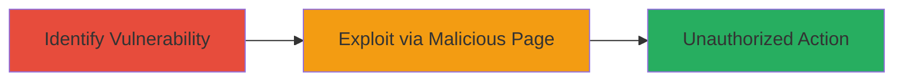

---
tags:
  - csrf
  - web-vulnerability
  - cross-site-request-forgery
  - dod
type: attack_chain
tools: []
tactics:
  - '[[Initial Access]]'
verified: false
platforms:
  - Web
submitted: true
complexity: medium
created_at: '2023-10-01T00:00:00Z'
procedures:
  - '[[procedures/Identify-CSRF-Vulnerability-on-Web-Endpoint]]'
  - '[[procedures/Demonstrate-CSRF-via-Malicious-Webpage]]'
step_count: 2
techniques:
  - '[[Exploit Public-Facing Application]]'
updated_at: '2025-12-14T17:27:15.377Z'
description: >-
  A multi-step attack demonstrating the identification and exploitation of a
  CSRF vulnerability on a U.S. Department of Defense website, allowing
  authenticated users to be tricked into performing unauthorized actions such as
  posting or altering confidential information.
skill_level: intermediate
impact_level: high
id: 26373f5e-07e2-456c-bfea-7be9ef04710c
validated: true
mitre_tactics:
  - '[[Initial Access]]'
mitre_techniques:
  - '[[Exploit Public-Facing Application]]'
---
# CSRF Exploitation on DoD Website for Unauthorized Data Modification

Multi-stage attack chain demonstrating a complete attack workflow targeting a CSRF vulnerability on a U.S. Department of Defense website. The attack tricks authenticated users into executing unintended state-changing actions, such as posting or modifying confidential information or redirecting sensitive data to an attacker.

## Chain Metrics Dashboard

| Metric | Value |
|--------|-------|
| Chain Status | Unverified |
| Total Steps | 2 |
| Execution Time | ~5 minutes |
| Skill Level | Intermediate |
| Complexity | Medium |
| Impact Level | High |

## Attack Flow Visualization

## Prerequisites & Requirements

### Required Tools

- Web browser for testing
- Text editor for crafting HTML

### Target Environment

- Web platform with state-changing endpoints
- Authenticated session on the target DoD website
- No specific ports or services beyond standard HTTP/HTTPS

### Initial Access Requirements

- Valid user credentials for the DoD website
- Ability to host or serve a malicious webpage (e.g., local server or external hosting)
- Network access to the target website

## Detailed Attack Procedures

### Step 1: Identify CSRF Vulnerability
procedure: [[procedures/Identify-CSRF-Vulnerability-on-Web-Endpoint]]

**Objective**: Locate state-changing endpoints on the target website that lack CSRF protection, enabling forged cross-origin requests.

**Instructions**: Inspect the DoD website for forms or actions that perform state changes (e.g., posting data or updating profiles) without CSRF tokens. Use browser developer tools to examine network requests during authenticated sessions. Check if requests can be replicated from a different origin without authentication tokens.

**Expected Output**: Identification of vulnerable endpoints, such as a POST request to update user data without token validation.

**Success Indicators**:
- Endpoint found lacking CSRF token in request headers or form
- Successful replication of request from external site without errors

### Step 2: Demonstrate Exploitation
procedure: [[procedures/Demonstrate-CSRF-via-Malicious-Webpage]]

**Objective**: Craft and host a malicious webpage that forges requests to the vulnerable endpoint when visited by an authenticated user, leading to unauthorized actions.

**Instructions**: Create an HTML page with a hidden form or JavaScript that submits a forged request to the identified vulnerable endpoint. Host the page on a server and lure the victim (authenticated user) to visit it, e.g., via phishing. Verify the action completes by checking the target's state.

**Expected Output**: The forged request executes successfully, resulting in data modification or redirection on the target site.

**Success Indicators**:
- Victim's browser submits the request automatically upon page load
- Target site reflects the unauthorized change (e.g., updated confidential info)

## Attack Chain Summary

### Key Achievements

1. Successful identification of unprotected state-changing endpoint on DoD website.
2. Creation of a proof-of-concept malicious webpage exploiting the CSRF flaw.
3. Demonstration of potential impact, including unauthorized posting or data redirection.

## Technique & Tactic Coverage

### MITRE ATT&CK Techniques

- [[Exploit Public-Facing Application]]

### MITRE ATT&CK Tactics

- [[Initial Access]]

---
*Last updated: 2023-10-01T00:00:00Z*
