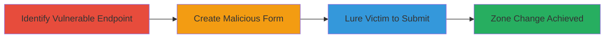

---
tags:
  - csrf
  - web
  - api
  - instacart
type: attack_chain
tools: []
tactics:
  - '[[Initial Access]]'
commands:
  - '[[commands/test-csrf-endpoint-curl]]'
verified: false
platforms:
  - Web
submitted: true
complexity: medium
created_at: '2023-10-01T12:00:00Z'
procedures:
  - '[[procedures/Identify-Instacart-CSRF-Vulnerable-Endpoint]]'
  - '[[procedures/Craft-Malicious-CSRF-HTML-Form]]'
  - '[[procedures/Social-Engineer-Victim-for-CSRF-Submission]]'
step_count: 3
techniques:
  - '[[Exploit Public-Facing Application]]'
updated_at: '2025-12-14T17:27:50.208Z'
description: >-
  A multi-step CSRF attack targeting Instacart's admin API to unauthorizedly
  change authenticated users' zone settings via forged POST requests.
skill_level: intermediate
impact_level: high
id: 2103dc6b-c5cd-4866-8426-16eadc6d6d4a
validated: true
mitre_tactics:
  - '[[Initial Access]]'
mitre_techniques:
  - '[[Exploit Public-Facing Application]]'
---
# CSRF Exploitation on Instacart Admin API to Alter User Zones

Multi-stage attack chain demonstrating a complete CSRF workflow against Instacart's admin API.

## Chain Metrics Dashboard

| Metric | Value |
|--------|-------|
| Chain Status | Unverified |
| Total Steps | 3 |
| Execution Time | ~5 minutes |
| Skill Level | Intermediate |
| Complexity | Medium |
| Impact Level | High |

## Attack Flow Visualization



## Prerequisites & Requirements

### Required Tools

- Web browser for testing
- Text editor for HTML crafting

### Target Environment

- Web platform
- Access to Instacart admin API (https://admin.instacart.com)
- No specific ports or services beyond standard HTTPS (443)

### Initial Access Requirements

- Victim must be authenticated to Instacart (session cookie present)
- Attacker needs to host malicious HTML on a controllable domain
- No prior network access to internal systems required

## Detailed Attack Procedures

### Step 1: Identify Vulnerable Endpoint
procedure: [[procedures/Identify-Instacart-CSRF-Vulnerable-Endpoint]]

**Objective**: Discover the CSRF-vulnerable API endpoint that allows zone updates without token validation.

**Instructions**: Use browser developer tools or [[commands/test-csrf-endpoint-curl]] to probe the endpoint. Inspect network requests during legitimate zone changes to confirm parameters 'zip' and 'override' are accepted via POST without CSRF tokens.

```bash
curl -X POST https://admin.instacart.com/api/v2/zones -d "zip=10001&override=true" -b "session_cookie_value"
```

**Expected Output**: HTTP 200 response indicating successful zone update if authenticated.

**Success Indicators**:
- Endpoint responds to POST without CSRF token
- Zone update occurs without additional validation

### Step 2: Craft Malicious Form
procedure: [[procedures/Craft-Malicious-CSRF-HTML-Form]]

**Objective**: Create an HTML form that auto-submits forged data to the vulnerable endpoint.

**Instructions**: Write HTML with a hidden form targeting the endpoint. Set action to https://admin.instacart.com/api/v2/zones, method POST, and fields for zip (e.g., 10001) and override=true. Use JavaScript to auto-submit on page load.

**Expected Output**: Form submission alters the victim's zone upon loading the page.

**Success Indicators**:
- Form HTML validates in browser
- Test submission changes zone in a controlled environment

### Step 3: Lure Victim
procedure: [[procedures/Social-Engineer-Victim-for-CSRF-Submission]]

**Objective**: Trick an authenticated Instacart user into visiting the malicious page, triggering the zone change.

**Instructions**: Host the HTML on a phishing site or via email link. Ensure the victim is logged into Instacart so their session cookie is sent with the request.

**Expected Output**: Victim's zone updated to attacker's chosen zip code, disrupting service.

**Success Indicators**:
- Victim visits site while authenticated
- API logs show forged request from victim's IP

## Attack Chain Summary

### Key Achievements

1. Identified CSRF lack in zone update API
2. Crafted exploitable HTML payload
3. Enabled unauthorized zone manipulation for any user

## Technique & Tactic Coverage

### MITRE ATT&CK Techniques

- [[Exploit Public-Facing Application]]

### MITRE ATT&CK Tactics

- [[Initial Access]]

---
*Last updated: 2023-10-01T12:00:00Z*
