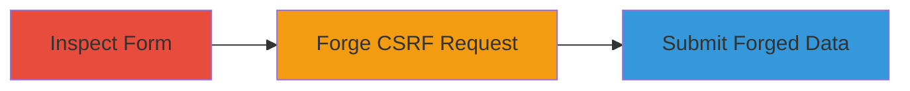

# CSRF Exploitation on Legal Robot Webhook Endpoint

Multi-stage attack chain demonstrating a complete attack workflow exploiting a CSRF vulnerability in the Legal Robot webhook endpoint.

## Chain Metrics Dashboard

| Metric | Value |
|--------|-------|
| Chain Status | Unverified |
| Total Steps | 2 |
| Execution Time | ~5 minutes |
| Skill Level | Beginner |
| Complexity | Low |
| Impact Level | Low |

## Attack Flow Visualization

## Prerequisites & Requirements

### Required Tools

- Browser Developer Tools

### Target Environment

- Web application (Legal Robot beta page)
- Required services/ports: HTTPS on port 443
- Network access requirements: Internet access to app.legalrobot.com

### Initial Access Requirements

- Authenticated user session on Legal Robot
- No special credentials beyond standard login
- Prior access needed: Ability to visit the beta/nl page

## Detailed Attack Procedures

### Step 1: Inspect Form Submission
procedure: [[procedures/Inspect-Web-Form-for-CSRF-Protections]]

**Objective**: Analyze the webhook form submission to identify lack of CSRF protections.

**Instructions**: Open the Legal Robot beta page at https://www.legalrobot.com/beta/nl/ in a browser. Use developer tools to monitor network requests during form submission. Submit the form with sample data (e.g., firstName: Test, lastName: User, email: test@example.com) and inspect the POST request to /webhooks/beta.

**Expected Output**: POST request details showing form fields (firstName, lastName, position, company, email, language) without CSRF tokens.

**Success Indicators**:
- Request intercepted in dev tools
- No anti-CSRF headers or tokens observed

### Step 2: Demonstrate CSRF Exploitation
procedure: [[procedures/Craft-Malicious-CSRF-Form-for-Webhook-Submission]]

**Objective**: Create and deliver a malicious page that forges a submission to the webhook endpoint using a victim's authenticated session.

**Instructions**: Create an HTML file with a hidden form targeting https://app.legalrobot.com/webhooks/beta. Set form fields to forged values (e.g., firstName: Attacker, email: attacker@evil.com, language: nl). Use JavaScript to auto-submit the form on page load. Host the page on a controllable server and trick the victim into visiting it while authenticated to Legal Robot.

**Expected Output**: Forged POST request submitted, potentially creating a webhook entry with attacker-controlled data.

**Success Indicators**:
- Form auto-submits in victim's browser
- Server logs confirm POST to webhook endpoint
- No errors in console indicating CSRF block

## Attack Chain Summary

### Key Achievements

1. Identified missing CSRF protections on public webhook endpoint
2. Demonstrated ability to forge user data submissions cross-site
3. Highlighted low-impact risk due to endpoint's public nature

## Technique & Tactic Coverage

### MITRE ATT&CK Techniques

- [[Exploit Public-Facing Application]]

### MITRE ATT&CK Tactics

- [[Initial Access]]

---
*Last updated: 2023-10-01T00:00:00Z*
