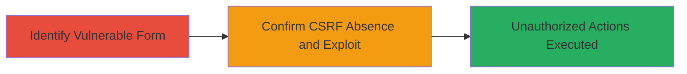

---
tags:
  - csrf
  - web
  - authentication-bypass
type: attack_chain
tools: []
tactics:
  - '[[Initial Access]]'
verified: false
platforms:
  - Web
submitted: true
complexity: low
created_at: '2023-10-01T00:00:00Z'
procedures:
  - '[[procedures/Identify-Vulnerable-Login-Form]]'
  - '[[procedures/Confirm-and-Exploit-CSRF-Absence]]'
step_count: 2
techniques:
  - '[[Exploit Public-Facing Application]]'
updated_at: '2025-12-14T17:27:15.826Z'
description: >-
  A multi-stage attack chain exploiting the absence of CSRF protection on the
  Localize.io login form, allowing attackers to force authenticated users to
  perform unauthorized actions such as logins or data modifications.
skill_level: beginner
impact_level: high
id: 98d7da4d-6514-4965-9e92-39f732d6d689
validated: true
mitre_tactics:
  - '[[Initial Access]]'
mitre_techniques:
  - '[[Exploit Public-Facing Application]]'
---
# CSRF Exploitation on Localize.io Login Form for Unauthorized User Actions

Multi-stage attack chain demonstrating a complete attack workflow targeting the lack of CSRF protection on the login form at http://www.localize.io/, enabling attackers to trick users into executing unauthorized commands on their behalf.

## Chain Metrics Dashboard

| Metric | Value |
|--------|-------|
| Chain Status | Unverified |
| Total Steps | 2 |
| Execution Time | ~5 minutes |
| Skill Level | Beginner |
| Complexity | Low |
| Impact Level | High |

## Attack Flow Visualization



## Prerequisites & Requirements

### Required Tools

- Web browser with developer tools (e.g., Chrome DevTools)

### Target Environment

- Web platform
- Accessible login form at http://www.localize.io/
- No specific ports or services beyond standard HTTP/HTTPS

### Initial Access Requirements

- Public network access to the target site
- No prior credentials needed for discovery

## Detailed Attack Procedures

### Step 1: Identify Vulnerable Login Form
procedure: [[procedures/Identify-Vulnerable-Login-Form]]

**Objective**: Locate and inspect the login form to identify potential CSRF vulnerabilities by examining form inputs.

**Instructions**: Navigate to http://www.localize.io/ using a web browser. Open developer tools (F12 or right-click > Inspect) and examine the HTML source of the login form. Look for input fields named `sign_in[username]` (text type) and `sign_in[password]` (password type). Note the form's action URL and method (typically POST to the login endpoint).

**Expected Output**: Visible form elements without any anti-CSRF mechanisms like hidden tokens.

**Success Indicators**:
- Form inputs for username and password are present and unprotected.
- No CSRF token input field observed.

### Step 2: Confirm and Exploit CSRF Absence
procedure: [[procedures/Confirm-and-Exploit-CSRF-Absence]]

**Objective**: Verify the lack of CSRF protection and demonstrate exploitation by simulating an unauthorized form submission from a malicious site.

**Instructions**: Create a simple HTML page on a local server or use browser console to craft a form submission. For example, use the following HTML to simulate a malicious login attempt:

```html
<!DOCTYPE html>
<html>
<body>
<form action="http://www.localize.io/login" method="POST" id="csrf-poc">
    <input type="hidden" name="sign_in[username]" value="attacker@evil.com">
    <input type="hidden" name="sign_in[password]" value="weakpass123">
</form>
<script>document.getElementById('csrf-poc').submit();</script>
</body>
</html>
```

Host this on a separate domain (e.g., via Python's SimpleHTTPServer) and trick a user into visiting it while authenticated or to force a login as the attacker's account. Submit the form to confirm it processes without token validation.

**Expected Output**: The target site processes the login or action without rejecting due to missing CSRF token.

**Success Indicators**:
- Form submission succeeds without errors.
- User is logged in as specified credentials or performs unintended action.

## Attack Chain Summary

### Key Achievements

1. Identified unprotected login form inputs.
2. Confirmed CSRF vulnerability through inspection and test submission.
3. Demonstrated potential for unauthorized actions, such as account takeover via forced login.

## Technique & Tactic Coverage

### MITRE ATT&CK Techniques

- [[Exploit Public-Facing Application]]

### MITRE ATT&CK Tactics

- [[Initial Access]]

---
*Last updated: 2023-10-01T00:00:00Z*
