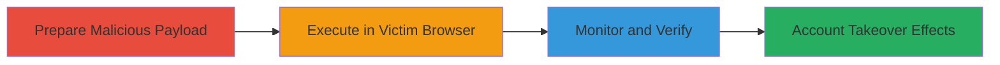

---
tags:
  - csrf
  - xss
  - web
  - account-takeover
type: attack_chain
tools:
  - '[[tools/Browser]]'
  - '[[tools/Browser-Developer-Tools]]'
  - '[[tools/CORS-Anywhere-Proxy]]'
tactics:
  - '[[Initial Access]]'
verified: false
platforms:
  - Web
submitted: true
complexity: medium
created_at: '2024-01-01T00:00:00Z'
procedures:
  - '[[procedures/Prepare-Malicious-HTML-for-CSRF-Login-Forgery]]'
  - '[[procedures/Deploy-and-Execute-CSRF-Payload-in-Victim-Browser]]'
  - '[[procedures/Monitor-Network-Response-for-Exploitation-Verification]]'
step_count: 3
techniques:
  - '[[Exploit Public-Facing Application]]'
  - '[[Drive-by Compromise]]'
  - '[[JavaScript]]'
updated_at: '2025-12-14T17:27:35.894Z'
description: >-
  A multi-stage CSRF attack targeting the login endpoint of analytics.mopub.com
  to force victims to authenticate as the attacker, enabling monitoring, social
  engineering, and unauthorized actions.
skill_level: intermediate
impact_level: high
id: bce3c7f8-8c1d-4d97-878d-e678908841f2
validated: true
mitre_tactics:
  - '[[Initial Access]]'
mitre_techniques:
  - '[[Exploit Public-Facing Application]]'
  - '[[Drive-by Compromise]]'
  - '[[JavaScript]]'
---
# CSRF Exploitation on MoPub Analytics Login for Forced Account Login

Multi-stage attack chain demonstrating a complete CSRF workflow on the MoPub analytics platform to forge login requests and hijack victim sessions.

## Chain Metrics Dashboard

| Metric | Value |
|--------|-------|
| Chain Status | Unverified |
| Total Steps | 3 |
| Execution Time | ~5 minutes |
| Skill Level | Intermediate |
| Complexity | Medium |
| Impact Level | High |

## Attack Flow Visualization

## Prerequisites & Requirements

### Required Tools

- [[tools/Browser]]
- [[tools/Browser-Developer-Tools]]
- [[tools/CORS-Anywhere-Proxy]]

### Target Environment

- Web platform
- Access to analytics.mopub.com/login endpoint
- No specific ports or services beyond standard HTTPS (443)

### Initial Access Requirements

- Attacker credentials for MoPub account
- Victim must visit a malicious page (e.g., via phishing or drive-by)
- Network access to the internet for proxy usage

## Detailed Attack Procedures

### Step 1: Prepare Malicious Payload
procedure: [[procedures/Prepare-Malicious-HTML-for-CSRF-Login-Forgery]]

**Objective**: Create a forged login request payload using HTML and JavaScript to target the vulnerable endpoint.

**Instructions**: Edit an HTML file to include the attacker's credentials in an AJAX POST request, prepending the target URL with the CORS proxy to bypass restrictions. The payload sends JSON data to https://analytics.mopub.com/login without CSRF tokens.

**Expected Output**: A ready-to-deploy HTML file (e.g., csrfinlogin.html) that automates the forged request.

**Success Indicators**:
- HTML file saved with valid JSON payload containing attacker's username and password
- No syntax errors in JavaScript code

### Step 2: Execute in Victim Browser
procedure: [[procedures/Deploy-and-Execute-CSRF-Payload-in-Victim-Browser]]

**Objective**: Trick the victim into loading the malicious HTML, triggering the CSRF request from their authenticated context.

**Instructions**: Host or send the HTML file to the victim (e.g., via email or malicious site). Upon loading in the victim's browser, the AJAX executes automatically, forging the login as the attacker.

**Expected Output**: The victim's browser sends the POST request to the login endpoint, potentially logging them into the attacker's account.

**Success Indicators**:
- Page loads without errors in victim browser
- Network tab shows outgoing POST request to the proxied endpoint

### Step 3: Monitor and Verify Exploitation
procedure: [[procedures/Monitor-Network-Response-for-Exploitation-Verification]]

**Objective**: Observe the response to confirm successful CSRF exploitation and identify any secondary issues like XSS.

**Instructions**: Use developer tools to inspect the network response from the forged request, checking status codes for success or failure.

**Expected Output**: Response status (200 for success, 401 for failure, 400 for bad request potentially leading to XSS).

**Success Indicators**:
- 200 status indicates victim is now logged in as attacker
- 400 status may reveal reflected input for further XSS exploitation

## Attack Chain Summary

### Key Achievements

1. Bypassed CSRF protections on the login endpoint using a simple HTML payload
2. Forced victim authentication into attacker's account, enabling activity monitoring and unauthorized actions
3. Identified potential XSS via content-sniffing in error responses

## Technique & Tactic Coverage

### MITRE ATT&CK Techniques

- [[Exploit Public-Facing Application]]
- [[Drive-by Compromise]]
- [[JavaScript]]

### MITRE ATT&CK Tactics

- [[Initial Access]]

---

*Last updated: 2024-01-01T00:00:00Z*
