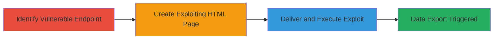

---
tags:
  - csrf
  - shopify
  - api
  - data-exfiltration
  - web
type: attack_chain
tools: []
tactics:
  - '[[Initial Access]]'
  - '[[Collection]]'
verified: false
platforms:
  - Web
submitted: true
complexity: medium
created_at: '2023-10-01T00:00:00Z'
procedures:
  - '[[procedures/Identify-Vulnerable-Shopify-Partner-API-Endpoint]]'
  - '[[procedures/Create-Auto-Submitting-HTML-Form-for-CSRF-Exploitation]]'
  - '[[procedures/Host-and-Deliver-Malicious-HTML-to-Authenticated-Victim]]'
step_count: 3
techniques:
  - '[[Drive-by Compromise]]'
  - '[[JavaScript]]'
updated_at: '2025-12-14T17:27:42.261Z'
description: >-
  A multi-stage CSRF attack targeting the Shopify Partner API endpoint lacking
  protection, allowing unauthorized export of sensitive app installation data
  via a malicious HTML page.
skill_level: intermediate
impact_level: high
id: 0e2a452f-7455-4375-9b9f-fcf9fad5e579
validated: true
mitre_tactics:
  - '[[Initial Access]]'
  - '[[Collection]]'
mitre_techniques:
  - '[[Drive-by Compromise]]'
  - '[[JavaScript]]'
---
---
id: 123e4567-e89b-12d3-a456-426614174000
name: CSRF Exploitation on Shopify Partner API to Export Installed Users Data
type: attack_chain
description: A multi-stage CSRF attack targeting the Shopify Partner API endpoint lacking protection, allowing unauthorized export of sensitive app installation data via a malicious HTML page.
verified: false
submitted: false
step_count: 3
created_at: 2023-10-01T00:00:00Z
updated_at: 2023-10-01T00:00:00Z
procedures: [[procedures/Identify-Vulnerable-Shopify-Partner-API-Endpoint]], [[procedures/Create-Auto-Submitting-HTML-Form-for-CSRF-Exploitation]], [[procedures/Host-and-Deliver-Malicious-HTML-to-Authenticated-Victim]]
techniques: [[Drive-by Compromise]], [[JavaScript]]
tactics: [[Initial Access]], [[Collection]]
tags: csrf, shopify, api, data-exfiltration, web
platforms: Web
tools: []
---

# CSRF Exploitation on Shopify Partner API to Export Installed Users Data

Multi-stage attack chain demonstrating a complete attack workflow exploiting missing CSRF protection on the Shopify Partner API to force authenticated users to export sensitive app installation data.

## Chain Metrics Dashboard

| Metric | Value |
|--------|-------|
| Chain Status | Unverified |
| Total Steps | 3 |
| Execution Time | ~5 minutes |
| Skill Level | Intermediate |
| Complexity | Medium |
| Impact Level | High |

## Attack Flow Visualization



## Prerequisites & Requirements

### Required Tools

- Text editor (e.g., VS Code)
- Web server (e.g., Python's built-in HTTP server)

### Target Environment

- Web platform
- Shopify Partner API services
- No specific ports required; operates over HTTPS

### Initial Access Requirements

- Knowledge of target app ID
- Ability to lure authenticated Shopify partners to a malicious page (e.g., via phishing email or link)
- No prior credentials needed for attacker

## Detailed Attack Procedures

### Step 1: Identify Vulnerable Endpoint
procedure: [[procedures/Identify-Vulnerable-Shopify-Partner-API-Endpoint]]

**Objective**: Locate and verify the unprotected API endpoint that allows exporting installed users without CSRF checks.

**Instructions**: Manually test the Shopify Partner API endpoint by sending a GET request to https://app.shopify.com/services/partners/api_clients/{app_id}/export_installed_users, replacing {app_id} with a known app ID. Observe that no authentication tokens or CSRF tokens are required, and the request succeeds if the browser is authenticated as a partner.

**Expected Output**: Successful response containing exported user installation data in CSV or similar format.

**Success Indicators**:
- Endpoint responds with data without CSRF errors
- No token validation prompts

### Step 2: Create Exploiting HTML Page
procedure: [[procedures/Create-Auto-Submitting-HTML-Form-for-CSRF-Exploitation]]

**Objective**: Develop a malicious HTML page that automatically submits a form to the vulnerable endpoint upon loading.

**Instructions**: Use a text editor to create an HTML file with a form targeting the endpoint. Include JavaScript to auto-submit the form on page load. Replace {app_id} with the target app's ID. Save as index.html.

Example HTML structure:

```html
<!DOCTYPE html>
<html>
<head><title>Loading...</title></head>
<body>
<form id="csrf-form" action="https://app.shopify.com/services/partners/api_clients/{app_id}/export_installed_users" method="GET">
</form>
<script>document.getElementById('csrf-form').submit();</script>
</body>
</html>
```

**Expected Output**: HTML file ready for hosting.

**Success Indicators**:
- Form auto-submits when page loads in browser
- No visible user interaction required

### Step 3: Deliver and Execute the Exploit
procedure: [[procedures/Host-and-Deliver-Malicious-HTML-to-Authenticated-Victim]]

**Objective**: Host the HTML page and trick an authenticated Shopify partner into visiting it, triggering the unauthorized export.

**Instructions**: Host the HTML file using a simple web server, e.g., run `python -m http.server 8000` in the directory. Obtain the hosting URL (e.g., http://attacker-ip:8000). Send the URL to the victim via email, chat, or social engineering. When the victim (authenticated in Shopify) visits, the form submits automatically.

**Expected Output**: Victim's browser exports the data to the attacker's controlled endpoint or logs the request.

**Success Indicators**:
- Victim visits the page
- Server logs show GET request to Shopify endpoint
- Data export completes silently

## Attack Chain Summary

### Key Achievements

1. Identified unprotected API endpoint for user data export
2. Crafted invisible CSRF exploit via auto-submitting form
3. Successfully exfiltrated sensitive installation data without victim awareness

## Technique & Tactic Coverage

### MITRE ATT&CK Techniques

- [[Drive-by Compromise]] Drive-by Compromise
- [[JavaScript]] JavaScript

### MITRE ATT&CK Tactics

- [[Initial Access]] Initial Access
- [[Collection]] Collection

---
*Last updated: 2023-10-01T00:00:00Z*
