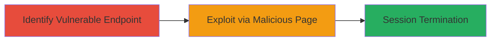

# CSRF Exploitation on Simplenote Logout Endpoint to Force User Logout

Multi-stage attack chain demonstrating a complete attack workflow exploiting CSRF on the logout endpoint to disrupt user sessions.

## Chain Metrics Dashboard

| Metric | Value |
|--------|-------|
| Chain Status | Unverified |
| Total Steps | 2 |
| Execution Time | ~1 minute |
| Skill Level | Beginner |
| Complexity | Low |
| Impact Level | Medium |

## Attack Flow Visualization

## Prerequisites & Requirements

### Required Tools

- None (uses standard browser and HTML)

### Target Environment

- Web platform
- Target: app.simplenote.com (logged-in user session)
- No specific ports or services required beyond HTTP/HTTPS

### Initial Access Requirements

- Victim must be authenticated to Simplenote
- Attacker needs to lure victim to malicious page (e.g., via phishing link)
- No prior credentials or network access needed

## Detailed Attack Procedures

### Step 1: Identify Vulnerable Logout Endpoint
procedure: [[procedures/Identify-CSRF-Vulnerability-in-Logout-Endpoint]]

**Objective**: Discover the logout endpoint and confirm lack of CSRF protections to enable cross-origin exploitation.

**Instructions**: Inspect the application's logout functionality to identify the endpoint URL and request method. Verify that it uses GET without origin checks or tokens by testing cross-origin requests.

**Expected Output**: Confirmation that https://app.simplenote.com/logout accepts unauthenticated GET requests from external origins, resulting in logout.

**Success Indicators**:
- Endpoint responds to GET without CSRF token validation
- Cross-origin request successfully logs out a test session

### Step 2: Exploit CSRF to Force Logout
procedure: [[procedures/Exploit-CSRF-via-Malicious-HTML-Image-Tag]]

**Objective**: Craft and deploy a malicious page that triggers the vulnerable endpoint, forcing the victim's browser to send a logout request.

**Instructions**: Create an HTML page with an img tag pointing to the logout endpoint. Host it on an attacker-controlled domain and trick the victim into visiting the page while logged in.

**Expected Output**: Victim's session terminates upon page load, redirecting them to the login page.

**Success Indicators**:
- Victim's browser loads the img tag and sends GET to /logout
- Simplenote session ends, disrupting user access

## Attack Chain Summary

### Key Achievements

1. Identified CSRF vulnerability in GET-based logout endpoint
2. Demonstrated exploitation via simple HTML img tag
3. Achieved involuntary session termination for authenticated users

## Technique & Tactic Coverage

### MITRE ATT&CK Techniques

- [[Exploit Public-Facing Application]]

### MITRE ATT&CK Tactics

- [[Initial Access]]

---
*Last updated: 2023-10-01T00:00:00Z*
