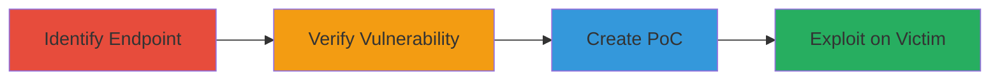

---
tags:
  - csrf
  - web
  - asp.net
type: attack_chain
tools: []
tactics:
  - '[[Initial Access]]'
verified: false
platforms:
  - Web
submitted: true
complexity: medium
created_at: '2023-10-01T00:00:00Z'
procedures:
  - '[[procedures/Identify-Comment-Submission-Endpoint]]'
  - '[[procedures/Verify-Absence-of-CSRF-Protection]]'
  - '[[procedures/Create-and-Host-CSRF-Proof-of-Concept-Page]]'
  - '[[procedures/Demonstrate-CSRF-Exploitation-on-Victim]]'
step_count: 4
techniques:
  - '[[Exploit Public-Facing Application]]'
updated_at: '2025-12-14T17:27:22.503Z'
description: >-
  A multi-stage attack chain exploiting a CSRF vulnerability in the Starbucks
  blog comment feature to post unauthorized comments on behalf of authenticated
  users.
skill_level: intermediate
impact_level: medium
id: 0a5d4f51-55c1-4325-8619-796bfba51341
validated: true
mitre_tactics:
  - '[[Initial Access]]'
mitre_techniques:
  - '[[Exploit Public-Facing Application]]'
---
# CSRF Exploitation on Starbucks Blog Comment Submission for Unauthorized Posting

Multi-stage attack chain demonstrating a complete CSRF workflow on blogs.starbucks.com, allowing attackers to post comments without user knowledge.

## Chain Metrics Dashboard

| Metric | Value |
|--------|-------|
| Chain Status | Unverified |
| Total Steps | 4 |
| Execution Time | ~5 minutes |
| Skill Level | Intermediate |
| Complexity | Medium |
| Impact Level | Medium |

## Attack Flow Visualization



## Prerequisites & Requirements

### Required Tools

- Web browser with developer tools (e.g., Chrome DevTools)
- Local web server (e.g., Python's http.server) for hosting PoC

### Target Environment

- Web platform
- Authenticated user session on blogs.starbucks.com
- No specific ports or services beyond standard HTTPS (443)

### Initial Access Requirements

- Attacker must lure victim to malicious page (e.g., via phishing link)
- Victim must be authenticated on the target site
- No prior credentials needed for attacker

## Detailed Attack Procedures

### Step 1: Identify Comment Submission Endpoint
procedure: [[procedures/Identify-Comment-Submission-Endpoint]]

**Objective**: Locate the vulnerable comment posting endpoint on the target blog.

**Instructions**: Navigate to a blog article on blogs.starbucks.com, such as /blogs/customer/archive/2016/05/06/starbucks-doubleshot-174-energy-coffee-makes-a-flavorful-foray-into-the-realm-of-spiced-coffee.aspx. Use browser developer tools to inspect the comment form and capture the POST request details, including form fields like __VIEWSTATE, tbComment, and submit button coordinates.

**Expected Output**: Details of the POST request to the endpoint, confirming form data structure.

**Success Indicators**:
- Endpoint URL identified
- Form parameters captured

### Step 2: Verify Absence of CSRF Protection
procedure: [[procedures/Verify-Absence-of-CSRF-Protection]]

**Objective**: Confirm the endpoint lacks CSRF token validation, enabling cross-origin submissions.

**Instructions**: Analyze the captured POST request in developer tools or a proxy like Burp Suite. Check for absence of CSRF tokens in headers or form data and note the Content-Type: application/x-www-form-urlencoded, which allows cross-origin forms.

**Expected Output**: No CSRF token present; request succeeds without it.

**Success Indicators**:
- No token field observed
- Cross-origin test submission possible

### Step 3: Create and Host CSRF Proof-of-Concept Page
procedure: [[procedures/Create-and-Host-CSRF-Proof-of-Concept-Page]]

**Objective**: Build a malicious HTML page that auto-submits the comment form to the vulnerable endpoint.

**Instructions**: Create an HTML file mimicking the comment form, set to auto-submit on load. Host it on a server, e.g., using Python: `python -m http.server 8000`. Example HTML:

```html
<!DOCTYPE html>
<html>
<body>
<form id="csrf-form" action="https://blogs.starbucks.com/blogs/customer/archive/2016/05/06/starbucks-doubleshot-174-energy-coffee-makes-a-flavorful-foray-into-the-realm-of-spiced-coffee.aspx" method="POST">
<input type="hidden" name="__VIEWSTATE" value="[CAPTURED_VALUE]" />
<input type="hidden" name="tbComment" value="qwqw" />
<!-- Add other hidden fields as captured -->
</form>
<script>document.getElementById('csrf-form').submit();</script>
</body>
</html>
```

**Expected Output**: Page loads and automatically submits the form.

**Success Indicators**:
- Form auto-submits without user interaction
- Page accessible via hosted URL

### Step 4: Demonstrate CSRF Exploitation on Victim
procedure: [[procedures/Demonstrate-CSRF-Exploitation-on-Victim]]

**Objective**: Trick an authenticated victim into visiting the PoC, resulting in unauthorized comment posting.

**Instructions**: Lure the victim (who is logged into blogs.starbucks.com) to the hosted PoC URL, e.g., https://attacker.com/starg.html. Upon visit, the form submits automatically, posting the comment from the victim's account.

**Expected Output**: Confirmation message on the target site: 'Thanks for sharing your feedback! If your feedback doesn't appear right away, please be patient as it may take a few minutes to publish.'

**Success Indicators**:
- Comment appears on the blog under victim's account
- No user consent required

## Attack Chain Summary

### Key Achievements

1. Identified vulnerable comment endpoint without CSRF protection
2. Created auto-submitting PoC for cross-origin exploitation
3. Demonstrated unauthorized comment posting via victim interaction
4. Highlighted potential for spam or malicious content injection

## Technique & Tactic Coverage

### MITRE ATT&CK Techniques

- [[Exploit Public-Facing Application]]

### MITRE ATT&CK Tactics

- [[Initial Access]]

---
*Last updated: 2023-10-01T00:00:00Z*
