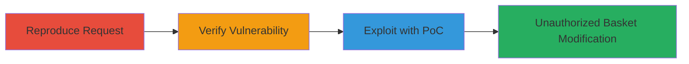

---
tags:
  - csrf
  - web
  - teavana
  - demandware
  - salesforce-commerce-cloud
type: attack_chain
tools: []
tactics:
  - '[[Initial Access]]'
verified: false
platforms:
  - Web
submitted: true
complexity: low
created_at: '2023-10-01T00:00:00Z'
procedures:
  - '[[procedures/Reproduce-Coupon-Addition-Request]]'
  - '[[procedures/Verify-Missing-CSRF-Protection]]'
  - '[[procedures/Craft-CSRF-Proof-of-Concept]]'
step_count: 3
techniques:
  - '[[Exploit Public-Facing Application]]'
updated_at: '2025-12-14T17:27:29.823Z'
description: >-
  Exploits a missing CSRF token in the Teavana website's coupon addition
  endpoint to unauthorizedly add coupons to an authenticated user's shopping
  basket.
skill_level: beginner
impact_level: low
id: c73aab05-56d9-4c38-a397-b496eb0fdb6a
validated: true
mitre_tactics:
  - '[[Initial Access]]'
mitre_techniques:
  - '[[Exploit Public-Facing Application]]'
---
# CSRF Exploitation on Teavana Coupon Addition Endpoint

Multi-stage attack chain demonstrating a complete CSRF vulnerability exploitation workflow on the Teavana website, allowing unauthorized addition of coupons to a user's shopping basket.

## Chain Metrics Dashboard

| Metric | Value |
|--------|-------|
| Chain Status | Unverified |
| Total Steps | 3 |
| Execution Time | ~5 minutes |
| Skill Level | Beginner |
| Complexity | Low |
| Impact Level | Low |

## Attack Flow Visualization



## Prerequisites & Requirements

### Required Tools

- Browser with developer tools (e.g., Chrome DevTools)

### Target Environment

- Web platform
- Demandware (Salesforce Commerce Cloud)
- Authenticated user session on Teavana website

### Initial Access Requirements

- Valid user account on Teavana
- Network access to the website
- No prior elevated access needed

## Detailed Attack Procedures

### Step 1: Reproduce Coupon Addition Request
procedure: [[procedures/Reproduce-Coupon-Addition-Request]]

**Objective**: Manually simulate the legitimate coupon addition process to capture the HTTP request details.

**Instructions**: Log in to the Teavana website as an authenticated user. Navigate to the basket or checkout page, enter the coupon code 'BOGO50', and submit it. Use browser developer tools to intercept and inspect the resulting POST request.

**Expected Output**: Captured POST request to `/on/demandware.store/Sites-Teavana-Site/default/Home-AddCouponToBasket` with parameters `couponcode=BOGO50` and `format=ajax`.

**Success Indicators**:
- Coupon successfully added to basket
- Request details logged without errors

### Step 2: Verify Missing CSRF Protection
procedure: [[procedures/Verify-Missing-CSRF-Protection]]

**Objective**: Analyze the captured request to confirm the absence of CSRF token validation.

**Instructions**: In the developer tools network tab, examine the POST request headers and body for any CSRF token (e.g., no `X-CSRF-Token` header or `__csrf` parameter). Attempt to replay the request using [[commands/curl-add-coupon-csrf]] from a different origin to test if it succeeds without authentication context.

```bash
curl -X POST 'https://www.teavana.com/on/demandware.store/Sites-Teavana-Site/default/Home-AddCouponToBasket' -d 'couponcode=BOGO50&format=ajax' -H 'Cookie: your-session-cookie'
```

**Expected Output**: Request succeeds without a CSRF token, confirming the vulnerability.

**Success Indicators**:
- No CSRF token present in request
- Replayable request modifies basket

### Step 3: Craft CSRF Proof-of-Concept
procedure: [[procedures/Craft-CSRF-Proof-of-Concept]]

**Objective**: Build an HTML form that tricks an authenticated user into submitting the malicious request via cross-site forgery.

**Instructions**: Create a simple HTML page with a form that auto-submits the POST request to the vulnerable endpoint. Host it on a different domain and lure the victim (authenticated Teavana user) to visit it.

Example PoC HTML:

```html
<!DOCTYPE html>
<html>
<body>
<form id="csrf-form" action="https://www.teavana.com/on/demandware.store/Sites-Teavana-Site/default/Home-AddCouponToBasket" method="POST">
    <input type="hidden" name="couponcode" value="BOGO50">
    <input type="hidden" name="format" value="ajax">
</form>
<script>document.getElementById('csrf-form').submit();</script>
</body>
</html>
```

**Expected Output**: When visited by an authenticated user, the form submits and adds the coupon without user interaction.

**Success Indicators**:
- Coupon added to victim's basket
- No user consent required

## Attack Chain Summary

### Key Achievements

1. Identified and verified CSRF vulnerability in coupon endpoint
2. Demonstrated unauthorized basket modification
3. Created functional PoC for exploitation

## Technique & Tactic Coverage

### MITRE ATT&CK Techniques

- [[Exploit Public-Facing Application]]

### MITRE ATT&CK Tactics

- [[Initial Access]]

---
*Last updated: 2023-10-01T00:00:00Z*
