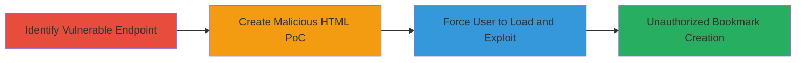

# CSRF Exploitation on TopCoder Wiki Bookmark Creation for Unauthorized Actions

Multi-stage attack chain demonstrating a complete attack workflow exploiting CSRF in the TopCoder wiki to create unauthorized bookmarks on behalf of authenticated users.

## Chain Metrics Dashboard

| Metric | Value |
|--------|-------|
| Chain Status | Unverified |
| Total Steps | 3 |
| Execution Time | ~5 minutes |
| Skill Level | Intermediate |
| Complexity | Medium |
| Impact Level | High |

## Attack Flow Visualization



## Prerequisites & Requirements

### Required Tools

- Web browser for testing
- Text editor for creating HTML files

### Target Environment

- Web platform running Java servlets (TopCoder wiki)
- Endpoint: https://apps.topcoder.com/wiki/plugins/socialbookmarking/updatebookmark.action
- No specific ports or services beyond standard HTTPS (443)

### Initial Access Requirements

- Attacker needs to identify the target wiki
- Victim must be an authenticated user of TopCoder (logged in via https://accounts.topcoder.com/member)
- No prior network access beyond public internet; relies on social engineering to get victim to open HTML file

## Detailed Attack Procedures

### Step 1: Identify Vulnerable Endpoint
procedure: [[procedures/Identify-CSRF-Vulnerable-Endpoint]]

**Objective**: Examine the bookmark creation endpoint to confirm the absence of CSRF protections, establishing the foundation for exploitation.

**Instructions**: Manually inspect the form submission endpoint using browser developer tools or direct requests. Navigate to the TopCoder wiki and attempt to create a bookmark, monitoring the network tab for the POST request to https://apps.topcoder.com/wiki/plugins/socialbookmarking/updatebookmark.action. Verify no CSRF token is included in the request headers or form fields.

**Expected Output**: Confirmation that the endpoint accepts POST requests without token validation, allowing cross-origin submissions.

**Success Indicators**:
- No CSRF token observed in form or headers
- Endpoint responds to unauthenticated or cross-origin POSTs with successful bookmark creation when cookies are present

### Step 2: Create Malicious HTML PoC
procedure: [[procedures/Create-CSRF-Proof-of-Concept-HTML]]

**Objective**: Develop a proof-of-concept HTML file that automatically submits a forged request to the vulnerable endpoint, simulating unauthorized bookmark creation.

**Instructions**: Use a text editor to create an HTML file named csrf.html. Include a hidden form that targets the vulnerable endpoint with parameters for bookmark creation (e.g., title, URL, description). Add JavaScript to auto-submit the form on page load. Example structure:

```html
<!DOCTYPE html>
<html>
<body>
<form id="csrfForm" action="https://apps.topcoder.com/wiki/plugins/socialbookmarking/updatebookmark.action" method="post">
    <input type="hidden" name="title" value="Malicious Bookmark">
    <input type="hidden" name="url" value="http://evil.com">
    <input type="hidden" name="description" value="CSRF PoC">
</form>
<script>document.getElementById('csrfForm').submit();</script>
</body>
</html>
```
Save the file and host it or prepare for delivery to the victim.

**Expected Output**: A functional HTML file that, when loaded, triggers an automatic POST request to the endpoint.

**Success Indicators**:
- Form submission occurs without user interaction
- Local testing (with mocked endpoint) confirms auto-submission

### Step 3: Exploit CSRF via Malicious HTML
procedure: [[procedures/Exploit-CSRF-via-Malicious-HTML]]

**Objective**: Trick an authenticated user into loading the malicious HTML, resulting in unauthorized bookmark creation on their behalf.

**Instructions**: Deliver the csrf.html file to the victim via email, phishing link, or shared drive, ensuring they are logged into TopCoder. When the victim opens the file in their browser (while authenticated), the form auto-submits using their session cookies to create the bookmark. If login issues arise, direct to https://accounts.topcoder.com/member for re-authentication.

**Expected Output**: A new bookmark appears in the victim's TopCoder wiki account without their consent.

**Success Indicators**:
- Bookmark created in victim's account
- No user interaction required beyond opening the HTML file
- Attack works across origins due to missing CSRF protections

## Attack Chain Summary

### Key Achievements

1. Identified and confirmed CSRF vulnerability in bookmark endpoint
2. Created a stealthy HTML-based exploit for drive-by execution
3. Demonstrated unauthorized state-changing action on authenticated users

## Technique & Tactic Coverage

### MITRE ATT&CK Techniques

- [[Exploit Public-Facing Application]]
- [[Drive-by Compromise]]

### MITRE ATT&CK Tactics

- [[Initial Access]]
- [[Execution]]

---

*Last updated: 2023-10-01T00:00:00Z*
