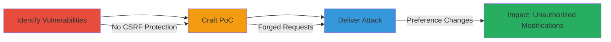

---
tags:
  - csrf
  - web
  - topcoder
  - wiki
  - user-preferences
type: attack_chain
tools: []
tactics:
  - '[[Initial Access]]'
verified: false
platforms:
  - Web
submitted: true
complexity: medium
created_at: '2023-10-01T00:00:00Z'
procedures:
  - '[[procedures/Identify-CSRF-Vulnerable-Endpoints]]'
  - '[[procedures/Craft-CSRF-Proof-of-Concept-HTML]]'
  - '[[procedures/Deliver-CSRF-Attack-via-Malicious-Webpage]]'
step_count: 3
techniques:
  - '[[Exploit Public-Facing Application]]'
  - '[[Drive-by Compromise]]'
updated_at: '2025-12-14T17:27:15.952Z'
description: >-
  A multi-stage attack chain exploiting CSRF vulnerabilities in the TopCoder
  wiki application's user preference editing endpoints to force authenticated
  users to alter their settings without consent.
skill_level: intermediate
impact_level: high
id: 3d0b1351-0c36-4efe-8c0a-c25971231a78
validated: true
mitre_tactics:
  - '[[Initial Access]]'
mitre_techniques:
  - '[[Exploit Public-Facing Application]]'
  - '[[Drive-by Compromise]]'
---
# CSRF Exploitation on TopCoder Wiki User Preferences

Multi-stage attack chain demonstrating a complete CSRF workflow against the TopCoder wiki application.

## Chain Metrics Dashboard

| Metric | Value |
|--------|-------|
| Chain Status | Unverified |
| Total Steps | 3 |
| Execution Time | ~5 minutes |
| Skill Level | Intermediate |
| Complexity | Medium |
| Impact Level | High |

## Attack Flow Visualization

## Prerequisites & Requirements

### Required Tools

- Web browser developer tools (e.g., Chrome DevTools)
- Text editor for HTML (e.g., VS Code)

### Target Environment

- Web platform
- TopCoder wiki application at https://apps.topcoder.com/wiki
- No specific ports or services beyond standard HTTPS (443)

### Initial Access Requirements

- Attacker needs to host or control a malicious webpage
- Victim must be an authenticated user of the TopCoder wiki
- No prior credentials or network access to the target required; relies on social engineering

## Detailed Attack Procedures

### Step 1: Identify Vulnerable Endpoints
procedure: [[procedures/Identify-CSRF-Vulnerable-Endpoints]]

**Objective**: Inspect the target application's endpoints to confirm the absence of CSRF protections, identifying state-changing POST requests that can be forged.

**Instructions**: Use browser developer tools to examine the network requests during normal preference editing. Navigate to the login page at https://apps.topcoder.com/wiki/login.action or https://accounts.topcoder.com/member to authenticate, then attempt to edit preferences via https://apps.topcoder.com/wiki/users/editmypreferences.action and https://apps.topcoder.com/wiki/users/editemailpreferences.action. Monitor for CSRF tokens in the HTML forms or request headers.

**Expected Output**: Confirmation that no CSRF tokens, origin checks, or same-site cookie attributes are present in the requests.

**Success Indicators**:
- POST requests to preference endpoints lack anti-CSRF mechanisms
- Forms can be replicated without authentication tokens

### Step 2: Craft Proof-of-Concept HTML
procedure: [[procedures/Craft-CSRF-Proof-of-Concept-HTML]]

**Objective**: Develop malicious HTML files that automatically submit forged POST requests to the vulnerable endpoints, simulating user preference changes.

**Instructions**: Create two HTML files: one for general preferences (csrf_general.html) and one for email preferences (csrf_mail.html). Embed hidden forms that target the endpoints with arbitrary values, using JavaScript to auto-submit upon page load.

**Expected Output**: Functional HTML files that, when loaded in a browser, send POST requests mimicking authenticated user actions.

**Success Indicators**:
- HTML files load and submit requests without errors
- Requests match the structure of legitimate preference updates

### Step 3: Deliver CSRF Attack via Malicious Webpage
procedure: [[procedures/Deliver-CSRF-Attack-via-Malicious-Webpage]]

**Objective**: Lure the authenticated victim to visit the malicious webpage, triggering the automatic submission of forged requests to alter their preferences.

**Instructions**: Host the PoC HTML files on a controlled server or use a service like GitHub Pages. Distribute the link via phishing email, social engineering, or embedded in another site. Ensure the victim is logged into the TopCoder wiki before visiting.

**Expected Output**: Victim's preferences (general and email) are modified without their interaction, as confirmed by checking the account settings post-attack.

**Success Indicators**:
- Victim visits the page while authenticated
- Server logs show successful POST requests to TopCoder endpoints
- Attacker verifies changes via secondary access or victim report

## Attack Chain Summary

### Key Achievements

1. Identified CSRF vulnerabilities in user preference endpoints without anti-CSRF protections.
2. Created targeted PoC HTML to forge preference modifications.
3. Demonstrated impact through drive-by preference changes on authenticated users.

## Technique & Tactic Coverage

### MITRE ATT&CK Techniques

- [[Exploit Public-Facing Application]] Exploit Public-Facing Application
- [[Drive-by Compromise]] Drive-by Compromise

### MITRE ATT&CK Tactics

- [[Initial Access]] Initial Access

---
*Last updated: 2023-10-01T00:00:00Z*
