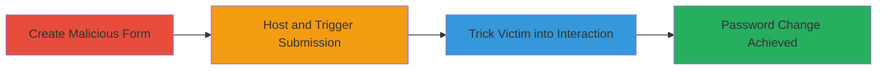

---
tags:
  - csrf
  - wordpress
  - web-vulnerability
type: attack_chain
tools: []
tactics:
  - '[[Initial Access]]'
verified: false
platforms:
  - Web
submitted: true
complexity: medium
created_at: '2023-10-01T00:00:00Z'
procedures:
  - '[[procedures/Create-Malicious-CSRF-HTML-Form]]'
  - '[[procedures/Host-and-Trigger-CSRF-Form]]'
  - '[[procedures/Social-Engineering-Victim-Interaction]]'
step_count: 3
techniques:
  - '[[Exploit Public-Facing Application]]'
  - '[[Drive-by Compromise]]'
updated_at: '2025-12-14T17:27:15.442Z'
description: >-
  A multi-stage CSRF attack targeting the unprotected WordPress post password
  submission form on Uber's newsroom site, allowing an attacker to trick
  authenticated users into changing the post password to an attacker-controlled
  value.
skill_level: intermediate
impact_level: low
id: 069539e8-5862-4a97-b6f1-909899c24236
validated: true
mitre_tactics:
  - '[[Initial Access]]'
mitre_techniques:
  - '[[Exploit Public-Facing Application]]'
  - '[[Drive-by Compromise]]'
---
# CSRF Exploitation on Uber Newsroom WordPress Post Password Form

Multi-stage attack chain demonstrating a complete CSRF workflow against the Uber newsroom WordPress site.

## Chain Metrics Dashboard

| Metric | Value |
|--------|-------|
| Chain Status | Unverified |
| Total Steps | 3 |
| Execution Time | ~5 minutes |
| Skill Level | Intermediate |
| Complexity | Medium |
| Impact Level | Low |

## Attack Flow Visualization

## Prerequisites & Requirements

### Required Tools

- None (manual HTML creation and browser-based execution)

### Target Environment

- Web platform with WordPress
- Access to https://newsroom.uber.com/india/how-to-refer/ or similar protected post
- Victim must be authenticated to the WordPress admin or login area

### Initial Access Requirements

- No prior credentials needed for attacker
- Victim requires active session on the target site
- Network access to host malicious page (local or remote)

## Detailed Attack Procedures

### Step 1: Create Malicious CSRF HTML Form
procedure: [[procedures/Create-Malicious-CSRF-HTML-Form]]

**Objective**: Generate an HTML page that automatically submits a forged POST request to the vulnerable WordPress form, setting the post password to an attacker-controlled value.

**Instructions**: Manually create an HTML file with a form targeting the vulnerable endpoint. Use a text editor to write the code, including hidden fields for the password and submit action.

**Expected Output**: A file named `submit.html` ready for hosting or local loading.

**Success Indicators**:
- HTML file created without syntax errors
- Form action points to `https://newsroom.uber.com/india/wp-login.php?action=postpass&wpe-login=ubernewblog`

### Step 2: Host and Trigger CSRF Form
procedure: [[procedures/Host-and-Trigger-CSRF-Form]]

**Objective**: Load the malicious HTML in a browser to simulate or prepare the forged request submission.

**Instructions**: Open the `submit.html` file in a web browser, either locally or by hosting it on a simple server. Click the submit button to test the POST request.

**Expected Output**: The browser submits the POST request to the target URL, potentially altering the post password if tested in an authenticated session.

**Success Indicators**:
- Form submits without errors
- Network tab in browser dev tools shows POST to the WordPress endpoint with `post_password=xxxxxxx`

### Step 3: Social Engineering Victim Interaction
procedure: [[procedures/Social-Engineering-Victim-Interaction]]

**Objective**: Deceive an authenticated victim into visiting the malicious page, triggering the CSRF attack and changing the post password.

**Instructions**: Distribute the link to the hosted `submit.html` via phishing email, social media, or other means. Ensure the victim is logged into the Uber newsroom WordPress site.

**Expected Output**: Victim's session forges the request, setting the post password to the attacker's value (e.g., 'xxxxxxx').

**Success Indicators**:
- Victim reports accessing a suspicious page
- Attacker verifies the post password change by attempting access to the protected content

## Attack Chain Summary

### Key Achievements

1. Identified missing CSRF tokens in WordPress form
2. Crafted and delivered a functional CSRF payload
3. Demonstrated low-impact password modification on a protected post

## Technique & Tactic Coverage

### MITRE ATT&CK Techniques

- [[Exploit Public-Facing Application]] Exploit Public-Facing Application
- [[Drive-by Compromise]] Drive-by Compromise

### MITRE ATT&CK Tactics

- [[Initial Access]] Initial Access

---

*Last updated: 2023-10-01T00:00:00Z*
