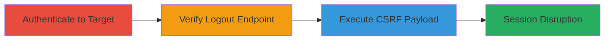

---
tags:
  - csrf
  - web
  - logout
  - weblate
  - session-disruption
type: attack_chain
tools: []
tactics:
  - '[[Initial Access]]'
  - '[[Execution]]'
verified: false
platforms:
  - Web
submitted: true
complexity: low
created_at: '2023-10-01T00:00:00Z'
procedures:
  - '[[procedures/Authenticate-to-Weblate-via-SAML]]'
  - '[[procedures/Verify-Direct-Logout-Endpoint]]'
  - '[[procedures/Execute-CSRF-Logout-via-Malicious-Link]]'
step_count: 3
techniques:
  - '[[Drive-by Compromise]]'
  - '[[Exploit Public-Facing Application]]'
updated_at: '2025-12-14T17:27:49.503Z'
description: >-
  A multi-stage attack demonstrating CSRF vulnerability in Weblate's logout
  action, allowing attackers to force logged-in users to logout via malicious
  links without CSRF protection.
skill_level: beginner
impact_level: medium
id: 2e20f5f0-f8ff-4c25-a28a-5efe7eb5e300
validated: true
mitre_tactics:
  - '[[Initial Access]]'
  - '[[Execution]]'
mitre_techniques:
  - '[[Drive-by Compromise]]'
  - '[[Exploit Public-Facing Application]]'
---
# CSRF Exploitation on Weblate Logout Endpoint for Forced User Logout

Multi-stage attack chain demonstrating a complete attack workflow exploiting the lack of CSRF protection on Weblate's logout endpoint, allowing an attacker to disrupt user sessions by forcing involuntary logouts through crafted malicious links.

## Chain Metrics Dashboard

| Metric | Value |
|--------|-------|
| Chain Status | Unverified |
| Total Steps | 3 |
| Execution Time | ~2 minutes |
| Skill Level | Beginner |
| Complexity | Low |
| Impact Level | Medium |

## Attack Flow Visualization

## Prerequisites & Requirements

### Required Tools

- Web browser (e.g., Chrome or Firefox)

### Target Environment

- Web platform
- Weblate instance (e.g., https://weblate.org)
- SAML authentication enabled

### Initial Access Requirements

- Valid username and password for Weblate account
- Network access to the target Weblate site
- No prior session required, but target must be authenticated

## Detailed Attack Procedures

### Step 1: Authenticate to Weblate
procedure: [[procedures/Authenticate-to-Weblate-via-SAML]]

**Objective**: Establish an authenticated session on the target Weblate instance to simulate a legitimate user state for testing the logout vulnerability.

**Instructions**: Navigate to the Weblate homepage and complete the login process using provided credentials. This sets up the session that will be targeted by the CSRF exploit.

**Expected Output**: Successful login redirect to the dashboard, with user profile visible in the top-right corner.

**Success Indicators**:
- User is logged in and can access protected pages
- No authentication errors

### Step 2: Verify Direct Logout Endpoint
procedure: [[procedures/Verify-Direct-Logout-Endpoint]]

**Objective**: Confirm that the logout endpoint is accessible and functional without additional protections, setting the stage for CSRF exploitation.

**Instructions**: While authenticated, directly access the logout URL in a new tab or via browser developer tools to observe the session termination.

**Expected Output**: Immediate logout and redirect to login page, confirming the endpoint's behavior.

**Success Indicators**:
- Session ends upon accessing /logout/
- No CSRF token prompt or error

### Step 3: Execute CSRF Logout via Malicious Link
procedure: [[procedures/Execute-CSRF-Logout-via-Malicious-Link]]

**Objective**: Trick the authenticated user into clicking a malicious link that triggers the unprotected logout endpoint, demonstrating the CSRF vulnerability.

**Instructions**: Create a simple external HTML page hosting the crafted link, then have the authenticated user visit and click it. Verify the effect by refreshing the original Weblate tab.

**Expected Output**: User's session logs out involuntarily upon link click, disrupting access to the application.

**Success Indicators**:
- Original tab shows login prompt after refresh
- No user consent required for logout

## Attack Chain Summary

### Key Achievements

1. Successful authentication to establish a testable session
2. Verification of unprotected logout endpoint
3. Demonstration of CSRF leading to forced session termination and potential denial of service

## Technique & Tactic Coverage

### MITRE ATT&CK Techniques

- [[Drive-by Compromise]]
- [[Exploit Public-Facing Application]]

### MITRE ATT&CK Tactics

- [[Initial Access]]
- [[Execution]]

---

*Last updated: 2023-10-01T00:00:00Z*
