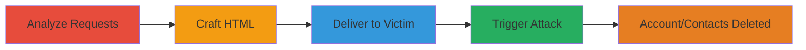

---
tags:
  - csrf
  - web
  - account-deletion
  - contact-erasure
type: attack_chain
tools:
  - '[[tools/Burp-Suite]]'
tactics:
  - '[[Initial Access]]'
verified: false
platforms:
  - Web
submitted: true
complexity: medium
created_at: '2023-10-01T00:00:00Z'
procedures:
  - '[[procedures/Analyze-HTTP-Requests-for-CSRF-Vulnerabilities]]'
  - '[[procedures/Craft-Malicious-HTML-for-CSRF-Exploitation]]'
  - '[[procedures/Deliver-Malicious-HTML-to-Victim]]'
  - '[[procedures/Trigger-CSRF-Attack-via-Victim-Interaction]]'
step_count: 4
techniques:
  - '[[Exploit Public-Facing Application]]'
  - '[[Drive-by Compromise]]'
updated_at: '2025-12-14T17:27:23.537Z'
description: >-
  A multi-stage CSRF attack exploiting missing tokens on m.badoo.com to delete
  victim accounts or erase imported contacts via malicious HTML files.
skill_level: intermediate
impact_level: high
id: 96a75712-c9b4-4df0-b35b-6af1ab7519d4
validated: true
mitre_tactics:
  - '[[Initial Access]]'
mitre_techniques:
  - '[[Exploit Public-Facing Application]]'
  - '[[Drive-by Compromise]]'
---
# CSRF Exploitation on m.badoo.com for Unauthorized Account Deletion and Contact Erasure

Multi-stage attack chain demonstrating a complete CSRF workflow on the m.badoo.com subdomain, exploiting missing CSRF tokens in POST requests for account deletion and contact erasure.

## Chain Metrics Dashboard

| Metric | Value |
|--------|-------|
| Chain Status | Unverified |
| Total Steps | 4 |
| Execution Time | ~10 minutes |
| Skill Level | Intermediate |
| Complexity | Medium |
| Impact Level | High |

## Attack Flow Visualization

## Prerequisites & Requirements

### Required Tools

- [[tools/Burp-Suite]]

### Target Environment

- Web platform targeting m.badoo.com subdomain
- Active victim session required
- No specific ports; standard HTTPS (443)

### Initial Access Requirements

- Victim must have an active authenticated session on m.badoo.com
- Attacker needs a way to deliver HTML files (e.g., email, messaging)
- No prior credentials needed for attacker

## Detailed Attack Procedures

### Step 1: Analyze HTTP Requests for CSRF Vulnerabilities
procedure: [[procedures/Analyze-HTTP-Requests-for-CSRF-Vulnerabilities]]

**Objective**: Identify missing CSRF protections in POST requests for account deletion and contact erasure endpoints.

**Instructions**: Configure Burp Suite as a proxy to intercept traffic from a browser session on m.badoo.com. Perform actions like attempting account deletion or contact erasure to capture the requests. Inspect for absence of CSRF tokens and note any JSON content-type issues.

**Expected Output**: Captured POST requests without CSRF tokens; identification of JSON parsing flaw where '=' is appended, bypassable with dummy parameter.

**Success Indicators**:
- No CSRF token observed in request headers or body
- JSON response shows appended '=' character

### Step 2: Craft Malicious HTML for CSRF Exploitation
procedure: [[procedures/Craft-Malicious-HTML-for-CSRF-Exploitation]]

**Objective**: Create HTML files that forge POST requests to the vulnerable endpoints without needing CSRF tokens.

**Instructions**: Write two HTML files: one targeting account deletion (eado(delete).html) and one for contact erasure (badoo(erase_contacts).html). Each file includes a form with action set to the vulnerable POST endpoint, including necessary parameters and the dummy 'ignore_me':' value='test' to bypass JSON issues. Ensure forms auto-submit or include a submit button.

**Expected Output**: Valid HTML files ready for delivery that mimic the original requests.

**Success Indicators**:
- HTML forms POST to correct m.badoo.com endpoints
- Dummy parameter included to handle JSON flaw

### Step 3: Deliver Malicious HTML to Victim
procedure: [[procedures/Deliver-Malicious-HTML-to-Victim]]

**Objective**: Send the crafted HTML files to the target victim to enable interaction.

**Instructions**: Transmit the HTML files via email, direct messaging, or file sharing services. Include instructions or social engineering to encourage the victim to open the file in their browser while logged into m.badoo.com.

**Expected Output**: Victim receives and opens the HTML file in a browser with an active m.badoo.com session.

**Success Indicators**:
- Victim confirms receipt or opens the file
- Browser session remains active on m.badoo.com

### Step 4: Trigger CSRF Attack via Victim Interaction
procedure: [[procedures/Trigger-CSRF-Attack-via-Victim-Interaction]]

**Objective**: Execute the forged requests to perform unauthorized deletion or erasure.

**Instructions**: Instruct the victim to click the submit button in the HTML file, or design the HTML to auto-submit on load. Monitor for success by checking if the victim's account or contacts are affected.

**Expected Output**: Server responds with success for deletion/erasure; victim's account deleted or contacts erased.

**Success Indicators**:
- POST request sent from victim's browser
- Account deletion or contact erasure confirmed on m.badoo.com

## Attack Chain Summary

### Key Achievements

1. Identified CSRF vulnerability via request analysis
2. Bypassed JSON parsing issue with dummy parameter
3. Successfully deleted victim account or erased contacts without authentication

## Technique & Tactic Coverage

### MITRE ATT&CK Techniques

- [[Exploit Public-Facing Application]]
- [[Drive-by Compromise]]

### MITRE ATT&CK Tactics

- [[Initial Access]]

---
*Last updated: 2023-10-01T00:00:00Z*
