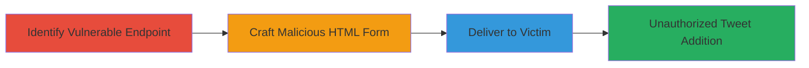

---
tags:
  - csrf
  - twitter
  - web-vulnerability
  - session-hijacking
type: attack_chain
tools: []
tactics:
  - '[[Initial Access]]'
verified: false
platforms:
  - Web
submitted: true
complexity: medium
created_at: '2023-10-01T00:00:00Z'
procedures:
  - '[[procedures/Identify-CSRF-Vulnerable-Endpoint-in-Twitter-Curator]]'
  - '[[procedures/Craft-Malicious-HTML-Form-for-Twitter-CSRF]]'
  - '[[procedures/Deliver-CSRF-Payload-to-Victim-via-Social-Engineering]]'
step_count: 3
techniques:
  - '[[Drive-by Compromise]]'
  - '[[Exploit Public-Facing Application]]'
updated_at: '2025-12-14T17:27:35.880Z'
description: >-
  A multi-stage CSRF attack targeting Twitter's curator feature to
  unauthorizedly add tweets to a victim's collection by forging POST requests
  without CSRF protection.
skill_level: intermediate
impact_level: high
id: 1021dc24-d577-4d21-9e82-8dbba3b7ffa1
validated: true
mitre_tactics:
  - '[[Initial Access]]'
mitre_techniques:
  - '[[Drive-by Compromise]]'
  - '[[Exploit Public-Facing Application]]'
---
# CSRF Exploitation to Add Arbitrary Tweets to Twitter User Collections

Multi-stage attack chain demonstrating a complete CSRF workflow against Twitter's curator feature, allowing unauthorized addition of tweets to a user's personal collection.

## Chain Metrics Dashboard

| Metric | Value |
|--------|-------|
| Chain Status | Unverified |
| Total Steps | 3 |
| Execution Time | ~5 minutes |
| Skill Level | Intermediate |
| Complexity | Medium |
| Impact Level | High |

## Attack Flow Visualization

## Prerequisites & Requirements

### Required Tools

- None (manual web development tools like a text editor for HTML)

### Target Environment

- Web platform
- Twitter Collections (Curator) service
- No specific ports; requires internet access

### Initial Access Requirements

- Attacker must know the victim's Twitter collection ID (e.g., via public profile or enumeration)
- Victim must be authenticated (logged in) to Twitter
- No prior credentials needed for attacker; exploits session cookies

## Detailed Attack Procedures

### Step 1: Identify Vulnerable Endpoint
procedure: [[procedures/Identify-CSRF-Vulnerable-Endpoint-in-Twitter-Curator]]

**Objective**: Locate the Twitter API endpoint for adding content to collections and confirm lack of CSRF protection.

**Instructions**: Manually inspect Twitter's curator interface using browser developer tools to identify the POST endpoint. Test by attempting to add a tweet to a collection and observe the network request for parameters like tweet_ids[], collections[], and model[id]. Verify no CSRF token is required by simulating a request from an external context.

**Expected Output**: Confirmation of endpoint https://curator.twitter.com/api/collections/STREAM/content accepting POST without token validation.

**Success Indicators**:
- Endpoint identified with required parameters
- Test request succeeds without CSRF token

### Step 2: Craft Malicious HTML Form
procedure: [[procedures/Craft-Malicious-HTML-Form-for-Twitter-CSRF]]

**Objective**: Create an auto-submitting HTML form that forges a POST request to the vulnerable endpoint using victim-supplied parameters.

**Instructions**: Use a text editor to build an HTML page with a form targeting the endpoint. Include hidden inputs for tweet_ids[] (e.g., a malicious tweet ID like '667977435124658176'), collections[] (victim's collection ID), and model[id] ('STREAM'). Add JavaScript to auto-submit the form on page load.

**Expected Output**: A functional HTML file that, when loaded, submits the forged request.

**Success Indicators**:
- Form HTML validates and auto-submits in a browser test
- Parameters correctly mimic legitimate request

### Step 3: Deliver CSRF Payload to Victim
procedure: [[procedures/Deliver-CSRF-Payload-to-Victim-via-Social-Engineering]]

**Objective**: Trick the authenticated victim into loading the malicious page, triggering the CSRF attack.

**Instructions**: Host the HTML file on a controllable server (e.g., GitHub Pages or a personal site) or send it via email/phishing link. Entice the victim to click the link while logged into Twitter, ensuring the page loads in their browser to submit the request using their session cookies.

**Expected Output**: Tweet added to victim's collection without their interaction.

**Success Indicators**:
- Victim visits the page while authenticated
- Collection updated with arbitrary tweet (verifiable in victim's Twitter)

## Attack Chain Summary

### Key Achievements

1. Identified unprotected CSRF endpoint in Twitter's API
2. Crafted and delivered a functional exploit via HTML form
3. Achieved unauthorized modification of user data, enabling spam or disruption

## Technique & Tactic Coverage

### MITRE ATT&CK Techniques

- [[Drive-by Compromise]]
- [[Exploit Public-Facing Application]]

### MITRE ATT&CK Tactics

- [[Initial Access]]

---
*Last updated: 2023-10-01T00:00:00Z*
