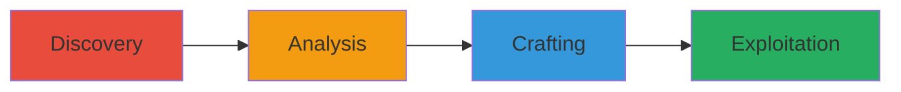

# CSRF Exploitation to Add Unauthorized Album on onpatient.com

Multi-stage attack chain demonstrating a complete CSRF workflow on the onpatient.com photos feature.

## Chain Metrics Dashboard

| Metric | Value |
|--------|-------|
| Chain Status | Unverified |
| Total Steps | 4 |
| Execution Time | ~5 minutes |
| Skill Level | Intermediate |
| Complexity | Medium |
| Impact Level | Medium |

## Attack Flow Visualization

## Prerequisites & Requirements

### Required Tools

- [[tools/Burp-Proxy]]

### Target Environment

- Web platform: onpatient.com
- Required services/ports: HTTPS (443)
- Network access requirements: Internet access to onpatient.com

### Initial Access Requirements

- Attacker account on onpatient.com
- Victim must be authenticated (logged in) to onpatient.com
- No prior access to victim account needed beyond social engineering for page visit

## Detailed Attack Procedures

### Step 1: Discover CSRF Vulnerability in Album Addition
procedure: [[procedures/Discover-CSRF-Vulnerability-in-Album-Addition]]

**Objective**: Identify the album addition feature and trigger the POST request to observe the endpoint behavior.

**Instructions**: Log in as an attacker to onpatient.com, navigate to the photos section, and attempt to add an album named 'hacking' to initiate the POST request to https://onpatient.com/photos/add_album/.

**Expected Output**: The request is sent, and the album is added successfully.

**Success Indicators**:
- Album added to attacker's account
- POST endpoint identified as /photos/add_album/

### Step 2: Analyze Request with Burp Proxy
procedure: [[procedures/Analyze-Request-with-Burp-Proxy]]

**Objective**: Intercept and inspect the request to confirm lack of CSRF token enforcement.

**Instructions**: Configure Burp Proxy to intercept traffic, repeat the album addition action, and examine the request headers for X-CSRFToken and sessionid. Remove the X-CSRFToken and resend the request to verify it still succeeds.

**Expected Output**: Request succeeds without X-CSRFToken, confirming the vulnerability.

**Success Indicators**:
- Headers show X-CSRFToken is present but not required
- Modified request without token adds album successfully

### Step 3: Craft Malicious CSRF HTML Form
procedure: [[procedures/Craft-Malicious-CSRF-HTML-Form]]

**Objective**: Create a form that submits a forged request to the vulnerable endpoint without the CSRF token.

**Instructions**: Write an HTML file (e.g., form-csrf.html) with a POST form targeting https://onpatient.com/photos/add_album/, including a hidden input for the album name 'hacking', and an auto-submitting script or button.

**Expected Output**: HTML page ready for delivery that, when loaded by a victim, submits the forged request.

**Success Indicators**:
- Form HTML validates and targets the correct endpoint
- No X-CSRFToken included in the form

### Step 4: Deliver and Execute CSRF Attack on Victim
procedure: [[procedures/Deliver-and-Execute-CSRF-Attack-on-Victim]]

**Objective**: Trick the victim into loading the malicious page while authenticated, forcing the unauthorized album addition.

**Instructions**: Host or email the HTML file to the victim. When the victim visits the page while logged into onpatient.com, the form auto-submits, adding the 'hacking' album to their account. The response includes the new album ID confirming success.

**Expected Output**: Victim's account shows the unauthorized 'hacking' album; server responds with album ID.

**Success Indicators**:
- Album added to victim's photos section
- Server response: JSON or HTML confirming album creation with ID

## Attack Chain Summary

### Key Achievements

1. Identified CSRF vulnerability in album addition endpoint
2. Confirmed token bypass via proxy analysis
3. Crafted and delivered malicious form for exploitation
4. Demonstrated account manipulation without victim interaction beyond page visit

## Technique & Tactic Coverage

### MITRE ATT&CK Techniques

- [[Exploit Public-Facing Application]]

### MITRE ATT&CK Tactics

- [[Initial Access]]

---

*Last updated: 2023-10-01T00:00:00Z*
