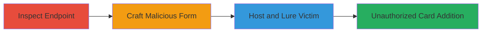

---
tags:
  - csrf
  - web
  - payment
  - starbucks
type: attack_chain
tools: []
tactics:
  - '[[Initial Access]]'
verified: false
platforms:
  - Web
submitted: true
complexity: medium
created_at: '2023-10-01T00:00:00Z'
procedures:
  - '[[procedures/Inspect-Starbucks-Credit-Card-Addition-Endpoint-for-CSRF]]'
  - '[[procedures/Craft-Malicious-HTML-Form-for-Starbucks-CSRF]]'
  - '[[procedures/Host-and-Lure-Victim-to-Starbucks-CSRF-Page]]'
step_count: 3
techniques:
  - '[[Drive-by Compromise]]'
updated_at: '2025-12-14T17:27:35.729Z'
description: >-
  A multi-stage CSRF attack on Starbucks' store website allowing attackers to
  add arbitrary credit card details to authenticated users' accounts without
  consent.
skill_level: intermediate
impact_level: high
id: 68c7dc76-3658-4640-a9da-bfa0f85375b3
validated: true
mitre_tactics:
  - '[[Initial Access]]'
mitre_techniques:
  - '[[Drive-by Compromise]]'
---
# CSRF Exploitation to Add Unauthorized Credit Card to Starbucks Account

Multi-stage attack chain demonstrating a complete CSRF workflow on store.starbucks.com to unauthorizedly save attacker-controlled credit card details to a victim's account.

## Chain Metrics Dashboard

| Metric | Value |
|--------|-------|
| Chain Status | Unverified |
| Total Steps | 3 |
| Execution Time | ~5 minutes |
| Skill Level | Intermediate |
| Complexity | Medium |
| Impact Level | High |

## Attack Flow Visualization

## Prerequisites & Requirements

### Required Tools

- Web browser for inspection (e.g., Chrome DevTools)
- Text editor for HTML crafting
- Web server for hosting malicious page (e.g., local Python server)

### Target Environment

- Web platform
- Starbucks store website (store.starbucks.com)
- Demandware (Salesforce Commerce Cloud) tech stack
- Payment processing services

### Initial Access Requirements

- Victim must be authenticated to Starbucks account
- Attacker needs a way to lure victim (e.g., phishing link)
- No special credentials for attacker; relies on victim's session

## Detailed Attack Procedures

### Step 1: Inspect Endpoint
procedure: [[procedures/Inspect-Starbucks-Credit-Card-Addition-Endpoint-for-CSRF]]

**Objective**: Identify the vulnerable credit card addition endpoint and confirm lack of CSRF protection.

**Instructions**: Open store.starbucks.com in a browser, navigate to the payment section, and use developer tools to inspect the form for adding credit cards. Look for the POST endpoint and form fields.

**Expected Output**: Endpoint URL and form fields revealed, no CSRF token present.

**Success Indicators**:
- Endpoint confirmed: https://store.starbucks.com/on/demandware.store/Sites-Starbucks-Site/default/COBilling-AddCreditCard
- Form fields include dwfrm_billing_paymentMethods_creditCard_type, owner, number, etc.

### Step 2: Craft Malicious Form
procedure: [[procedures/Craft-Malicious-HTML-Form-for-Starbucks-CSRF]]

**Objective**: Create an HTML page that auto-submits fake credit card details to the vulnerable endpoint.

**Instructions**: Use a text editor to build an HTML form with hidden inputs matching the legitimate form fields, set to auto-submit via JavaScript when the page loads. Include attacker-controlled card details.

**Expected Output**: A self-contained HTML file ready for hosting.

**Success Indicators**:
- Form auto-submits POST data silently
- Fields populated with test values (e.g., Visa card, masked number)

### Step 3: Host and Lure Victim
procedure: [[procedures/Host-and-Lure-Victim-to-Starbucks-CSRF-Page]]

**Objective**: Deploy the malicious page and trick the authenticated victim into visiting it, triggering the unauthorized card addition.

**Instructions**: Host the HTML file on an attacker-controlled server and send a phishing link to the victim (e.g., via email or social engineering). Ensure the victim is logged into Starbucks.

**Expected Output**: Victim's account now has the attacker's card saved as a payment method.

**Success Indicators**:
- Victim visits the page while authenticated
- Card details added to account without user interaction
- Potential financial misuse if used for purchases

## Attack Chain Summary

### Key Achievements

1. Identified CSRF vulnerability in payment endpoint
2. Crafted and hosted exploit delivering unauthorized card addition
3. Enabled silent account modification leading to financial impact

## Technique & Tactic Coverage

### MITRE ATT&CK Techniques

- [[Drive-by Compromise]]

### MITRE ATT&CK Tactics

- [[Initial Access]]

---
*Last updated: 2023-10-01T00:00:00Z*
