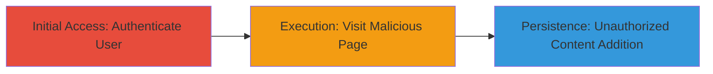

---
tags:
  - csrf
  - web
  - exploit
  - unauthorized-action
type: attack_chain
tools: []
tactics:
  - '[[Initial Access]]'
verified: false
platforms:
  - Web
submitted: true
complexity: medium
created_at: '2023-10-01T00:00:00Z'
procedures:
  - '[[procedures/Authenticate-to-delight-im]]'
  - '[[procedures/Host-and-Visit-Malicious-CSRF-PoC-Page]]'
  - '[[procedures/Execute-CSRF-Form-Submission]]'
step_count: 3
techniques:
  - '[[Drive-by Compromise]]'
updated_at: '2025-12-14T17:27:22.473Z'
description: >-
  A multi-stage attack chain exploiting a CSRF vulnerability in the delight.im
  application to force authenticated users to add unwanted movies or series to
  their account via a malicious HTML page.
skill_level: intermediate
impact_level: high
id: e0b9fa39-dc48-4bc3-bf34-109f8ea399ad
validated: true
mitre_tactics:
  - '[[Initial Access]]'
mitre_techniques:
  - '[[Drive-by Compromise]]'
---
# CSRF Exploitation to Add Unauthorized Movies or Series in delight.im

Multi-stage attack chain demonstrating a complete attack workflow exploiting CSRF in the delight.im application to add unauthorized content to a victim's account.

## Chain Metrics Dashboard

| Metric | Value |
|--------|-------|
| Chain Status | Unverified |
| Total Steps | 3 |
| Execution Time | ~2 minutes |
| Skill Level | Intermediate |
| Complexity | Medium |
| Impact Level | High |

## Attack Flow Visualization



## Prerequisites & Requirements

### Required Tools

- Web browser (e.g., Chrome, Firefox)
- Text editor for creating HTML PoC

### Target Environment

- Web platform: delight.im application
- Required services/ports: HTTP/HTTPS on standard web ports (80/443)
- Network access requirements: Internet access to delight.im and ability to host or serve malicious HTML

### Initial Access Requirements

- Victim must be a registered user of delight.im
- Attacker needs to trick victim into visiting the malicious page while logged in
- No special credentials for attacker; relies on victim's session

## Detailed Attack Procedures

### Step 1: Authenticate to delight.im
procedure: [[procedures/Authenticate-to-delight-im]]

**Objective**: Establish a valid session as the target user to enable CSRF exploitation.

**Instructions**: The victim logs into their delight.im account using their credentials via the standard login form on the website.

**Expected Output**: Successful login redirect to the dashboard or home page, with session cookies set in the browser.

**Success Indicators**:
- User is redirected to authenticated area
- Profile or account section shows logged-in state

### Step 2: Host and Visit Malicious CSRF PoC Page
procedure: [[procedures/Host-and-Visit-Malicious-CSRF-PoC-Page]]

**Objective**: Trick the authenticated user into loading a malicious HTML page that triggers the CSRF request.

**Instructions**: Create and host an HTML file (e.g., movie.html) containing an auto-submitting form targeting the delight.im add movie endpoint. Serve it via a web server or file hosting, then lure the victim to visit it while logged in.

Example HTML for movie addition:

```html
<!DOCTYPE html>
<html>
<body>
<form id="csrf-form" action="https://delight.im/add-movie" method="POST">
    <input type="hidden" name="name" value="Malicious Movie">
    <input type="hidden" name="year" value="2023">
    <input type="hidden" name="string" value="fake-imdb-id">
</form>
<script>
    document.getElementById('csrf-form').submit();
</script>
</body>
</html>
```

Host this file and send a link to the victim (e.g., via phishing email).

**Expected Output**: The page loads and automatically submits the form, sending a POST request to the vulnerable endpoint.

**Success Indicators**:
- Form submission occurs without user interaction
- Network tab in browser dev tools shows POST to /add-movie

### Step 3: Execute CSRF Form Submission
procedure: [[procedures/Execute-CSRF-Form-Submission]]

**Objective**: Bypass CSRF protections to add unauthorized movie or series to the victim's account.

**Instructions**: Upon page load, the embedded JavaScript auto-submits the form using the victim's active session cookies, exploiting the lack of CSRF token validation on the add movie/series endpoint.

**Expected Output**: The movie or series is added to the victim's account without confirmation, visible upon checking their library.

**Success Indicators**:
- Unauthorized content appears in the victim's delight.im library
- No error messages from the server indicating CSRF failure

## Attack Chain Summary

### Key Achievements

1. Established victim session for exploitation
2. Delivered and executed malicious CSRF payload via drive-by page visit
3. Successfully added unwanted content, demonstrating account manipulation

## Technique & Tactic Coverage

### MITRE ATT&CK Techniques

- [[Drive-by Compromise]]

### MITRE ATT&CK Tactics

- [[Initial Access]]

---
*Last updated: 2023-10-01T00:00:00Z*
