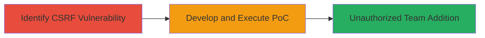

---
tags:
  - csrf
  - web-vulnerability
  - team-invite
  - unauthorized-access
type: attack_chain
tools: []
tactics:
  - '[[Initial Access]]'
verified: false
platforms:
  - Web
submitted: true
complexity: medium
created_at: '2023-10-01T00:00:00Z'
procedures:
  - '[[procedures/Identify-CSRF-Vulnerability-on-Create-Invite-Endpoint]]'
  - '[[procedures/Exploit-CSRF-with-Proof-of-Concept]]'
step_count: 2
techniques:
  - '[[Exploit Public-Facing Application]]'
updated_at: '2025-12-14T17:27:49.560Z'
description: >-
  A multi-step attack leveraging a CSRF vulnerability in the Create Invite
  endpoint of Lark Technologies' application to unauthorizedly add users to a
  team by tricking authenticated victims.
skill_level: intermediate
impact_level: high
id: 70f82dcb-375f-47b3-986e-db709a2f7b9f
validated: true
mitre_tactics:
  - '[[Initial Access]]'
mitre_techniques:
  - '[[Exploit Public-Facing Application]]'
---
# CSRF Exploitation to Add Unauthorized Users to Team via Create Invite Endpoint

Multi-stage attack chain demonstrating a complete attack workflow exploiting a CSRF vulnerability in Lark Technologies' application.

## Chain Metrics Dashboard

| Metric | Value |
|--------|-------|
| Chain Status | Unverified |
| Total Steps | 2 |
| Execution Time | ~5 minutes |
| Skill Level | Intermediate |
| Complexity | Medium |
| Impact Level | High |

## Attack Flow Visualization

## Prerequisites & Requirements

### Required Tools

- None (relies on browser and basic web development knowledge)

### Target Environment

- Web application (Lark Technologies platform)
- Authenticated user session required
- No specific ports or services beyond standard HTTPS (443)

### Initial Access Requirements

- Attacker must have a way to trick the victim into visiting a malicious page (e.g., phishing link)
- Victim must be authenticated in the Lark application
- No prior credentials needed for attacker, but social engineering for victim interaction

## Detailed Attack Procedures

### Step 1: Identify CSRF Vulnerability
procedure: [[procedures/Identify-CSRF-Vulnerability-on-Create-Invite-Endpoint]]

**Objective**: Detect the absence of CSRF protection on the Create Invite endpoint to confirm exploitability.

**Instructions**: Inspect the Create Invite functionality in the Lark application. Use browser developer tools to examine network requests when creating a legitimate invite. Verify if the endpoint (typically a POST to /api/invite or similar) lacks CSRF tokens in forms or headers, and does not enforce origin validation.

**Expected Output**: Confirmation that requests can be forged without authentication tokens specific to CSRF.

**Success Indicators**:
- No CSRF token observed in legitimate requests
- Endpoint accepts requests from arbitrary origins

### Step 2: Exploit CSRF with Proof of Concept
procedure: [[procedures/Exploit-CSRF-with-Proof-of-Concept]]

**Objective**: Craft and deliver a malicious PoC to trick an authenticated victim into adding unauthorized users to the team.

**Instructions**: Create a malicious HTML page that auto-submits a form to the Create Invite endpoint with attacker-specified user details. Host the page on a controlled server and send a link to the victim via email or chat. When the victim visits while authenticated, the request executes silently.

**Expected Output**: The victim receives no visible change, but the unauthorized user is added to the team.

**Success Indicators**:
- Invite sent to target user without victim interaction
- Attacker verifies addition via team roster or notifications

## Attack Chain Summary

### Key Achievements

1. Identified CSRF vulnerability in Create Invite endpoint
2. Developed PoC to forge team invitations
3. Enabled unauthorized team membership additions

## Technique & Tactic Coverage

### MITRE ATT&CK Techniques

- [[Exploit Public-Facing Application]]

### MITRE ATT&CK Tactics

- [[Initial Access]]

---
*Last updated: 2023-10-01T00:00:00Z*
