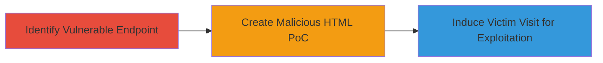

---
tags:
  - csrf
  - web-vulnerability
  - ecommerce
type: attack_chain
tools: []
tactics:
  - '[[Initial Access]]'
verified: false
platforms:
  - Web
submitted: true
complexity: medium
created_at: '2024-10-01T00:00:00Z'
procedures:
  - '[[procedures/Identify-CSRF-Vulnerable-Wishlist-Endpoint]]'
  - '[[procedures/Create-Malicious-HTML-for-CSRF-PoC]]'
  - '[[procedures/Execute-CSRF-Attack-via-Victim-Page-Visit]]'
step_count: 3
techniques:
  - '[[Exploit Public-Facing Application]]'
updated_at: '2025-12-14T17:27:29.967Z'
description: >-
  A multi-stage attack exploiting the lack of CSRF protection in the Teavana
  wishlist comments feature to remotely manipulate user comments without
  authentication or consent.
skill_level: intermediate
impact_level: medium
id: bdeac73c-6108-4de3-9ab5-08a48835050b
validated: true
mitre_tactics:
  - '[[Initial Access]]'
mitre_techniques:
  - '[[Exploit Public-Facing Application]]'
---
# CSRF Exploitation to Add or Edit Wishlist Comments on Teavana.com

Multi-stage attack chain demonstrating a complete CSRF workflow against the Teavana wishlist comments feature, allowing unauthorized manipulation of user data.

## Chain Metrics Dashboard

| Metric | Value |
|--------|-------|
| Chain Status | Unverified |
| Total Steps | 3 |
| Execution Time | ~5 minutes |
| Skill Level | Intermediate |
| Complexity | Medium |
| Impact Level | Medium |

## Attack Flow Visualization

## Prerequisites & Requirements

### Required Tools

- Browser developer tools for inspection
- Text editor for HTML creation

### Target Environment

- Web platform
- Demandware (Salesforce Commerce Cloud)
- Access to authenticated user session on teavana.com

### Initial Access Requirements

- Victim must be authenticated on teavana.com
- Attacker needs victim's wishlist ID (e.g., via social engineering or prior recon)
- No direct credentials required for attacker

## Detailed Attack Procedures

### Step 1: Identify Vulnerable Endpoint
procedure: [[procedures/Identify-CSRF-Vulnerable-Wishlist-Endpoint]]

**Objective**: Locate the POST endpoint for wishlist comments lacking CSRF protection to confirm exploitability.

**Instructions**: Use browser developer tools to inspect network requests while interacting with the wishlist comments feature on teavana.com. Look for POST requests to the Wishlist-Comments endpoint and verify absence of CSRF tokens in the request headers or form data.

**Expected Output**: Identification of the endpoint https://www.teavana.com/on/demandware.store/Sites-Teavana-Site/default/Wishlist-Comments/{wishlist_id} with parameters like wishlistComment and save, without token validation.

**Success Indicators**:
- Endpoint confirmed without CSRF token
- Request can be replicated cross-origin

### Step 2: Create Malicious HTML PoC
procedure: [[procedures/Create-Malicious-HTML-for-CSRF-PoC]]

**Objective**: Develop an HTML page that auto-submits a form to the vulnerable endpoint, simulating unauthorized comment addition.

**Instructions**: Create an HTML file with a form targeting the identified endpoint, including the payload for the comment. Use JavaScript or onload event to auto-submit the form upon page load.

**Expected Output**: A functional HTML page that, when loaded by an authenticated victim, posts data to the endpoint.

**Success Indicators**:
- Form auto-submits without user interaction
- Payload includes wishlistComment and save parameters

### Step 3: Execute CSRF Attack via Victim Page Visit
procedure: [[procedures/Execute-CSRF-Attack-via-Victim-Page-Visit]]

**Objective**: Trick the victim into visiting the malicious page while authenticated, resulting in comment manipulation.

**Instructions**: Host the PoC HTML on an attacker-controlled server or send it via phishing. When the victim visits and loads the page, the form submits automatically to add or edit the wishlist comment.

**Expected Output**: Comment added or edited in the victim's wishlist without their knowledge.

**Success Indicators**:
- Victim's wishlist shows unauthorized comment
- No alerts or blocks during submission

## Attack Chain Summary

### Key Achievements

1. Identified CSRF vulnerability in wishlist comments endpoint
2. Created and deployed a drive-by PoC for remote exploitation
3. Demonstrated medium-impact manipulation of user account data

## Technique & Tactic Coverage

### MITRE ATT&CK Techniques

- [[Exploit Public-Facing Application]]

### MITRE ATT&CK Tactics

- [[Initial Access]]

---

*Last updated: 2024-10-01T00:00:00Z*
