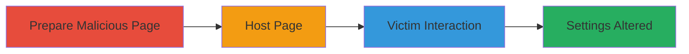

---
tags:
  - csrf
  - web-vulnerability
  - lichess
type: attack_chain
tools: []
tactics:
  - '[[Initial Access]]'
verified: false
platforms:
  - Web
submitted: true
complexity: low
created_at: '2023-10-01T00:00:00Z'
procedures:
  - '[[procedures/Prepare-CSRF-Attack-Page]]'
  - '[[procedures/Host-CSRF-Attack-Page]]'
  - '[[procedures/Deliver-CSRF-Attack-to-Victim]]'
step_count: 3
techniques:
  - '[[Exploit Public-Facing Application]]'
updated_at: '2025-12-14T17:27:57.384Z'
description: >-
  A multi-step CSRF attack targeting the Lichess network feature to
  unauthorizedly change an authenticated user's routing preferences, potentially
  degrading their connection.
skill_level: beginner
impact_level: medium
id: 89de5590-c7d7-4eb7-9597-44ad25f35e30
validated: true
mitre_tactics:
  - '[[Initial Access]]'
mitre_techniques:
  - '[[Exploit Public-Facing Application]]'
---
# CSRF Exploitation to Alter Lichess Network Routing Settings

Multi-stage attack chain demonstrating a complete CSRF workflow against the Lichess network feature.

## Chain Metrics Dashboard

| Metric | Value |
|--------|-------|
| Chain Status | Unverified |
| Total Steps | 3 |
| Execution Time | ~5 minutes |
| Skill Level | Beginner |
| Complexity | Low |
| Impact Level | Medium |

## Attack Flow Visualization



## Prerequisites & Requirements

### Required Tools

- Web hosting service (e.g., GitHub Pages, free web host)

### Target Environment

- Lichess.org web application
- Victim must be authenticated user

### Initial Access Requirements

- No prior credentials needed for attacker
- Victim's active session in Lichess
- Ability to communicate with victim (e.g., via email, chat)

## Detailed Attack Procedures

### Step 1: Prepare Malicious Page
procedure: [[procedures/Prepare-CSRF-Attack-Page]]

**Objective**: Create an HTML page containing a link that triggers the CSRF request to change network settings.

**Instructions**: Use a text editor to create an HTML file with a disguised link to the vulnerable endpoint. The link uses a GET request to /account/network?usingAltSocket=false, switching to direct routing.

```html
<html><body><a href="https://lichess.org/account/network?usingAltSocket=false">Click here to view a chess strategy</a></body></html>
```

Save the file as csrf.html.

**Expected Output**: A local HTML file ready for hosting.

**Success Indicators**:
- HTML file created without syntax errors
- Link URL correctly points to the vulnerable endpoint

### Step 2: Host the Page
procedure: [[procedures/Host-CSRF-Attack-Page]]

**Objective**: Make the malicious HTML accessible via a public URL for delivery to the victim.

**Instructions**: Upload the HTML file to an attacker-controlled web server or free hosting platform. Ensure the page loads correctly and the link is clickable.

For example, if using a local server for testing, run a simple HTTP server (though not required for production exploit):

```bash
python3 -m http.server 8000
```

Access via http://attacker-ip:8000/csrf.html.

**Expected Output**: Public URL (e.g., https://attacker-site.com/csrf.html) that serves the page.

**Success Indicators**:
- Page loads in browser without errors
- Clicking the link in a test browser (without auth) shows the GET request in network logs

### Step 3: Deliver to Victim
procedure: [[procedures/Deliver-CSRF-Attack-to-Victim]]

**Objective**: Trick the authenticated victim into visiting the page and clicking the link, executing the CSRF.

**Instructions**: Send the hosted URL to the victim via email, chat, or social engineering (e.g., "Check out this chess tip: [URL]"). Ensure the victim is logged into Lichess in their browser.

Monitor for success by checking if the victim's settings change (if observable) or by victim reports.

**Expected Output**: Victim's network routing updated to direct (usingAltSocket=false).

**Success Indicators**:
- Victim confirms clicking the link
- Victim's Lichess account shows changed network preferences
- No additional prompts during the request

## Attack Chain Summary

### Key Achievements

1. Bypassed CSRF protections to alter user settings without consent
2. Demonstrated impact on user experience via routing changes
3. Highlighted risks of state-changing GET requests in web apps

## Technique & Tactic Coverage

### MITRE ATT&CK Techniques

- [[Exploit Public-Facing Application]]

### MITRE ATT&CK Tactics

- [[Initial Access]]

---
*Last updated: 2023-10-01T00:00:00Z*
