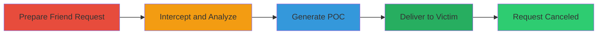

---
tags:
  - csrf
  - web
  - social-engineering
  - friend-request
type: attack_chain
tools:
  - '[[tools/Burp-Suite]]'
tactics:
  - '[[Initial Access]]'
verified: false
platforms:
  - Web
submitted: true
complexity: low
created_at: '2023-10-01T00:00:00Z'
procedures:
  - '[[procedures/Prepare-Friend-Request-on-XVIDEOS]]'
  - '[[procedures/Intercept-Cancellation-Request-with-Burp-Suite]]'
  - '[[procedures/Generate-CSRF-POC-with-Burp-Suite]]'
  - '[[procedures/Deliver-CSRF-HTML-to-Victim]]'
step_count: 4
techniques:
  - '[[Drive-by Compromise]]'
updated_at: '2025-12-14T17:27:30.014Z'
description: >-
  A multi-stage CSRF attack exploiting the lack of token protection on the
  friend request cancellation endpoint, allowing unauthorized deletion of
  pending requests via malicious HTML.
skill_level: intermediate
impact_level: low
id: c146de3c-92f5-4ee6-a3d8-4211d296537d
validated: true
mitre_tactics:
  - '[[Initial Access]]'
mitre_techniques:
  - '[[Drive-by Compromise]]'
---
# CSRF-Exploitation-to-Cancel-Pending-Friend-Requests-on-XVIDEOS

Multi-stage attack chain demonstrating a complete CSRF workflow on the XVIDEOS platform to unauthorizedly cancel pending friend requests.

## Chain Metrics Dashboard

| Metric | Value |
|--------|-------|
| Chain Status | Unverified |
| Total Steps | 4 |
| Execution Time | ~10 minutes |
| Skill Level | Intermediate |
| Complexity | Low |
| Impact Level | Low |

## Attack Flow Visualization

## Prerequisites & Requirements

### Required Tools

- [[tools/Burp-Suite]]

### Target Environment

- Web platform: XVIDEOS
- Required services/ports: HTTPS (443)
- Network access requirements: Internet access to xvideos.com

### Initial Access Requirements

- Attacker account on XVIDEOS
- Victim must be authenticated on XVIDEOS
- Ability to send HTML via email, link, or messaging

## Detailed Attack Procedures

### Step 1: Prepare Friend Request
procedure: [[procedures/Prepare-Friend-Request-on-XVIDEOS]]

**Objective**: Authenticate, send a friend request to the target, and prepare for cancellation to identify the vulnerable endpoint.

**Instructions**: Log in to your XVIDEOS account, navigate to the target user's profile, and send a friend request. Then, go to the sent requests page to confirm and select for cancellation.

**Expected Output**: Pending friend request visible in https://www.xvideos.com/account/friends/requests/sent.

**Success Indicators**:
- Friend request sent successfully
- Request appears in sent list

### Step 2: Intercept and Analyze Request
procedure: [[procedures/Intercept-Cancellation-Request-with-Burp-Suite]]

**Objective**: Capture the cancellation POST request and confirm the absence of CSRF protection.

**Instructions**: Configure Burp Suite as a proxy, trigger the cancellation, and analyze the intercepted request for missing CSRF tokens.

**Expected Output**: POST to https://www.xvideos.com/profiles/USER123/friends/requests/cancel without CSRF token.

**Success Indicators**:
- Request intercepted
- No CSRF token observed in headers or body

### Step 3: Generate CSRF POC
procedure: [[procedures/Generate-CSRF-POC-with-Burp-Suite]]

**Objective**: Create a proof-of-concept HTML page that simulates the vulnerable POST request.

**Instructions**: Use Burp's built-in tool to generate the CSRF HTML form from the intercepted request, then customize it with the target user ID.

**Expected Output**: HTML file with a form posting to the cancellation endpoint.

**Success Indicators**:
- POC HTML generated
- Form submits without authentication

### Step 4: Deliver and Execute
procedure: [[procedures/Deliver-CSRF-HTML-to-Victim]]

**Objective**: Trick the victim into loading and submitting the malicious HTML, resulting in request cancellation.

**Instructions**: Host or send the HTML page to the victim (e.g., via phishing link), ensuring they are logged in to XVIDEOS.

**Expected Output**: Victim's pending friend request deleted upon form submission.

**Success Indicators**:
- Victim interacts with HTML
- Friend request canceled on victim's account

## Attack Chain Summary

### Key Achievements

1. Identified CSRF vulnerability in friend request cancellation
2. Generated and delivered exploitable POC HTML
3. Demonstrated unauthorized action on victim's behalf

## Technique & Tactic Coverage

### MITRE ATT&CK Techniques

- [[Drive-by Compromise]]

### MITRE ATT&CK Tactics

- [[Initial Access]]

---

*Last updated: 2023-10-01T00:00:00Z*
