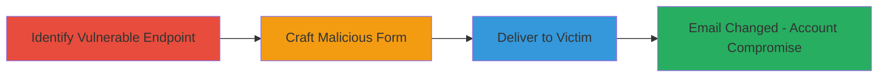

---
tags:
  - csrf
  - web
  - account-takeover
  - tiktok
type: attack_chain
tools: []
tactics:
  - '[[Initial Access]]'
verified: false
platforms:
  - Web
submitted: true
complexity: medium
created_at: '2022-04-05'
procedures:
  - '[[procedures/Identify-CSRF-Vulnerable-Endpoint]]'
  - '[[procedures/Craft-Malicious-CSRF-Form]]'
  - '[[procedures/Deliver-CSRF-Payload-to-Victim]]'
step_count: 3
techniques:
  - '[[Exploit Public-Facing Application]]'
  - '[[Drive-by Compromise]]'
updated_at: '2025-12-14T17:27:50.417Z'
description: >-
  A multi-stage attack leveraging a CSRF vulnerability in the TikTok Ads
  endpoint to unauthorizedly modify a victim's user verification email,
  potentially enabling account takeover.
skill_level: intermediate
impact_level: high
id: 9d133af3-446a-4402-b403-327c0d2d7303
validated: true
mitre_tactics:
  - '[[Initial Access]]'
mitre_techniques:
  - '[[Exploit Public-Facing Application]]'
  - '[[Drive-by Compromise]]'
---
# CSRF Exploitation to Change TikTok Ads User Verification Email

Multi-stage attack chain demonstrating a complete CSRF workflow against the TikTok Ads platform to change a user's verification email without consent.

## Chain Metrics Dashboard

| Metric | Value |
|--------|-------|
| Chain Status | Unverified |
| Total Steps | 3 |
| Execution Time | ~5 minutes |
| Skill Level | Intermediate |
| Complexity | Medium |
| Impact Level | High |

## Attack Flow Visualization



## Prerequisites & Requirements

### Required Tools

- Browser developer tools for inspection
- Text editor for crafting HTML

### Target Environment

- Web platform (TikTok Ads)
- Authenticated user session required on victim side
- No specific ports; standard HTTPS (443)

### Initial Access Requirements

- Victim must be authenticated to TikTok Ads
- Attacker needs a way to lure victim (e.g., phishing link)
- No prior access to victim's account needed

## Detailed Attack Procedures

### Step 1: Identify Vulnerable Endpoint
procedure: [[procedures/Identify-CSRF-Vulnerable-Endpoint]]

**Objective**: Locate the TikTok Ads endpoint responsible for changing user verification emails and confirm lack of CSRF protection.

**Instructions**: Use browser developer tools to inspect the network requests while attempting to change the verification email legitimately. Look for POST requests to endpoints like `/ads/account/verification/email/update` without CSRF tokens in the response or required headers.

**Expected Output**: Identification of the vulnerable POST endpoint URL, parameters (e.g., new_email), and confirmation that requests succeed without token validation.

**Success Indicators**:
- Endpoint found without CSRF token requirement
- Test request changes email when cookies are present

### Step 2: Craft Malicious CSRF Form
procedure: [[procedures/Craft-Malicious-CSRF-Form]]

**Objective**: Create an HTML page that automatically submits a forged request to the vulnerable endpoint using the victim's session.

**Instructions**: Write an HTML file with a hidden form targeting the identified endpoint. Set the form action to the POST URL and include fields for the attacker's desired email. Use JavaScript to auto-submit on page load.

Example HTML snippet:

```html
<!DOCTYPE html>
<html>
<body>
<form id="csrf-form" action="https://ads.tiktok.com/account/verification/email/update" method="POST">
    <input type="hidden" name="new_email" value="attacker@example.com">
</form>
<script>
    document.getElementById('csrf-form').submit();
</script>
</body>
</html>
```

Host this on an attacker-controlled server.

**Expected Output**: A functional HTML page that, when loaded by an authenticated victim, submits the request.

**Success Indicators**:
- Form submission triggers without user interaction
- Request includes victim's session cookies

### Step 3: Deliver CSRF Payload to Victim
procedure: [[procedures/Deliver-CSRF-Payload-to-Victim]]

**Objective**: Trick the authenticated victim into loading the malicious page, triggering the unauthorized email change.

**Instructions**: Send a phishing link to the victim (e.g., via email or social engineering) pointing to the hosted malicious HTML. Ensure the link appears benign, like "Check this TikTok ad update."

**Expected Output**: Victim visits the link, browser submits the CSRF request, and the verification email is updated to the attacker's control.

**Success Indicators**:
- Victim's email changed in TikTok Ads account
- Attacker receives confirmation or can verify via account access

## Attack Chain Summary

### Key Achievements

1. Identified CSRF vulnerability in user verification endpoint
2. Crafted and delivered payload leading to unauthorized email change
3. Enabled potential account compromise through verification control

## Technique & Tactic Coverage

### MITRE ATT&CK Techniques

- [[Exploit Public-Facing Application]]
- [[Drive-by Compromise]]

### MITRE ATT&CK Tactics

- [[Initial Access]]

---
*Last updated: 2022-04-05*
