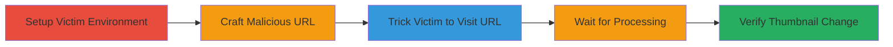

---
tags:
  - csrf
  - web
  - social-engineering
type: attack_chain
tools: []
tactics:
  - '[[Initial Access]]'
verified: false
platforms:
  - Web
submitted: true
complexity: medium
created_at: '2023-10-01T00:00:00Z'
procedures:
  - '[[procedures/Exploit-CSRF-to-Change-Video-Thumbnail]]'
step_count: 5
techniques:
  - '[[Drive-by Compromise]]'
updated_at: '2025-12-14T17:27:36.095Z'
description: >-
  A multi-stage attack leveraging CSRF in Chaturbate's video thumbnail change
  feature to trick victims into altering their content without consent.
skill_level: intermediate
impact_level: medium
id: 85ffd846-82c5-41db-87b3-55cda95ef74d
validated: true
mitre_tactics:
  - '[[Initial Access]]'
mitre_techniques:
  - '[[Drive-by Compromise]]'
---
# CSRF Exploitation to Change Video Thumbnail on Chaturbate

Multi-stage attack chain demonstrating a complete attack workflow exploiting CSRF in the video thumbnail change functionality.

## Chain Metrics Dashboard

| Metric | Value |
|--------|-------|
| Chain Status | Unverified |
| Total Steps | 5 |
| Execution Time | ~10 minutes |
| Skill Level | Intermediate |
| Complexity | Medium |
| Impact Level | Medium |

## Attack Flow Visualization

## Prerequisites & Requirements

### Required Tools

- None (relies on browser and social engineering)

### Target Environment

- Web platform (Chaturbate website)
- Victim must be logged into Chaturbate
- Attacker needs victim's video_id and thumbnail_id

### Initial Access Requirements

- Knowledge of victim's uploaded video details
- Ability to communicate with victim (e.g., email, chat)
- No prior credentials needed for attacker

## Detailed Attack Procedures

### Step 1: Set up the environment with victim's video details
procedure: [[procedures/Exploit-CSRF-to-Change-Video-Thumbnail]]

**Objective**: Identify and gather necessary identifiers from the victim's account to prepare for the exploit.

**Instructions**: Manually inspect the victim's Chaturbate profile or use browser developer tools to extract the video_id of an uploaded video (Video A) and the thumbnail_id of any associated thumbnail. This requires prior reconnaissance on the victim's public content.

**Expected Output**: video_id (e.g., 123456) and thumbnail_id (e.g., 789012).

**Success Indicators**:
- Video and thumbnail IDs obtained
- Confirmation that the video is accessible on the victim's account

### Step 2: Configure the malicious URL
procedure: [[procedures/Exploit-CSRF-to-Change-Video-Thumbnail]]

**Objective**: Construct a GET request URL that exploits the lack of CSRF protection to change the thumbnail.

**Instructions**: Build the URL using the format: https://chaturbate.com/photo_videos/video/thumbnail/{video_id}/?thumb={thumbnail_id}. Replace placeholders with actual IDs, e.g., https://chaturbate.com/photo_videos/video/thumbnail/123456/?thumb=789012. This URL, when visited by the logged-in victim, triggers the change without authentication checks beyond the session.

**Expected Output**: A fully formed malicious URL ready for distribution.

**Success Indicators**:
- URL validates syntactically
- No immediate errors when previewing (do not visit while logged in as victim)

### Step 3: Trick the victim into visiting the URL
procedure: [[procedures/Exploit-CSRF-to-Change-Video-Thumbnail]]

**Objective**: Use social engineering to induce the victim to load the malicious URL in their authenticated session.

**Instructions**: Deliver the URL via phishing email, direct message, or disguised link (e.g., shorten with bit.ly or embed in a fake support message like "Click to update your video settings"). Ensure the victim is logged into Chaturbate when they visit.

**Expected Output**: Victim accesses the URL, initiating the backend thumbnail change process.

**Success Indicators**:
- Victim confirms visiting the link (via follow-up)
- No user-facing alerts on the page

### Step 4: Wait for the change to process
procedure: [[procedures/Exploit-CSRF-to-Change-Video-Thumbnail]]

**Objective**: Allow time for Chaturbate's backend to process the thumbnail update triggered by the CSRF request.

**Instructions**: Monitor passively; the change occurs after a delay due to asynchronous processing. No active commands needed—simply wait 5-9 minutes.

**Expected Output**: Backend completes the thumbnail swap without victim intervention.

**Success Indicators**:
- Elapsed time reaches 5+ minutes
- No error notifications from the platform

### Step 5: Verify the thumbnail change
procedure: [[procedures/Exploit-CSRF-to-Change-Video-Thumbnail]]

**Objective**: Confirm the exploit's success by checking the victim's video thumbnail.

**Instructions**: Access the victim's Chaturbate profile, navigate to the bio tab, and inspect the video thumbnail for Video A. It should now display the new thumbnail_id's image.

**Expected Output**: Updated thumbnail visible on the profile.

**Success Indicators**:
- Thumbnail matches the targeted thumbnail_id
- Original thumbnail replaced

## Attack Chain Summary

### Key Achievements

1. Successful CSRF exploitation without direct access to victim's credentials
2. Disruption of victim's content presentation via thumbnail alteration
3. Demonstration of GET request vulnerability in authenticated workflows

## Technique & Tactic Coverage

### MITRE ATT&CK Techniques

- [[Drive-by Compromise]]

### MITRE ATT&CK Tactics

- [[Initial Access]]

---
*Last updated: 2023-10-01T00:00:00Z*
