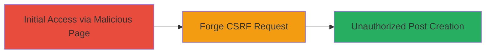

---
tags:
  - csrf
  - web
  - spam
  - rockstar-games
type: attack_chain
tools: []
tactics:
  - '[[Initial Access]]'
verified: false
platforms:
  - Web
submitted: true
complexity: low
created_at: '2023-10-01T00:00:00Z'
procedures:
  - '[[procedures/Exploiting-CSRF-to-Create-Unauthorized-Posts]]'
step_count: 1
techniques:
  - '[[Exploit Public-Facing Application]]'
updated_at: '2025-12-14T17:27:49.630Z'
description: >-
  A cross-site request forgery attack targeting the post creation endpoint in
  Rockstar Games' community platform, allowing unauthorized post creation and
  spamming on behalf of authenticated users.
skill_level: beginner
impact_level: low
id: 71e84691-6652-481d-871f-1280d5ae9392
validated: true
mitre_tactics:
  - '[[Initial Access]]'
mitre_techniques:
  - '[[Exploit Public-Facing Application]]'
---
# CSRF Exploitation to Create Unauthorized Posts in Rockstar Community Platform

Multi-stage attack chain demonstrating a complete attack workflow.

## Chain Metrics Dashboard

| Metric | Value |
|--------|-------|
| Chain Status | Unverified |
| Total Steps | 1 |
| Execution Time | ~1 minutes |
| Skill Level | Beginner |
| Complexity | Low |
| Impact Level | Low |

## Attack Flow Visualization



## Prerequisites & Requirements

### Required Tools

- None (uses standard web browser)

### Target Environment

- Web platform
- Rockstar Games community site
- Authenticated user session

### Initial Access Requirements

- Victim must be authenticated to the target site
- Victim must visit attacker's malicious page
- Exploitable only in older Chrome versions (pre-cross-origin changes)

## Detailed Attack Procedures

### Step 1: Forge and Execute CSRF Request
procedure: [[procedures/Exploiting-CSRF-to-Create-Unauthorized-Posts]]

**Objective**: Trick an authenticated user into creating a spam post via a forged cross-origin request to the vulnerable endpoint.

**Instructions**: Host a malicious HTML page on an attacker-controlled domain. The page automatically submits a form to /community/create-post.json with spam content. Ensure the victim is logged in to the Rockstar community platform and visits the page in an older Chrome browser.

Use [[commands/curl-csrf-test]] to verify the endpoint's vulnerability manually:

```bash
curl -X POST 'https://community.rockstargames.com/community/create-post.json' \
  -H 'Content-Type: application/x-www-form-urlencoded' \
  -d 'post_content=Spam message&other_params=value'
```

**Expected Output**: Successful post creation response (e.g., JSON with post ID) without CSRF token validation.

**Success Indicators**:
- Post appears in the community board under the victim's account
- No errors related to CSRF token in response

## Attack Chain Summary

### Key Achievements

1. Unauthorized post creation on behalf of the victim
2. Potential for spamming community boards
3. Exploitation limited to older browser versions

## Technique & Tactic Coverage

### MITRE ATT&CK Techniques

- [[Exploit Public-Facing Application]]

### MITRE ATT&CK Tactics

- [[Initial Access]]

---
*Last updated: 2023-10-01T00:00:00Z*
