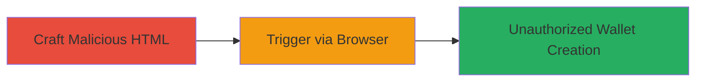

---
tags:
  - csrf
  - web
  - account-manipulation
  - coinbase
type: attack_chain
tools: []
tactics:
  - '[[Initial Access]]'
verified: false
platforms:
  - Web
submitted: true
complexity: medium
created_at: '2023-10-01T00:00:00Z'
procedures:
  - '[[procedures/Craft-Malicious-HTML-for-CSRF-Attack]]'
  - '[[procedures/Trigger-CSRF-Attack-via-Logged-in-Browser]]'
step_count: 2
techniques:
  - '[[Exploit Public-Facing Application]]'
updated_at: '2025-12-14T17:27:22.714Z'
description: >-
  A multi-stage CSRF attack that exploits the lack of anti-CSRF token validation
  in Coinbase's wallet creation endpoint, allowing unauthorized account
  modifications.
skill_level: intermediate
impact_level: high
id: bd55a18b-2129-41bd-89a0-108919c325de
validated: true
mitre_tactics:
  - '[[Initial Access]]'
mitre_techniques:
  - '[[Exploit Public-Facing Application]]'
---
# CSRF Exploitation to Create Unauthorized Wallets in Coinbase Accounts

Multi-stage attack chain demonstrating a complete CSRF workflow against Coinbase's wallet creation feature.

## Chain Metrics Dashboard

| Metric | Value |
|--------|-------|
| Chain Status | Unverified |
| Total Steps | 2 |
| Execution Time | ~5 minutes |
| Skill Level | Intermediate |
| Complexity | Medium |
| Impact Level | High |

## Attack Flow Visualization

## Prerequisites & Requirements

### Required Tools

- None (uses standard web development tools like a text editor)

### Target Environment

- Web platform
- Access to Coinbase website (https://www.coinbase.com/accounts)
- Victim must be logged in to Coinbase

### Initial Access Requirements

- No prior credentials needed for attacker
- Victim requires active Coinbase session
- Network access to internet

## Detailed Attack Procedures

### Step 1: Craft Malicious HTML
procedure: [[procedures/Craft-Malicious-HTML-for-CSRF-Attack]]

**Objective**: Create a malicious HTML page that submits a forged POST request to the Coinbase wallet creation endpoint without a CSRF token.

**Instructions**: Use a text editor to generate an HTML file with a form that targets the wallet creation endpoint. The form should mimic the legitimate request but omit the anti-CSRF token, exploiting the lack of origin validation.

**Expected Output**: A functional HTML file (e.g., csrf.html) that, when loaded, automatically submits the request.

**Success Indicators**:
- HTML file created and validated by opening in a browser (without login) to check form submission.
- No errors in browser console.

### Step 2: Trigger CSRF Attack
procedure: [[procedures/Trigger-CSRF-Attack-via-Logged-in-Browser]]

**Objective**: Deliver the malicious page to the victim and execute the CSRF by loading it in their authenticated browser session.

**Instructions**: Host the HTML file on a server or send it via phishing/email. When the victim (logged into Coinbase) opens it, the browser sends the request with session cookies, bypassing CSRF due to improper 'utf8' parameter handling in some browsers.

**Expected Output**: Unauthorized wallet created in the victim's Coinbase account.

**Success Indicators**:
- Victim's account shows new wallet upon login.
- Server logs confirm request submission.

## Attack Chain Summary

### Key Achievements

1. Successful forgery of wallet creation request without user consent.
2. Exploitation of missing CSRF token validation.
3. Potential for further account manipulation via the new wallet.

## Technique & Tactic Coverage

### MITRE ATT&CK Techniques

- [[Exploit Public-Facing Application]]

### MITRE ATT&CK Tactics

- [[Initial Access]]

---
*Last updated: 2023-10-01T00:00:00Z*
