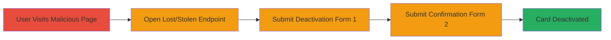

---
tags:
  - csrf
  - web-vulnerability
  - account-takeover
  - starbucks
type: attack_chain
tools: []
tactics:
  - '[[Initial Access]]'
verified: false
platforms:
  - Web
submitted: true
complexity: medium
created_at: '2023-10-01T00:00:00Z'
procedures:
  - '[[procedures/Host-Malicious-CSRF-Webpage]]'
  - '[[procedures/Open-Starbucks-Lost-Stolen-Page]]'
  - '[[procedures/Submit-CSRF-Deactivation-Form-One]]'
  - '[[procedures/Submit-CSRF-Confirmation-Form-Two]]'
step_count: 4
techniques:
  - '[[Drive-by Compromise]]'
  - '[[Exploit Public-Facing Application]]'
updated_at: '2025-12-14T17:27:30.057Z'
description: >-
  A multi-stage CSRF attack that tricks an authenticated user into deactivating
  their Starbucks digital card by submitting unauthorized forms via a malicious
  webpage.
skill_level: intermediate
impact_level: high
id: 1a835270-e1fe-439b-afd4-053fa3177b0e
validated: true
mitre_tactics:
  - '[[Initial Access]]'
mitre_techniques:
  - '[[Drive-by Compromise]]'
  - '[[Exploit Public-Facing Application]]'
---
# CSRF Exploitation to Deactivate Starbucks Digital Card Without Authorization

Multi-stage attack chain demonstrating a complete CSRF workflow to unauthorizedly deactivate a Starbucks digital card.

## Chain Metrics Dashboard

| Metric | Value |
|--------|-------|
| Chain Status | Unverified |
| Total Steps | 4 |
| Execution Time | ~1 minute |
| Skill Level | Intermediate |
| Complexity | Medium |
| Impact Level | High |

## Attack Flow Visualization

## Prerequisites & Requirements

### Required Tools

- None (uses standard web technologies: HTML, JavaScript)

### Target Environment

- Web browser with active Starbucks session
- Access to host a malicious HTML page (e.g., via local server or public host)

### Initial Access Requirements

- Victim must be authenticated to Starbucks account
- Victim must visit the attacker's controlled malicious webpage
- No special network access beyond internet connectivity

## Detailed Attack Procedures

### Step 1: Host Malicious CSRF Webpage
procedure: [[procedures/Host-Malicious-CSRF-Webpage]]

**Objective**: Create and host a webpage that automatically initiates the CSRF attack sequence upon loading.

**Instructions**: Develop an HTML page with embedded JavaScript that triggers the subsequent steps. Host it on a server accessible to the victim.

**Expected Output**: Victim loads the page, and JavaScript begins execution without user interaction.

**Success Indicators**:
- Page loads successfully in victim's browser
- JavaScript onload event fires

### Step 2: Open Starbucks Lost/Stolen Page
procedure: [[procedures/Open-Starbucks-Lost-Stolen-Page]]

**Objective**: Silently open the Starbucks card lost/stolen endpoint in a new window or iframe to prepare for form submission.

**Instructions**: Use JavaScript to open the target URL in a new window.

**Expected Output**: The Starbucks lost/stolen page loads in the background.

**Success Indicators**:
- New window or iframe opens to https://www.starbucks.com/account/card/loststolen
- Page is accessible due to victim's authenticated session

### Step 3: Submit First Deactivation Form
procedure: [[procedures/Submit-CSRF-Deactivation-Form-One]]

**Objective**: Automatically submit the initial deactivation form to the zero-balance endpoint, exploiting lack of CSRF tokens.

**Instructions**: After a delay, use JavaScript to populate and submit the form via POST to the vulnerable endpoint.

**Expected Output**: Form submission succeeds, initiating card deactivation process.

**Success Indicators**:
- HTTP POST request sent to https://www.starbucks.com/account/card/loststolenzerobalance
- No CSRF token validation blocks the request

### Step 4: Submit Confirmation Form
procedure: [[procedures/Submit-CSRF-Confirmation-Form-Two]]

**Objective**: Submit the confirmation form to complete the deactivation, locking the victim out of their card balance.

**Instructions**: Use JavaScript to submit the second form after another delay.

**Expected Output**: Card is marked as lost/stolen, deactivating access.

**Success Indicators**:
- Second POST request succeeds
- Victim's Starbucks account reflects deactivated card

## Attack Chain Summary

### Key Achievements

1. Successful exploitation of missing CSRF protection on sensitive card management endpoints
2. Unauthorized deactivation of digital card without victim consent
3. Potential denial of access to stored balance and features

## Technique & Tactic Coverage

### MITRE ATT&CK Techniques

- [[Drive-by Compromise]]
- [[Exploit Public-Facing Application]]

### MITRE ATT&CK Tactics

- [[Initial Access]]

---
*Last updated: 2023-10-01T00:00:00Z*
