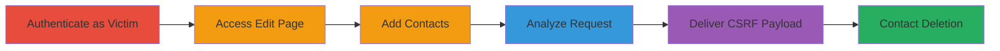

# CSRF Exploitation to Delete User Contact Information in Acronis Academy

Multi-stage attack chain demonstrating a complete workflow to exploit a CSRF vulnerability in the Acronis Academy web application, allowing unauthorized deletion of user contact details (email, telephone, fax, address, Skype) by tricking an authenticated user into visiting a malicious page.

## Chain Metrics Dashboard

| Metric | Value |
|--------|-------|
| Chain Status | Unverified |
| Total Steps | 5 |
| Execution Time | ~10 minutes |
| Skill Level | Intermediate |
| Complexity | Medium |
| Impact Level | Medium |

## Attack Flow Visualization



## Prerequisites & Requirements

### Required Tools

- Web browser with developer tools (e.g., Chrome DevTools)
- Proxy tool for request interception (optional, e.g., Burp Suite)

### Target Environment

- Web platform: Acronis Academy at https://academy.acronis.com/
- Required services/ports: HTTPS on port 443
- Network access requirements: Internet access to the target domain

### Initial Access Requirements

- Victim's valid credentials for Acronis Academy account
- Attacker's control over a malicious web page (e.g., hosted on a server or phishing site)
- No prior access needed beyond tricking the victim to visit the malicious page while authenticated

## Detailed Attack Procedures

### Step 1: Authenticate as Victim
procedure: [[procedures/Authenticate-as-Victim-User-in-Acronis-Academy]]

**Objective**: Gain authenticated access to the victim's account to prepare for contact management.

**Instructions**: Open a web browser and navigate to the login page. Enter the victim's credentials to log in.

**Expected Output**: Successful login redirect to the dashboard, with session cookies established.

**Success Indicators**:
- User is logged in and can access account features
- No authentication errors

### Step 2: Access Account Edit Page
procedure: [[procedures/Access-Account-Edit-Page-in-Acronis-Academy]]

**Objective**: Reach the contact management interface to enable addition and potential deletion of details.

**Instructions**: From the dashboard, navigate to the account settings. Use the URL structure https://academy.acronis.com/#/account/edit/account_id/<victim_account_id> to directly access the edit page, replacing <victim_account_id> with the actual ID.

**Expected Output**: Page loads showing current account details and contact fields.

**Success Indicators**:
- Edit interface is visible
- Contact fields (email, phone, etc.) are editable

### Step 3: Add Contact Details
procedure: [[procedures/Add-Contact-Details-to-Victim-Account]]

**Objective**: Populate the account with contact information to create deletable targets for the exploit.

**Instructions**: In the edit interface, fill in fields for email, telephone, fax, address, or Skype. Save the changes to persist the data.

**Expected Output**: Confirmation message or updated profile showing new contacts.

**Success Indicators**:
- New contacts appear in the account view
- Data is saved without errors

### Step 4: Analyze Deletion Request
procedure: [[procedures/Analyze-Deletion-Request-for-CSRF-Vulnerability]]

**Objective**: Intercept and examine the deletion mechanism to confirm lack of CSRF protection.

**Instructions**: Attempt to delete a contact via the UI. Use browser developer tools (Network tab) or a proxy to capture the request. Observe that it uses a GET method to /account/delete-contact/contact_id/<contact_id> without any CSRF token.

**Expected Output**: Captured request shows plain GET without tokens: GET https://academy.acronis.com/account/delete-contact/contact_id/123.

**Success Indicators**:
- Request intercepted and lacks CSRF headers or tokens
- Deletion succeeds in the test environment

### Step 5: Deliver CSRF Payload
procedure: [[procedures/Craft-and-Deliver-CSRF-Payload-to-Delete-Contacts]]

**Objective**: Trick the victim into executing the deletion via a malicious page.

**Instructions**: Create an HTML page with an auto-submitting form targeting the delete endpoint. Host it on a server and send the link to the victim (e.g., via phishing). Ensure the victim is authenticated in Acronis Academy when they visit.

Example malicious HTML:
```html
<!DOCTYPE html>
<html>
<body>
<form id="csrf" action="https://academy.acronis.com/account/delete-contact/contact_id/<target_contact_id>" method="GET">
</form>
<script>document.getElementById('csrf').submit();</script>
</body>
</html>
```
Replace <target_contact_id> with the actual ID.

**Expected Output**: Victim's browser submits the GET request, deleting the contact silently.

**Success Indicators**:
- Contact details removed from victim's account
- No user interaction required beyond visiting the page

## Attack Chain Summary

### Key Achievements

1. Confirmed CSRF vulnerability in contact deletion endpoint
2. Demonstrated unauthorized data modification without direct access
3. Highlighted risks of GET-based destructive actions without protection

## Technique & Tactic Coverage

### MITRE ATT&CK Techniques

- [[Drive-by Compromise]]
- [[Exploit Public-Facing Application]]

### MITRE ATT&CK Tactics

- [[Initial Access]]

---
*Last updated: 2023-10-01T00:00:00Z*
