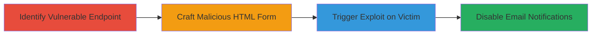

---
tags:
  - csrf
  - web
  - email-notifications
  - instacart
type: attack_chain
tools: []
tactics:
  - '[[Initial Access]]'
verified: false
platforms:
  - Web
submitted: true
complexity: medium
created_at: '2023-10-01T00:00:00Z'
procedures:
  - '[[procedures/Identify-Vulnerable-CSRF-Endpoint-in-Email-Settings]]'
  - '[[procedures/Craft-CSRF-Proof-of-Concept-HTML]]'
  - '[[procedures/Demonstrate-CSRF-Exploit-via-Form-Submission]]'
step_count: 3
techniques:
  - '[[Drive-by Compromise]]'
updated_at: '2025-12-14T17:27:29.954Z'
description: >-
  A multi-stage attack exploiting a CSRF vulnerability in Instacart's email
  settings API to alter user notification preferences without authentication.
skill_level: intermediate
impact_level: high
id: a0af5dba-c60d-4c33-bc36-545098468324
validated: true
mitre_tactics:
  - '[[Initial Access]]'
mitre_techniques:
  - '[[Drive-by Compromise]]'
---
# CSRF Exploitation to Disable Email Notifications in Instacart

Multi-stage attack chain demonstrating a complete attack workflow exploiting a Cross-Site Request Forgery (CSRF) vulnerability in Instacart's email settings API. An attacker can trick an authenticated user into visiting a malicious page, which automatically submits a forged request to disable or alter email notifications, potentially causing the user to miss critical security alerts or account updates.

## Chain Metrics Dashboard

| Metric | Value |
|--------|-------|
| Chain Status | Unverified |
| Total Steps | 3 |
| Execution Time | ~5 minutes |
| Skill Level | Intermediate |
| Complexity | Medium |
| Impact Level | High |

## Attack Flow Visualization

## Prerequisites & Requirements

### Required Tools

- None (relies on browser and HTML crafting)

### Target Environment

- Web platform (Instacart application)
- Required services/ports: HTTPS on port 443
- Network access requirements: Internet access to Instacart domain

### Initial Access Requirements

- Victim must be authenticated to Instacart
- Attacker needs to lure victim to malicious page (e.g., via phishing link)
- No prior access to victim's account needed

## Detailed Attack Procedures

### Step 1: Identify Vulnerable Endpoint
procedure: [[procedures/Identify-Vulnerable-CSRF-Endpoint-in-Email-Settings]]

**Objective**: Locate the API endpoint responsible for email notification settings that lacks CSRF protection.

**Instructions**: Analyze the Instacart web application by inspecting network traffic or reviewing API documentation. Focus on endpoints related to email preferences, such as those for disabling notifications. Verify that POST requests to the endpoint do not require or validate CSRF tokens.

**Expected Output**: Confirmation of the vulnerable endpoint URL, e.g., https://www.instacart.com/api/v2/email_settings/{id}/disable?resource_token=.

**Success Indicators**:
- Endpoint accepts unauthenticated POST requests from external origins
- No CSRF token is enforced

### Step 2: Craft Malicious HTML Form
procedure: [[procedures/Craft-CSRF-Proof-of-Concept-HTML]]

**Objective**: Create an HTML page that automatically submits a forged request to the vulnerable endpoint when loaded in the victim's browser.

**Instructions**: Develop a simple HTML form targeting the identified endpoint. Use JavaScript to auto-submit the form upon page load, mimicking the legitimate request parameters like resource_token.

**Expected Output**: A functional HTML file that, when opened by an authenticated user, alters email settings.

**Success Indicators**:
- Form submission succeeds without errors
- Browser developer tools show the request being sent to Instacart

### Step 3: Trigger Exploit on Victim
procedure: [[procedures/Demonstrate-CSRF-Exploit-via-Form-Submission]]

**Objective**: Lure the victim to the malicious page and observe the impact on their account settings.

**Instructions**: Host the crafted HTML on a controllable server or use a phishing technique to direct the victim to it. Monitor for successful notification disablement by checking the victim's Instacart account afterward.

**Expected Output**: Victim's email notifications disabled, confirmed via account inspection or video demonstration.

**Success Indicators**:
- Account settings changed without user interaction
- No authentication prompts during the process

## Attack Chain Summary

### Key Achievements

1. Identified CSRF-vulnerable API endpoint in email settings
2. Developed a proof-of-concept exploit using auto-submitting HTML
3. Demonstrated real-world impact on authenticated user sessions

## Technique & Tactic Coverage

### MITRE ATT&CK Techniques

- [[Drive-by Compromise]]

### MITRE ATT&CK Tactics

- [[Initial Access]]

---

*Last updated: 2023-10-01T00:00:00Z*
