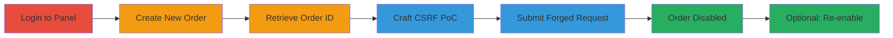

---
tags:
  - csrf
  - web
  - exploit
  - order-disable
type: attack_chain
tools:
  - '[[tools/Burp-Suite-Professional]]'
tactics:
  - '[[Initial Access]]'
verified: false
platforms:
  - Web
submitted: true
complexity: medium
created_at: '2023-10-01T00:00:00Z'
procedures:
  - '[[procedures/Exploit-CSRF-to-Disable-Orders]]'
step_count: 6
techniques:
  - '[[Exploit Public-Facing Application]]'
updated_at: '2025-12-14T17:27:03.781Z'
description: >-
  A multi-step attack leveraging CSRF to disable user orders in the
  StopTheHacker panel without authentication or user interaction, requiring an
  active victim session and order ID knowledge.
skill_level: intermediate
impact_level: low
id: 5e0d6dd0-29dc-48c5-8d86-a832a0db7ec2
validated: true
mitre_tactics:
  - '[[Initial Access]]'
mitre_techniques:
  - '[[Exploit Public-Facing Application]]'
---
# CSRF Exploitation to Disable User Orders in StopTheHacker Panel

Multi-stage attack chain demonstrating a complete CSRF workflow to disable orders in the StopTheHacker panel. The attack exploits the lack of CSRF token validation on the disable-order endpoint, allowing an attacker to forge a POST request if they can trick a victim into loading a malicious HTML form while authenticated.

## Chain Metrics Dashboard

| Metric | Value |
|--------|-------|
| Chain Status | Unverified |
| Total Steps | 6 |
| Execution Time | ~5 minutes |
| Skill Level | Intermediate |
| Complexity | Medium |
| Impact Level | Low |

## Attack Flow Visualization

## Prerequisites & Requirements

### Required Tools

- [[tools/Burp-Suite-Professional]]

### Target Environment

- Web platform
- StopTheHacker panel at https://panel.stopthehacker.com
- No specific ports or services beyond standard HTTPS (443)

### Initial Access Requirements

- Attacker must have a way to deliver the CSRF PoC to the victim (e.g., via phishing email or malicious website)
- Victim must have an active authenticated session in the panel
- Knowledge or guessable order ID (e.g., sequential like 240720)

## Detailed Attack Procedures

### Step 1: Login to the Panel
procedure: [[procedures/Exploit-CSRF-to-Disable-Orders]]

**Objective**: Establish a valid session in the StopTheHacker panel to simulate or prepare for the victim's authenticated state.

**Instructions**: Access the login functionality at the StopTheHacker panel to establish a valid session. This step is typically performed by the victim unknowingly, but for testing, log in manually.

**Expected Output**: Successful login redirect to the dashboard with session cookies set.

**Success Indicators**:
- Authentication successful
- Access to panel features granted

### Step 2: Subscribe or Order a New Scan
procedure: [[procedures/Exploit-CSRF-to-Disable-Orders]]

**Objective**: Create a new order to generate a target order ID for exploitation.

**Instructions**: Use the panel's subscription or ordering feature to create a new order, such as subscribing to a scan service.

**Expected Output**: New order created with an assigned ID.

**Success Indicators**:
- Order confirmation displayed
- Order ID generated (e.g., 240720)

### Step 3: Go to the Billing Page and Get the Order ID
procedure: [[procedures/Exploit-CSRF-to-Disable-Orders]]

**Objective**: Retrieve the specific order ID from the billing section to target in the CSRF attack.

**Instructions**: Navigate to the Billing section in the panel and locate the order details to note the ID.

**Expected Output**: Order ID visible (e.g., 240720).

**Success Indicators**:
- Order ID obtained
- Billing page accessible

### Step 4: Put the Order ID in the PoC and Submit It
procedure: [[procedures/Exploit-CSRF-to-Disable-Orders]]

**Objective**: Craft and load the CSRF proof-of-concept HTML form with the target order ID.

**Instructions**: Use [[tools/Burp-Suite-Professional]] to generate or modify the PoC HTML form. Include the order ID in the form action URL (e.g., /manage/disable-order/order/240720). Load the HTML in a browser with an active panel session and submit.

**Expected Output**: POST request sent to https://panel.stopthehacker.com/manage/disable-order/order/240720 with parameters reason=Other, otherReason=-, submit=.

**Success Indicators**:
- Form submission triggers the request
- No errors in browser console

### Step 5: The Order Will Be Disabled
procedure: [[procedures/Exploit-CSRF-to-Disable-Orders]]

**Objective**: Confirm the order has been disabled via the forged request.

**Instructions**: After submission, check the panel's billing or orders section to verify the status change.

**Expected Output**: Order status updated to disabled without user confirmation.

**Success Indicators**:
- Order marked as disabled in panel
- Service disruption for the user

### Step 6: Repeat Procedure for Enabling a Service
procedure: [[procedures/Exploit-CSRF-to-Disable-Orders]]

**Objective**: Demonstrate reversibility by exploiting a similar CSRF on the enable-order endpoint.

**Instructions**: Craft a similar PoC for the enable-order endpoint and submit while authenticated.

**Expected Output**: Order re-enabled.

**Success Indicators**:
- Order status restored to active
- Similar lack of CSRF protection confirmed

## Attack Chain Summary

### Key Achievements

1. Bypassed CSRF protections to disable orders silently
2. Demonstrated impact on user services with minimal interaction
3. Highlighted reversible but disruptive nature of the vulnerability

## Technique & Tactic Coverage

### MITRE ATT&CK Techniques

- [[Exploit Public-Facing Application]]

### MITRE ATT&CK Tactics

- [[Initial Access]]

---

*Last updated: 2023-10-01T00:00:00Z*
