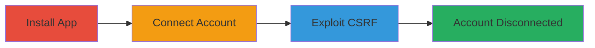

# CSRF Exploitation to Disconnect Twitter Account from Shopify Integration

Multi-stage attack chain demonstrating a complete attack workflow exploiting CSRF in Shopify's Twitter app integration to force disconnection of a user's Twitter account.

## Chain Metrics Dashboard

| Metric | Value |
|--------|-------|
| Chain Status | Unverified |
| Total Steps | 3 |
| Execution Time | ~5 minutes |
| Skill Level | Intermediate |
| Complexity | Medium |
| Impact Level | High |

## Attack Flow Visualization



## Prerequisites & Requirements

### Required Tools

- Web browser (e.g., Firefox or Chrome)
- Access to a Shopify store admin panel
- Malicious HTML hosting (e.g., local server or public host)

### Target Environment

- Shopify platform with admin access
- Twitter app integration enabled
- Web-based, no specific ports required beyond standard HTTPS (443)

### Initial Access Requirements

- Valid Shopify store credentials for installation and connection
- Victim must be logged into Shopify
- Attacker needs to trick victim into loading malicious HTML (e.g., via phishing)

## Detailed Attack Procedures

### Step 1: Install Twitter App
procedure: [[procedures/Install-Twitter-App-in-Shopify-Store]]

**Objective**: Add the Twitter app to the target Shopify store to enable the vulnerable integration.

**Instructions**: Navigate to the Shopify admin apps section and install the Twitter app from the provided URL. This sets up the environment for the CSRF exploit.

**Expected Output**: App installed successfully, visible in the store's app list.

**Success Indicators**:
- App appears in Shopify admin under Apps
- No errors during installation

### Step 2: Connect Twitter Account
procedure: [[procedures/Connect-Twitter-Account-to-Shopify-App]]

**Objective**: Link a Twitter account to the Shopify app, creating the authenticated state vulnerable to CSRF disconnection.

**Instructions**: Use the app interface to authenticate and connect the Twitter account via OAuth flow.

**Expected Output**: Twitter account linked, confirmation message in the app.

**Success Indicators**:
- Twitter integration status shows as connected
- API access granted to Shopify

### Step 3: Exploit CSRF to Disconnect
procedure: [[procedures/Exploit-CSRF-to-Disconnect-Twitter-Account]]

**Objective**: Force disconnection of the Twitter account using a forged GET request via CSRF without user consent.

**Instructions**: Host an HTML page with an img tag pointing to the vulnerable endpoint and trick the victim into loading it while logged in. Execute the disconnect request using [[commands/csrf-twitter-disconnect-get]] to simulate or verify.

```html

```

**Expected Output**: Twitter account disconnected from Shopify, requiring re-authentication.

**Success Indicators**:
- Integration status changes to disconnected
- No CSRF token required, request succeeds cross-origin

## Attack Chain Summary

### Key Achievements

1. Successfully installed and connected the Twitter app to a Shopify store.
2. Exploited missing CSRF protection on the disconnect endpoint.
3. Demonstrated unauthorized account disconnection, disrupting social integrations.

## Technique & Tactic Coverage

### MITRE ATT&CK Techniques

- [[Exploit Public-Facing Application]] Exploit Public-Facing Application

### MITRE ATT&CK Tactics

- [[Initial Access]] Initial Access

---
*Last updated: 2023-10-01T00:00:00Z*
