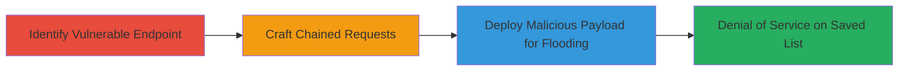

---
tags:
  - csrf
  - web
  - dos
  - lyst
type: attack_chain
tools: []
tactics:
  - '[[Impact]]'
verified: false
platforms:
  - Web
submitted: true
complexity: medium
created_at: '2023-10-01T00:00:00Z'
procedures:
  - '[[procedures/Identify-CSRF-Vulnerable-Stock-Alert-Endpoint]]'
  - '[[procedures/Craft-Chained-Return-URL-for-Multiple-Additions]]'
  - '[[procedures/Exploit-CSRF-to-Flood-Saved-List-via-Malicious-Page]]'
step_count: 3
techniques:
  - '[[Exploit Public-Facing Application]]'
updated_at: '2025-12-14T17:27:42.564Z'
description: >-
  Exploits a CSRF vulnerability in Lyst's stock alert feature to add thousands
  of unwanted items to a user's saved list via chained GET requests, causing
  denial of service and user frustration.
skill_level: intermediate
impact_level: high
id: 24fafac7-cc33-4c30-9c33-cdfc2e97c45f
validated: true
mitre_tactics:
  - '[[Impact]]'
mitre_techniques:
  - '[[Exploit Public-Facing Application]]'
---
# CSRF Exploitation to Flood Lyst User's Saved List with Unwanted Items

Multi-stage attack chain demonstrating a complete CSRF-based denial-of-service workflow on Lyst's platform.

## Chain Metrics Dashboard

| Metric | Value |
|--------|-------|
| Chain Status | Unverified |
| Total Steps | 3 |
| Execution Time | ~5 minutes |
| Skill Level | Intermediate |
| Complexity | Medium |
| Impact Level | High |

## Attack Flow Visualization



## Prerequisites & Requirements

### Required Tools

- Browser developer tools for inspection
- [[tools/Burp-Suite]] (optional for request crafting)

### Target Environment

- Lyst web application (www.lyst.com)
- Victim must be authenticated (logged in) to Lyst
- No special ports or services required beyond standard HTTPS (443)

### Initial Access Requirements

- Attacker needs to lure victim to a malicious page (e.g., via phishing or social engineering)
- No direct credentials needed; exploits victim's existing session
- Network access to Lyst from victim's browser

## Detailed Attack Procedures

### Step 1: Identify Vulnerable Endpoint
procedure: [[procedures/Identify-CSRF-Vulnerable-Stock-Alert-Endpoint]]

**Objective**: Discover the stock alert endpoint that lacks CSRF protection and automatically adds items to the user's saved list.

**Instructions**: Use browser developer tools or a proxy like Burp Suite to inspect network requests while interacting with Lyst's stock alert feature. Send a test GET request to the endpoint with a product ID to confirm it adds the item without authentication or tokens.

For example, execute a simple test using [[commands/test-stock-alert-endpoint]]:

```bash
curl -X GET "https://www.lyst.com/email-capture/stock-alert/93543518/" -v
```

**Expected Output**: The request succeeds (200 OK), and upon checking the victim's saved list, the item with ID 93543518 is added without user interaction.

**Success Indicators**:
- Item appears in saved list after GET request
- No CSRF token required in response or request

### Step 2: Craft Chained Requests
procedure: [[procedures/Craft-Chained-Return-URL-for-Multiple-Additions]]

**Objective**: Build a nested return_url chain to add multiple items in a single request via sequential redirects.

**Instructions**: Construct a URL with nested return_url parameters pointing to multiple stock alert endpoints. Use product IDs from Lyst's catalog. Test the chain locally or in a proxy before deployment.

Execute the chained request using [[commands/csrf-chained-stock-alert-get]]:

```bash
curl -X GET "https://www.lyst.com/email-capture/stock-alert/93543518/?return_url=/email-capture/stock-alert/91703404/?return_url=/email-capture/stock-alert/89201857/" -v
```

**Expected Output**: Series of 302 redirects, with each endpoint adding its item to the saved list upon victim visit.

**Success Indicators**:
- Multiple items (e.g., IDs 93543518, 91703404, 89201857) added sequentially
- No errors in redirect chain

### Step 3: Deploy for Flooding
procedure: [[procedures/Exploit-CSRF-to-Flood-Saved-List-via-Malicious-Page]]

**Objective**: Deliver the exploit via a malicious webpage to flood the saved list with thousands of items, rendering it unusable.

**Instructions**: Create a malicious HTML page embedding numerous  tags or links to chained stock alert URLs. Host it on an attacker-controlled server and trick the victim into visiting while logged into Lyst. Alternatively, use chained redirects in a phishing link.

For embedding, generate a page with 1000+  tags like:

```html


<!-- Repeat for thousands -->
```

When the victim loads the page, all images trigger GET requests, adding items.

**Expected Output**: Victim's saved list overwhelmed with thousands of items, potentially crashing the UI or causing frustration.

**Success Indicators**:
- Saved list contains excessive items post-visit
- Victim reports usability issues

## Attack Chain Summary

### Key Achievements

1. Identified CSRF-vulnerable endpoint allowing unauthorized additions
2. Chained requests to amplify impact in single interactions
3. Achieved DoS on saved list, leading to potential user churn

## Technique & Tactic Coverage

### MITRE ATT&CK Techniques

- [[Exploit Public-Facing Application]]

### MITRE ATT&CK Tactics

- [[Impact]]

---
*Last updated: 2023-10-01T00:00:00Z*
