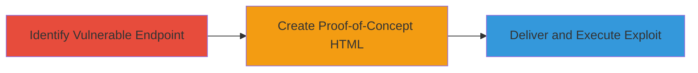

---
tags:
  - csrf
  - web
  - session-disruption
  - logout
type: attack_chain
tools: []
tactics:
  - '[[Initial Access]]'
commands: []
platforms:
  - Web
complexity: low
procedures:
  - '[[procedures/Exploit-CSRF-Logout-Vulnerability]]'
step_count: 3
techniques:
  - '[[Drive-by Compromise]]'
description: >-
  A multi-step attack leveraging a CSRF vulnerability in the IRCCloud logout
  endpoint to involuntarily terminate user sessions.
skill_level: beginner
impact_level: low
id: 17c1c374-56cc-4a81-8878-5215958b61c2
created_at: '2025-12-14T17:27:03.434Z'
updated_at: '2025-12-14T17:27:03.434Z'
verified: false
validated: true
submitted: true
mitre_tactics:
  - '[[Initial Access]]'
mitre_techniques:
  - '[[Drive-by Compromise]]'
---
# CSRF Exploitation to Force Authenticated Logout on IRCCloud

Multi-stage attack chain demonstrating a complete attack workflow exploiting a CSRF vulnerability in the IRCCloud logout endpoint.

## Chain Metrics Dashboard

| Metric | Value |
|--------|-------|
| Chain Status | Unverified |
| Total Steps | 3 |
| Execution Time | ~1 minutes |
| Skill Level | Beginner |
| Complexity | Low |
| Impact Level | Low |

## Attack Flow Visualization



## Prerequisites & Requirements

### Required Tools

- None (uses basic HTML and browser)

### Target Environment

- Web platform
- IRCCloud service accessible
- No specific ports or services beyond standard HTTPS (443)

### Initial Access Requirements

- Victim must be authenticated to IRCCloud
- Attacker needs a way to deliver malicious HTML (e.g., phishing link, malicious site)
- No prior credentials or network position required beyond internet access

## Detailed Attack Procedures

### Step 1: Identify Vulnerable Endpoint
procedure: [[procedures/Exploit-CSRF-Logout-Vulnerability]]

**Objective**: Locate the logout endpoint lacking CSRF protection to confirm exploitability.

**Instructions**: Review the IRCCloud application to identify the logout functionality. The endpoint https://www.irccloud.com/chat/logout accepts POST requests without CSRF token validation, allowing cross-origin forgery.

**Expected Output**: Confirmation that the endpoint processes POST requests without anti-CSRF measures.

**Success Indicators**:
- Endpoint identified and tested via browser developer tools or direct request
- No CSRF token required in requests

### Step 2: Create Proof-of-Concept HTML
procedure: [[procedures/Exploit-CSRF-Logout-Vulnerability]]

**Objective**: Develop a simple HTML form to forge the logout request using the victim's session.

**Instructions**: Create an HTML file with an auto-submitting form targeting the vulnerable endpoint:

```html
<form action="https://www.irccloud.com/chat/logout" method="POST">
    <input type="submit" value="Submit request" style="display:none;">
</form>
<script>document.forms[0].submit();</script>
```

Host this HTML on an attacker-controlled server or deliver via link.

**Expected Output**: HTML page that, when loaded, automatically submits the forged POST request.

**Success Indicators**:
- Form submission triggers without user interaction
- Request includes victim's session cookies

### Step 3: Deliver and Execute Exploit
procedure: [[procedures/Exploit-CSRF-Logout-Vulnerability]]

**Objective**: Trick the victim into loading the PoC, causing involuntary logout.

**Instructions**: Host the HTML page on a web server and send a link to the victim (e.g., via email or social engineering). When the victim loads the page in their browser while authenticated to IRCCloud, the form submits, forcing logout.

**Expected Output**: Victim's IRCCloud session terminates, redirecting them to the login page.

**Success Indicators**:
- Victim logs out unexpectedly
- No alerts or blocks from browser/CSRF protections

## Attack Chain Summary

### Key Achievements

1. Identified CSRF-vulnerable logout endpoint without token validation
2. Created and hosted a PoC HTML form for automatic request forgery
3. Demonstrated session disruption via social engineering delivery

## Technique & Tactic Coverage

### MITRE ATT&CK Techniques

- [[Drive-by Compromise]]

### MITRE ATT&CK Tactics

- [[Initial Access]]

---
*Last updated: 2023-10-01*
