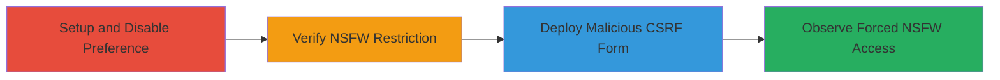

---
tags:
  - csrf
  - reddit
  - nsfw
  - web-vulnerability
type: attack_chain
tools: []
tactics:
  - '[[Initial Access]]'
verified: false
platforms:
  - Web
submitted: true
complexity: medium
procedures:
  - '[[procedures/Disable-Over18-Preference-on-Reddit]]'
  - '[[procedures/Verify-NSFW-Content-Block]]'
  - '[[procedures/Create-Malicious-CSRF-HTML-Form]]'
  - '[[procedures/Observe-CSRF-Exploitation-Effect]]'
step_count: 4
techniques:
  - '[[Drive-by Compromise]]'
  - '[[Exploit Public-Facing Application]]'
description: >-
  A multi-stage attack chain exploiting a CSRF vulnerability in Reddit's /over18
  endpoint to bypass user preferences and force exposure to NSFW content.
skill_level: intermediate
impact_level: high
id: 66fced66-0100-4505-a26b-153cba851b7d
created_at: '2025-12-14T17:27:57.284Z'
updated_at: '2025-12-14T17:27:57.284Z'
validated: true
mitre_tactics:
  - '[[Initial Access]]'
mitre_techniques:
  - '[[Drive-by Compromise]]'
  - '[[Exploit Public-Facing Application]]'
---
# CSRF Exploitation to Force Enable NSFW Content Viewing on Reddit

Multi-stage attack chain demonstrating a complete attack workflow exploiting CSRF on Reddit's /over18 endpoint to trick users into enabling NSFW content without consent.

## Chain Metrics Dashboard

| Metric | Value |
|--------|-------|
| Chain Status | Unverified |
| Total Steps | 4 |
| Execution Time | ~5 minutes |
| Skill Level | Intermediate |
| Complexity | Medium |
| Impact Level | High |

## Attack Flow Visualization

## Prerequisites & Requirements

### Required Tools

- Web browser (e.g., Chrome, Firefox)
- Text editor for HTML

### Target Environment

- Reddit platform (web)
- Access to a browser on the victim's machine
- No specific ports or services beyond standard HTTPS (443)

### Initial Access Requirements

- Valid Reddit account (attacker creates one for testing)
- Victim must be tricked into loading the malicious HTML (e.g., via phishing link)
- No prior credentials needed beyond normal user session

## Detailed Attack Procedures

### Step 1: Setup and Disable Preference
procedure: [[procedures/Disable-Over18-Preference-on-Reddit]]

**Objective**: Establish a controlled environment by disabling the over18 preference to simulate a restricted user.

**Instructions**: Log in to Reddit and navigate to preferences to turn off the NSFW option.

**Expected Output**: Preference disabled; confirmed in user settings.

**Success Indicators**:
- 'I am over eighteen' option is toggled off
- No NSFW content visible in feeds

### Step 2: Verify NSFW Content Block
procedure: [[procedures/Verify-NSFW-Content-Block]]

**Objective**: Confirm the restriction is active by attempting to access NSFW content, triggering the consent prompt.

**Instructions**: Visit an NSFW subreddit URL in the browser.

**Expected Output**: Browser shows a prompt asking for confirmation to view adult content.

**Success Indicators**:
- Access denied with over18 confirmation dialog
- Redirect or block to NSFW subreddit

### Step 3: Deploy Malicious CSRF Form
procedure: [[procedures/Create-Malicious-CSRF-HTML-Form]]

**Objective**: Create and load a malicious HTML page that auto-submits a CSRF request to enable the over18 preference.

**Instructions**: Save the provided HTML form to a local file and open it in the browser while logged into Reddit.

**Expected Output**: Automatic form submission to /over18 endpoint without user interaction.

**Success Indicators**:
- Form submits silently
- No CSRF token validation error

### Step 4: Observe Exploitation Effect
procedure: [[procedures/Observe-CSRF-Exploitation-Effect]]

**Objective**: Validate the bypass by directly accessing NSFW content without prompts.

**Instructions**: Revisit the NSFW subreddit after form submission.

**Expected Output**: Direct access to adult content without any confirmation dialog.

**Success Indicators**:
- NSFW subreddit loads fully
- Preference updated to enabled in settings

## Attack Chain Summary

### Key Achievements

1. Simulated restricted user state
2. Bypassed CSRF protection via malicious form
3. Forced unauthorized preference change
4. Enabled non-consensual NSFW exposure

## Technique & Tactic Coverage

### MITRE ATT&CK Techniques

- [[Drive-by Compromise]]
- [[Exploit Public-Facing Application]]

### MITRE ATT&CK Tactics

- [[Initial Access]]

---
*Last updated: 2023-10-01T00:00:00Z*
