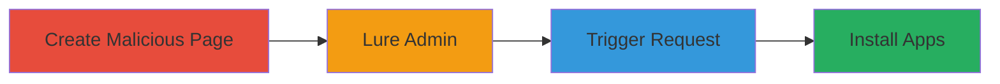

---
tags:
  - csrf
  - nextcloud
  - web
  - installation-force
type: attack_chain
tools: []
tactics:
  - '[[Initial Access]]'
  - '[[Execution]]'
verified: false
platforms:
  - Web
submitted: true
complexity: medium
created_at: '2023-10-01T00:00:00Z'
procedures:
  - '[[procedures/Create-Malicious-CSRF-Page-for-Nextcloud]]'
  - '[[procedures/Lure-Admin-to-Malicious-Page]]'
  - '[[procedures/Trigger-CSRF-Request-on-Page-Load]]'
  - '[[procedures/Verify-App-Installation-via-CSRF]]'
step_count: 4
techniques:
  - '[[Drive-by Compromise]]'
  - '[[Exploit Public-Facing Application]]'
updated_at: '2025-12-14T17:29:09.910Z'
description: >-
  A multi-stage CSRF attack leveraging a vulnerable endpoint in Nextcloud to
  force an authenticated admin to install recommended applications, expanding
  the attack surface.
skill_level: intermediate
impact_level: high
id: f7b787e2-d7e7-49d3-9591-787252a6598d
validated: true
mitre_tactics:
  - '[[Initial Access]]'
  - '[[Execution]]'
mitre_techniques:
  - '[[Drive-by Compromise]]'
  - '[[Exploit Public-Facing Application]]'
---
# CSRF Exploitation to Force Installation of Recommended Apps in Nextcloud

Multi-stage attack chain demonstrating a complete CSRF workflow against Nextcloud's recommended apps endpoint.

## Chain Metrics Dashboard

| Metric | Value |
|--------|-------|
| Chain Status | Unverified |
| Total Steps | 4 |
| Execution Time | ~5 minutes |
| Skill Level | Intermediate |
| Complexity | Medium |
| Impact Level | High |

## Attack Flow Visualization

## Prerequisites & Requirements

### Required Tools

- None (relies on web development tools like HTML editor)

### Target Environment

- Nextcloud instance (PHP-based web application)
- Authenticated admin session
- Web browser for victim

### Initial Access Requirements

- Attacker controls a domain for hosting malicious page
- Social engineering access to lure admin
- No direct network access to target needed (cross-origin request)

## Detailed Attack Procedures

### Step 1: Create Malicious Page
procedure: [[procedures/Create-Malicious-CSRF-Page-for-Nextcloud]]

**Objective**: Develop a webpage that automatically triggers the vulnerable GET request to Nextcloud's endpoint upon loading.

**Instructions**: Craft an HTML page with an invisible element, such as an img tag, that points to the target endpoint. Host this on an attacker-controlled domain.

**Expected Output**: A functional malicious webpage that initiates the CSRF request silently.

**Success Indicators**:
- Page loads without visible content
- Network inspection shows GET request to /nextcloud/index.php/core/apps/recommended

### Step 2: Lure Admin to Malicious Page
procedure: [[procedures/Lure-Admin-to-Malicious-Page]]

**Objective**: Trick the authenticated Nextcloud admin into visiting the attacker's page while their session is active.

**Instructions**: Use phishing emails, social engineering, or malicious links in communications to direct the admin to the hosted page.

**Expected Output**: Admin's browser loads the page, executing the CSRF trigger in their authenticated context.

**Success Indicators**:
- Admin confirms visit (e.g., via callback or log)
- No direct confirmation needed; observe later app installations

### Step 3: Trigger CSRF Request on Page Load
procedure: [[procedures/Trigger-CSRF-Request-on-Page-Load]]

**Objective**: Exploit the lack of anti-CSRF token validation to process the installation request.

**Instructions**: When the page loads, the embedded request fires cross-origin to the vulnerable endpoint, leveraging the admin's cookies for authentication.

**Expected Output**: The Nextcloud server receives and processes the GET request without token checks.

**Success Indicators**:
- Server logs show request from admin's IP
- No errors in request processing

### Step 4: Verify App Installation via CSRF
procedure: [[procedures/Verify-App-Installation-via-CSRF]]

**Objective**: Confirm that recommended apps have been installed, increasing the attack surface.

**Instructions**: Monitor Nextcloud admin panel or logs for new app installations initiated by the endpoint.

**Expected Output**: List of newly installed recommended applications visible in the Nextcloud interface.

**Success Indicators**:
- Apps appear in the installed list
- Potential new vulnerabilities from added plugins

## Attack Chain Summary

### Key Achievements

1. Bypassed CSRF protections to force admin actions
2. Installed unauthorized apps, expanding attack surface
3. Demonstrated social engineering integration with technical exploit

## Technique & Tactic Coverage

### MITRE ATT&CK Techniques

- [[Drive-by Compromise]]
- [[Exploit Public-Facing Application]]

### MITRE ATT&CK Tactics

- [[Initial Access]]
- [[Execution]]

---
*Last updated: 2023-10-01T00:00:00Z*
