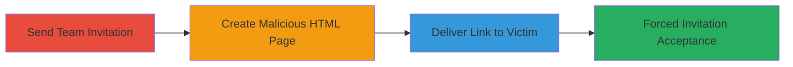

---
tags:
  - csrf
  - web-vulnerability
  - social-engineering
  - liberapay
type: attack_chain
tools: []
tactics:
  - '[[Initial Access]]'
verified: false
platforms:
  - Web
submitted: true
complexity: medium
created_at: '2024-01-01T00:00:00Z'
procedures:
  - '[[procedures/Send-Liberapay-Team-Invitation]]'
  - '[[procedures/Craft-Malicious-HTML-for-CSRF-Trigger]]'
  - '[[procedures/Deliver-CSRF-Link-to-Victim]]'
step_count: 3
techniques:
  - '[[Drive-by Compromise]]'
  - '[[Exploit Public-Facing Application]]'
updated_at: '2025-12-14T17:27:23.284Z'
description: >-
  A multi-step attack leveraging CSRF in Liberapay's team invitation process to
  trick authenticated users into accepting invitations without consent,
  resulting in unauthorized team membership.
skill_level: intermediate
impact_level: medium
id: 516f8c29-a0f7-4c76-bb11-2aa50e3ab2ab
validated: true
mitre_tactics:
  - '[[Initial Access]]'
mitre_techniques:
  - '[[Drive-by Compromise]]'
  - '[[Exploit Public-Facing Application]]'
---
# CSRF Exploitation to Force Liberapay Team Invitation Acceptance

Multi-stage attack chain demonstrating a complete workflow to exploit a CSRF vulnerability in Liberapay's team invitation acceptance, allowing an attacker to force an authenticated victim into a team without explicit consent.

## Chain Metrics Dashboard

| Metric | Value |
|--------|-------|
| Chain Status | Unverified |
| Total Steps | 3 |
| Execution Time | ~5 minutes |
| Skill Level | Intermediate |
| Complexity | Medium |
| Impact Level | Medium |

## Attack Flow Visualization



## Prerequisites & Requirements

### Required Tools

- None (manual web actions and HTML creation)

### Target Environment

- Liberapay web platform
- Attacker must control a Liberapay team
- Victim must have a Liberapay account and be authenticated

### Initial Access Requirements

- Attacker account with team creation privileges
- Victim's email or contact method for social engineering
- No prior network access beyond public internet

## Detailed Attack Procedures

### Step 1: Send Team Invitation
procedure: [[procedures/Send-Liberapay-Team-Invitation]]

**Objective**: Invite the target user to the attacker's Liberapay team, creating a valid acceptance endpoint for CSRF exploitation.

**Instructions**: Log in to the attacker's Liberapay account, navigate to the team management section, and send an invitation to the victim's email or username. This step is a prerequisite as the CSRF only works on pending invitations.

**Expected Output**: Invitation sent; victim receives notification but does not need to act.

**Success Indicators**:
- Invitation email or notification sent to victim
- Acceptance endpoint becomes active for the victim

### Step 2: Craft Malicious HTML Page
procedure: [[procedures/Craft-Malicious-HTML-for-CSRF-Trigger]]

**Objective**: Create a phishing page that automatically triggers the CSRF-protected acceptance endpoint via a clickable link when visited by the victim.

**Instructions**: Create an HTML file hosted on a controllable server (e.g., GitHub Pages or local server). Embed an auto-clicking link or simple anchor to the Liberapay acceptance URL, replacing {team} with the actual team slug (e.g., 'test-team'). Example HTML:

```html
<!DOCTYPE html>
<html>
<head><title>Click Here for Update</title></head>
<body>
<p>Please click here to accept your invitation:</p>
<a href="https://liberapay.com/test-team/membership/accept" id="acceptLink">Accept Invitation</a>
<script>document.getElementById('acceptLink').click();</script>
</body>
</html>
```
Upload and host this page publicly.

**Expected Output**: Accessible malicious webpage that, when visited by a logged-in victim, sends a GET request to the acceptance endpoint.

**Success Indicators**:
- Page loads without errors
- Link URL is correctly formed and points to Liberapay

### Step 3: Deliver CSRF Link to Victim
procedure: [[procedures/Deliver-CSRF-Link-to-Victim]]

**Objective**: Socially engineer the victim into visiting the malicious page while authenticated in Liberapay, triggering the forced acceptance.

**Instructions**: Send the malicious page URL to the victim via email, chat, or phishing pretext (e.g., "Click here to view your Liberapay update"). Ensure the victim is logged into Liberapay in their browser. Upon clicking, the GET request executes, accepting the invitation.

**Expected Output**: Victim added to the team; attacker sees new member in team dashboard.

**Success Indicators**:
- Victim reports clicking the link or team membership updates
- No CSRF token required, so acceptance succeeds silently

## Attack Chain Summary

### Key Achievements

1. Bypassed user consent for team membership via CSRF
2. Demonstrated lack of anti-CSRF protections on sensitive GET endpoints
3. Enabled unauthorized access to team resources for the victim

## Technique & Tactic Coverage

### MITRE ATT&CK Techniques

- [[Drive-by Compromise]]
- [[Exploit Public-Facing Application]]

### MITRE ATT&CK Tactics

- [[Initial Access]]

---
*Last updated: 2024-01-01T00:00:00Z*
