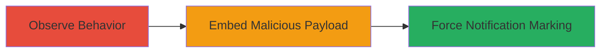

---
tags:
  - csrf
  - web-vulnerability
  - hackerone
  - notifications
type: attack_chain
tools: []
tactics:
  - '[[Initial Access]]'
commands:
  - '[[commands/csrf-img-report-load]]'
verified: false
platforms:
  - Web
submitted: true
complexity: low
created_at: '2023-10-01T00:00:00Z'
procedures:
  - '[[procedures/Observe-Notification-Marking-on-Report-Access]]'
  - '[[procedures/Exploit-CSRF-with-Malicious-Image-Tag]]'
step_count: 2
techniques:
  - '[[Drive-by Compromise]]'
updated_at: '2025-12-14T17:27:22.775Z'
description: >-
  A low-severity CSRF attack chain exploiting HackerOne's report viewing
  endpoint to mark unread notifications as read without user consent, using a
  malicious HTML image tag.
skill_level: beginner
impact_level: low
id: 04415cf9-cf11-4b08-ac28-32fca5cab914
validated: true
mitre_tactics:
  - '[[Initial Access]]'
mitre_techniques:
  - '[[Drive-by Compromise]]'
---
# CSRF Exploitation to Force Marking HackerOne Report Notifications as Read

Multi-stage attack chain demonstrating a CSRF vulnerability in HackerOne's report viewing functionality, allowing an attacker to trick authenticated users into marking specific report notifications as read via a simple GET request embedded in HTML.

## Chain Metrics Dashboard

| Metric | Value |
|--------|-------|
| Chain Status | Unverified |
| Total Steps | 2 |
| Execution Time | ~1 minute |
| Skill Level | Beginner |
| Complexity | Low |
| Impact Level | Low |

## Attack Flow Visualization



## Prerequisites & Requirements

### Required Tools

- None (uses standard browser and HTML)

### Target Environment

- Web platform
- HackerOne application (Ruby on Rails inferred)
- Authenticated user session required

### Initial Access Requirements

- Knowledge of target report ID
- Ability to deliver HTML payload (e.g., via phishing email or malicious site)
- Victim must be authenticated to HackerOne

## Detailed Attack Procedures

### Step 1: Observe Report Access Behavior
procedure: [[procedures/Observe-Notification-Marking-on-Report-Access]]

**Objective**: Identify that accessing a report URL via GET marks associated notifications as read without CSRF protection.

**Instructions**: Manually visit a HackerOne report URL, such as `https://hackerone.com/reports/5315`, while logged in and observe that unread notifications for that report are automatically marked as read.

**Expected Output**: Notifications for the report are marked as read upon page load.

**Success Indicators**:
- Unread notifications become read after GET request to `/reports/{id}`
- No POST or CSRF token required

### Step 2: Craft and Deliver CSRF Payload
procedure: [[procedures/Exploit-CSRF-with-Malicious-Image-Tag]]

**Objective**: Create and deliver HTML that forces the victim's browser to load the target report URL, marking notifications as read.

**Instructions**: Embed an image tag with the target report URL as src in HTML, e.g., using [[commands/csrf-img-report-load]]:

```html
<html></html>
```

Deliver this HTML to the victim via email, website, or other vector. When the victim loads it while authenticated, their browser fetches the URL.

**Expected Output**: Victim's notifications for the specified report are marked as read without interaction.

**Success Indicators**:
- Victim's browser makes GET request to `/reports/{id}`
- Server-side marking of notifications occurs

## Attack Chain Summary

### Key Achievements

1. Discovered lack of CSRF protection on report GET endpoint
2. Demonstrated exploitation via simple HTML img tag
3. Highlighted potential for missing in-app alerts (mitigated by email)

## Technique & Tactic Coverage

### MITRE ATT&CK Techniques

- [[Drive-by Compromise]]

### MITRE ATT&CK Tactics

- [[Initial Access]]

---
*Last updated: 2023-10-01T00:00:00Z*
