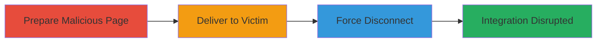

---
tags:
  - csrf
  - web-vulnerability
  - twitter-integration
  - zomato
  - php
type: attack_chain
tools: []
tactics:
  - '[[Initial Access]]'
  - '[[Impact]]'
verified: false
platforms:
  - Web
submitted: true
complexity: medium
created_at: '2023-10-01T00:00:00Z'
procedures:
  - '[[procedures/Craft-Malicious-CSRF-Form-for-Zomato-Twitter-Disconnect]]'
  - '[[procedures/Trick-Victim-into-Loading-CSRF-Page]]'
  - '[[procedures/Execute-CSRF-Request-to-Disconnect-Twitter]]'
step_count: 3
techniques:
  - '[[Drive-by Compromise]]'
  - '[[Exploit Public-Facing Application]]'
updated_at: '2025-12-14T17:27:30.115Z'
description: >-
  A multi-stage attack exploiting CSRF in Zomato's Twitter disconnect endpoint
  to unauthorizedly unlink a victim's Twitter integration from their profile.
skill_level: intermediate
impact_level: medium
id: a31b81f3-5744-428b-8d90-1f91a153c44b
validated: true
mitre_tactics:
  - '[[Initial Access]]'
  - '[[Impact]]'
mitre_techniques:
  - '[[Drive-by Compromise]]'
  - '[[Exploit Public-Facing Application]]'
---
# CSRF Exploitation to Force Twitter Disconnect on Zomato

Multi-stage attack chain demonstrating a complete CSRF workflow to disrupt user account integrations on Zomato.

## Chain Metrics Dashboard

| Metric | Value |
|--------|-------|
| Chain Status | Unverified |
| Total Steps | 3 |
| Execution Time | ~1 minute |
| Skill Level | Intermediate |
| Complexity | Medium |
| Impact Level | Medium |

## Attack Flow Visualization

## Prerequisites & Requirements

### Required Tools

- None (uses basic HTML hosting)

### Target Environment

- Web platform (Zomato website)
- PHP-based backend
- Victim must be authenticated to Zomato with Twitter connected

### Initial Access Requirements

- No prior credentials needed for attacker
- Victim must be logged into Zomato
- Network access to host a malicious page (e.g., via free hosting service)

## Detailed Attack Procedures

### Step 1: Craft Malicious CSRF Form
procedure: [[procedures/Craft-Malicious-CSRF-Form-for-Zomato-Twitter-Disconnect]]

**Objective**: Create an HTML page that automatically submits a forged request to Zomato's vulnerable endpoint.

**Instructions**: Develop a simple HTML form targeting the disconnect endpoint. Include an auto-submit mechanism using JavaScript or form attributes to trigger on page load. Host the page on an attacker-controlled server.

**Expected Output**: A hosted HTML file that, when loaded, sends the GET request to disconnect the Twitter link.

**Success Indicators**:
- HTML page loads without errors
- Form submission triggers automatically

### Step 2: Trick Victim into Loading Page
procedure: [[procedures/Trick-Victim-into-Loading-CSRF-Page]]

**Objective**: Socially engineer the victim to visit the malicious page while authenticated to Zomato.

**Instructions**: Send the link via phishing email, social media, or other means, disguising it as legitimate content. Ensure the victim is logged into Zomato in their browser session.

**Expected Output**: Victim's browser loads the page and submits the form.

**Success Indicators**:
- Victim visits the page
- No browser warnings block the load

### Step 3: Execute CSRF Request to Disconnect
procedure: [[procedures/Execute-CSRF-Request-to-Disconnect-Twitter]]

**Objective**: Exploit the lack of CSRF protection to force the disconnect action.

**Instructions**: Upon page load, the form submits a GET request to https://www.zomato.com/php/disconnect_twitter_profile.php, mimicking an AJAX call with the header X-Requested-With: XMLHttpRequest. The victim's session cookie authenticates the request.

**Expected Output**: Twitter integration disconnected from the victim's Zomato profile.

**Success Indicators**:
- Victim's Twitter link removed
- No CSRF token required or validated

## Attack Chain Summary

### Key Achievements

1. Forced unauthorized disconnection of Twitter from Zomato
2. Demonstrated CSRF impact on user experience
3. Highlighted missing anti-CSRF protections in legacy endpoints

## Technique & Tactic Coverage

### MITRE ATT&CK Techniques

- [[Drive-by Compromise]]
- [[Exploit Public-Facing Application]]

### MITRE ATT&CK Tactics

- [[Initial Access]]
- [[Impact]]

---

*Last updated: 2023-10-01T00:00:00Z*
