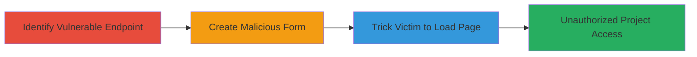

---
tags:
  - csrf
  - web
  - unauthorized-access
  - localize
type: attack_chain
tools: []
tactics:
  - '[[Initial Access]]'
verified: false
platforms:
  - Web
submitted: true
complexity: medium
created_at: '2023-10-01T00:00:00Z'
procedures:
  - '[[procedures/Identify-CSRF-Vulnerable-Invitation-Endpoint]]'
  - '[[procedures/Create-Malicious-HTML-Form-for-CSRF-Exploitation]]'
  - '[[procedures/Trick-Victim-into-Loading-Malicious-CSRF-Page]]'
step_count: 3
techniques:
  - '[[Exploit Public-Facing Application]]'
  - '[[Drive-by Compromise]]'
updated_at: '2025-12-14T17:27:03.823Z'
description: >-
  A multi-step attack leveraging CSRF to trick authenticated users into
  accepting invitations to private projects without consent, granting
  unauthorized access.
skill_level: intermediate
impact_level: high
id: 38e47f4c-b566-4ea2-b05c-3ff2506a17cb
validated: true
mitre_tactics:
  - '[[Initial Access]]'
mitre_techniques:
  - '[[Exploit Public-Facing Application]]'
  - '[[Drive-by Compromise]]'
---
# CSRF Exploitation to Force Unauthorized Acceptance of Private Project Invitations in Localize

Multi-stage attack chain demonstrating a complete attack workflow exploiting CSRF in Localize's private project invitation process.

## Chain Metrics Dashboard

| Metric | Value |
|--------|-------|
| Chain Status | Unverified |
| Total Steps | 3 |
| Execution Time | ~5 minutes |
| Skill Level | Intermediate |
| Complexity | Medium |
| Impact Level | High |

## Attack Flow Visualization

## Prerequisites & Requirements

### Required Tools

- Web browser for testing
- Text editor for HTML creation

### Target Environment

- Web platform (Localize.io)
- Required services/ports: HTTP/HTTPS on port 80/443
- Network access requirements: Internet access to target domain

### Initial Access Requirements

- Attacker needs to know a valid invitation ID (e.g., from reconnaissance or social engineering)
- Victim must be authenticated to Localize in their browser session
- No prior access to victim's account needed, but victim must visit attacker's malicious page while logged in

## Detailed Attack Procedures

### Step 1: Identify Vulnerable Endpoint
procedure: [[procedures/Identify-CSRF-Vulnerable-Invitation-Endpoint]]

**Objective**: Locate the POST endpoint responsible for accepting private project invitations and confirm lack of server-side CSRF validation.

**Instructions**: Use browser developer tools or network inspection to observe legitimate invitation acceptance requests. Identify the endpoint URL pattern, such as http://www.localize.io/invitations/{id}, and note that the CSRFToken field is present but not enforced server-side.

**Expected Output**: Confirmation of the endpoint and its parameters (e.g., invitations[userID], invitations[accept], invitations[role]).

**Success Indicators**:
- Endpoint identified without CSRF validation
- Parameters for forging request noted

### Step 2: Create Malicious HTML Form
procedure: [[procedures/Create-Malicious-HTML-Form-for-CSRF-Exploitation]]

**Objective**: Build a forged HTML form that submits the necessary POST data to the vulnerable endpoint, bypassing CSRF protection.

**Instructions**: Create an HTML file with a form targeting the invitations endpoint. Include hidden fields for required parameters, leaving CSRFToken empty or invalid. Optionally add JavaScript to auto-submit on page load.

**Expected Output**: A functional HTML page that, when loaded, sends a POST request to accept the invitation.

**Success Indicators**:
- Form submits successfully when tested in a controlled environment
- Request mimics legitimate acceptance without valid token

### Step 3: Trick Victim into Loading Malicious Page
procedure: [[procedures/Trick-Victim-into-Loading-Malicious-CSRF-Page]]

**Objective**: Socially engineer the victim to load the malicious page while authenticated, triggering the forged request and granting unauthorized access.

**Instructions**: Host the malicious HTML on an attacker-controlled server (e.g., via GitHub Pages or a simple web server). Send the link to the victim via email, phishing, or other means, enticing them to click while logged into Localize.

**Expected Output**: Victim's browser submits the CSRF request, accepting the invitation silently.

**Success Indicators**:
- Invitation accepted in victim's account
- Attacker gains access to the private project

## Attack Chain Summary

### Key Achievements

1. Bypassed CSRF protection to forge invitation acceptance
2. Achieved unauthorized access to private project data without victim interaction beyond page load
3. Demonstrated potential for confidentiality compromise in collaborative platforms

## Technique & Tactic Coverage

### MITRE ATT&CK Techniques

- [[Exploit Public-Facing Application]]
- [[Drive-by Compromise]]

### MITRE ATT&CK Tactics

- [[Initial Access]]

---

*Last updated: 2023-10-01T00:00:00Z*
