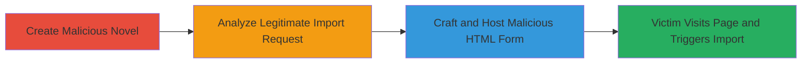

---
tags:
  - csrf
  - web-vulnerability
  - xss
  - pixiv
type: attack_chain
tools: []
tactics:
  - '[[Initial Access]]'
verified: false
platforms:
  - Web
submitted: true
complexity: medium
created_at: '2023-10-01T00:00:00Z'
procedures:
  - '[[procedures/Create-Malicious-Pixiv-Novel]]'
  - '[[procedures/Analyze-Pixiv-Import-Request]]'
  - '[[procedures/Craft-CSRF-HTML-Form-for-Pixiv-Import]]'
step_count: 3
techniques:
  - '[[Exploit Public-Facing Application]]'
  - '[[Drive-by Compromise]]'
updated_at: '2025-12-14T17:27:49.816Z'
description: >-
  A multi-stage attack exploiting CSRF in Pixiv's chatstory import endpoint to
  trick authenticated users into importing attacker-controlled novels,
  potentially embedding XSS payloads.
skill_level: intermediate
impact_level: medium
id: 3a3ca884-e1df-4c48-ab6f-7cf1ee0cafd0
validated: true
mitre_tactics:
  - '[[Initial Access]]'
mitre_techniques:
  - '[[Exploit Public-Facing Application]]'
  - '[[Drive-by Compromise]]'
---
# CSRF Exploitation to Force Unauthorized Chatstory Import on Pixiv

Multi-stage attack chain demonstrating a complete attack workflow exploiting CSRF in Pixiv's chatstory import feature.

## Chain Metrics Dashboard

| Metric | Value |
|--------|-------|
| Chain Status | Unverified |
| Total Steps | 3 |
| Execution Time | ~10 minutes |
| Skill Level | Intermediate |
| Complexity | Medium |
| Impact Level | Medium |

## Attack Flow Visualization

## Prerequisites & Requirements

### Required Tools

- Web browser with developer tools (e.g., Chrome DevTools)

### Target Environment

- Pixiv platform (web application)
- Authenticated attacker account on Pixiv
- Authenticated victim user on Pixiv

### Initial Access Requirements

- Attacker must have a Pixiv account to create content
- Victim must be authenticated in their browser session
- No special network access; attack relies on social engineering to lure victim to malicious page

## Detailed Attack Procedures

### Step 1: Create Malicious Novel
procedure: [[procedures/Create-Malicious-Pixiv-Novel]]

**Objective**: Create a novel on Pixiv containing potentially malicious content (e.g., XSS payloads in title or text) to use as the import target.

**Instructions**: Log in to your Pixiv account, navigate to the novel creation page, and author a novel with ID (e.g., 10997105). Include XSS payloads like `` in the title or text fields if aiming for chained exploitation.

**Expected Output**: A published novel with a unique ID, accessible via https://www.pixiv.net/novel/show.php?id=<novel_id>.

**Success Indicators**:
- Novel successfully created and visible on Pixiv
- Novel ID obtained for use in subsequent steps

### Step 2: Analyze Legitimate Import Request
procedure: [[procedures/Analyze-Pixiv-Import-Request]]

**Objective**: Inspect the network traffic of a legitimate chatstory import to identify the vulnerable endpoint and required parameters.

**Instructions**: As an authenticated user, navigate to the novel page (e.g., https://www.pixiv.net/novel/show.php?id=10997105), locate the 'チャットストーリーを作る' button in the sidebar, click it to trigger the import, and use browser developer tools (Network tab) to capture the POST request to https://chatstory.pixiv.net/imported. Note parameters: id=<novel_id>, text=<content>, comment=<comment>, title=<title>, user_id=<user_id>, x_restrict=0, is_original=true.

**Expected Output**: Captured POST request details, confirming lack of CSRF token.

**Success Indicators**:
- POST request details extracted
- Endpoint and parameters documented for forgery

### Step 3: Craft and Host Malicious HTML Form
procedure: [[procedures/Craft-CSRF-HTML-Form-for-Pixiv-Import]]

**Objective**: Build and host a malicious webpage that forges the import request, tricking the victim into submitting it via their authenticated session.

**Instructions**: Create an HTML file with a form targeting https://chatstory.pixiv.net/imported, using hidden inputs for the parameters (e.g., id=10997105, text with XSS, etc.). Add JavaScript to auto-submit on load or manipulate browser history for stealth. Host the page on a controllable server (e.g., GitHub Pages) and lure the victim via phishing link.

**Expected Output**: Hosted malicious page that, when visited by an authenticated victim, triggers the unauthorized import.

**Success Indicators**:
- Form submission successful when tested in authenticated session
- Victim's account shows imported chatstory with attacker's content

## Attack Chain Summary

### Key Achievements

1. Attacker novel created with potential payloads
2. Vulnerable endpoint analyzed without CSRF protections
3. Malicious page crafted to force import, enabling unauthorized content creation and possible XSS execution

## Technique & Tactic Coverage

### MITRE ATT&CK Techniques

- [[Exploit Public-Facing Application]] Exploit Public-Facing Application
- [[Drive-by Compromise]] Drive-by Compromise

### MITRE ATT&CK Tactics

- [[Initial Access]] Initial Access

---
*Last updated: 2023-10-01T00:00:00Z*
