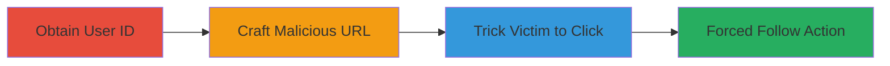

# CSRF Exploitation to Force Unauthorized LinkedIn Follow Actions

Multi-stage attack chain demonstrating a complete CSRF workflow on LinkedIn to force users to follow attacker-controlled accounts.

## Chain Metrics Dashboard

| Metric | Value |
|--------|-------|
| Chain Status | Unverified |
| Total Steps | 3 |
| Execution Time | ~5 minutes |
| Skill Level | Intermediate |
| Complexity | Medium |
| Impact Level | High |

## Attack Flow Visualization

## Prerequisites & Requirements

### Required Tools

- None (relies on browser and public information access)

### Target Environment

- LinkedIn web platform
- Authenticated user session (victim must be logged in)
- No specific ports or services beyond standard HTTPS (443)

### Initial Access Requirements

- Attacker needs public access to LinkedIn profiles to retrieve user IDs
- Victim must be authenticated in their browser session
- No prior credentials or network position required beyond internet access

## Detailed Attack Procedures

### Step 1: Obtain Victim User ID
procedure: [[procedures/Obtain-LinkedIn-Victim-User-ID]]

**Objective**: Retrieve the publicly available fsd_profile user ID for the target LinkedIn user to use in the CSRF payload.

**Instructions**: Access the victim's LinkedIn profile page and inspect the network requests or page source to extract the fsd_profile value, which serves as the user ID.

**Expected Output**: A numeric or alphanumeric user ID string, e.g., "123456789".

**Success Indicators**:
- User ID successfully retrieved from public profile data
- ID can be inserted into the entityUrn parameter

### Step 2: Craft Malicious URL
procedure: [[procedures/Craft-LinkedIn-CSRF-Malicious-URL]]

**Objective**: Construct a forged GET request URL that mimics a legitimate email recommendation to trigger the follow action without CSRF protection.

**Instructions**: Build the URL using the base endpoint https://www.linkedin.com/comm/mynetwork/discovery-see-all/ with required parameters including the victim's user ID in entityUrn, usecase for simulation, and tracking tokens to evade basic filters.

**Expected Output**: A complete malicious URL ready for distribution, e.g., https://www.linkedin.com/comm/mynetwork/discovery-see-all?usecase=EMAIL_MIXED_RECOMMENDATIONS&entityUrn=urn:li:fs_DiscoveryEntity:(urn:li:member:123456789,PEOPLE_FOLLOW)&trk=...

**Success Indicators**:
- URL parameters correctly include victim ID and follow entity
- URL appears legitimate when previewed

### Step 3: Deliver and Execute CSRF Attack
procedure: [[procedures/Deliver-and-Execute-LinkedIn-CSRF-Attack]]

**Objective**: Trick the victim into clicking the crafted link while authenticated, executing the unauthorized follow action.

**Instructions**: Distribute the URL via email, social media, or messaging, disguising it as a recommendation. When clicked, the browser sends the GET request, bypassing confirmation due to missing CSRF token.

**Expected Output**: Victim's account follows the attacker's controlled profile without user interaction.

**Success Indicators**:
- Victim clicks the link while logged in
- Attacker verifies the follow via LinkedIn profile followers list

## Attack Chain Summary

### Key Achievements

1. Retrieved public user ID for targeting
2. Crafted a functional CSRF URL exploiting the unprotected endpoint
3. Forced unauthorized follow action, enabling spam or phishing escalation

## Technique & Tactic Coverage

### MITRE ATT&CK Techniques

- [[Exploit Public-Facing Application]]

### MITRE ATT&CK Tactics

- [[Initial Access]]

---
*Last updated: 2023-10-01T12:00:00Z*
