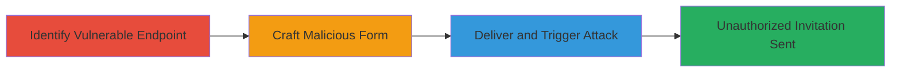

# CSRF Exploitation to Force Unauthorized Private Project Access Invitations in Localize

Multi-stage attack chain demonstrating a complete CSRF workflow against Localize's private project access invitation feature.

## Chain Metrics Dashboard

| Metric | Value |
|--------|-------|
| Chain Status | Unverified |
| Total Steps | 3 |
| Execution Time | ~5 minutes |
| Skill Level | Intermediate |
| Complexity | Medium |
| Impact Level | High |

## Attack Flow Visualization

## Prerequisites & Requirements

### Required Tools

- Web browser for inspection (e.g., Chrome DevTools)
- Text editor for HTML crafting

### Target Environment

- Web platform
- Localize application (www.localize.io)
- Authenticated user session required for victim

### Initial Access Requirements

- Attacker needs to lure victim to malicious page while authenticated to Localize
- No special credentials for attacker; relies on victim's session

## Detailed Attack Procedures

### Step 1: Identify Vulnerable Endpoint
procedure: [[procedures/Identify-CSRF-Vulnerable-Endpoint-for-Private-Project-Invitations]]

**Objective**: Analyze the private project access invitation form to confirm lack of CSRF token validation.

**Instructions**: Use browser developer tools to inspect the form submission for the invitation request. Look for the POST endpoint at http://www.localize.io/ and note parameters like CSRFToken (which is empty) and requestInvitation[repositoryID].

**Expected Output**: Confirmation of endpoint http://www.localize.io/ with POST method, empty CSRFToken, and repositoryID parameter (e.g., '9p').

**Success Indicators**:
- Endpoint identified without server-side token validation
- Form parameters documented

### Step 2: Craft Malicious HTML Form
procedure: [[procedures/Craft-Malicious-HTML-Form-for-CSRF-Attack]]

**Objective**: Create an HTML page that auto-submits a forged request to the vulnerable endpoint.

**Instructions**: Write an HTML file with a form targeting http://www.localize.io/, including hidden inputs for an empty CSRFToken and the target repositoryID (e.g., '9p'). Use JavaScript to auto-submit the form on page load.

**Expected Output**: A self-contained HTML file ready for delivery.

**Success Indicators**:
- Form auto-submits when loaded in victim's browser
- Request mimics legitimate invitation parameters

### Step 3: Deliver Malicious Page and Trigger Attack
procedure: [[procedures/Deliver-Malicious-Page-to-Trigger-CSRF]]

**Objective**: Trick the authenticated victim into loading the malicious page, causing the CSRF request to be sent.

**Instructions**: Host the HTML file on an attacker-controlled server or send it via email/phishing. When the victim (logged into Localize) loads the page, the form submits automatically, sending the invitation request on their behalf.

**Expected Output**: Invitation request sent from victim's session, potentially granting access or spamming.

**Success Indicators**:
- Victim's browser sends POST to http://www.localize.io/ without interaction
- Server accepts request due to missing token validation

## Attack Chain Summary

### Key Achievements

1. Identified CSRF vulnerability in invitation feature
2. Crafted and delivered exploit via malicious HTML
3. Forced unauthorized actions using victim's authentication

## Technique & Tactic Coverage

### MITRE ATT&CK Techniques

- [[Drive-by Compromise]]
- [[Exploit Public-Facing Application]]

### MITRE ATT&CK Tactics

- [[Initial Access]]

---
*Last updated: 2023-10-01T00:00:00Z*
